# Client Acquisition OS: the complete app guide

**Last updated:** 2026-10-01 (Log activity: suggested types first, the rest under More types). Keep this line current; see CLAUDE.md rule 12.

This one file replaces every earlier doc: `docs/01`–`docs/11`, `DEPLOY.md`, `PROGRESS.md`, `SAAS-PLAN.md`, `UI-WALKTHROUGH.md`, `bd-flow.md`, `lead-timeline-flow.md`, `README.md`'s guide text and `prompt.md`. Their full text lives in the sections below, grouped by topic. Section 16 maps every old heading to its new place.

**How to read it**
- **Sections 1–3** explain what the app is, who uses it and how offices are kept apart. Read these first.
- **Sections 4–10** are the spec: flows, data, rules, numbers and screens. The code must match them.
- **Sections 11–13** cover the design system, the build history and how to run, test and deploy.
- **Section 15** lists places where the older docs and the code disagree. Where they differ, **the code is what runs**. Treat each item there as a doc fix or a code fix still to decide.

**Old references.** Text moved in from the old docs still says things like "docs/04 section 8" or "docs/10". Use the table in section 16 to find where that section now lives.

## Contents

1. [Overview](#1-overview)
2. [Roles and permissions](#2-roles-and-permissions)
3. [Office boundary (multi-tenancy)](#3-office-boundary-multi-tenancy)
4. [Auth flows](#4-auth-flows)
5. [Data model](#5-data-model)
6. [Business rules](#6-business-rules)
7. [Metrics](#7-metrics)
8. [Screens](#8-screens)
9. [End-to-end user journeys](#9-end-to-end-user-journeys)
10. [Request flow](#10-request-flow)
11. [Design system](#11-design-system)
12. [Build history and progress](#12-build-history-and-progress)
13. [Setup, commands, seed data, testing and deploy](#13-setup-commands-seed-data-testing-and-deploy)
14. [Glossary](#14-glossary)
15. [Known differences between docs and code](#15-known-differences-between-docs-and-code)
16. [Where the old docs went](#16-where-the-old-docs-went)

## 1. Overview

Client Acquisition OS is a small, laptop-first CRM for **offices**: agencies or companies that win clients through business developers (BDs).
- **BDs** add detailed leads every day, log their outreach and move deals through a pipeline.
- **The founder** of each office watches the work live, assigns daily tasks and reviews performance.
- **A social media manager (SMM)** writes and publishes the office's posts.
- **The platform owner** runs the software business. They create and suspend offices, but never see any office's data.

**Stack:** Next.js (App Router, Server Components, Server Actions), TypeScript strict, Supabase (Postgres, Auth, Row Level Security, Realtime), Tailwind CSS with shadcn/ui, TanStack Table, dnd-kit, Recharts, React Hook Form with Zod, date-fns, sonner and cmdk. Tests use Vitest and Playwright. The app deploys to Vercel and Supabase Cloud. USD only.

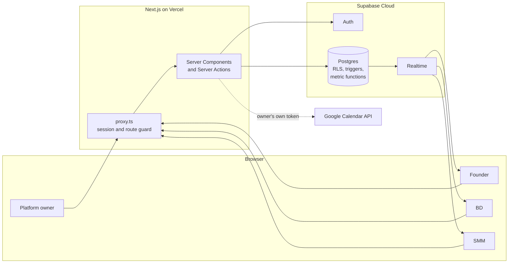
```mermaid
flowchart LR
  subgraph Browser
    O[Platform owner]
    F[Founder]
    B[BD]
    S[SMM]
  end
  subgraph Vercel["Next.js on Vercel"]
    SC[Server Components<br/>and Server Actions]
    P[proxy.ts<br/>session and route guard]
  end
  subgraph Supabase["Supabase Cloud"]
    A[Auth]
    DB[(Postgres<br/>RLS, triggers,<br/>metric functions)]
    RT[Realtime]
  end
  G[Google Calendar API]
  O & F & B & S --> P --> SC
  SC --> A
  SC --> DB
  DB --> RT --> F & B & S
  SC -. owner's own token .-> G
```

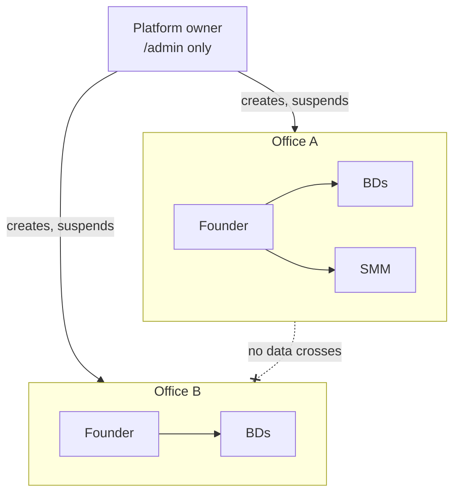
```mermaid
flowchart TB
  subgraph OA["Office A"]
    FA[Founder] --> BA[BDs]
    FA --> SA[SMM]
  end
  subgraph OB["Office B"]
    FB[Founder] --> BB[BDs]
  end
  Owner["Platform owner<br/>/admin only"] -->|creates, suspends| OA
  Owner -->|creates, suspends| OB
  OA -.-x|no data crosses| OB
```

What is in and out of scope is under "Scope" below. The business plan for selling to many offices is at the end of this section.

### 01 — Product spec (from `docs/01-product-spec.md`)

#### 1. Purpose

Replace the "Client Acquisition OS" spreadsheet with a web app that:

1. Makes BDs record **detailed** leads every day: company, location, website, LinkedIn, emails, phones and decision makers.
2. Makes every piece of outreach a logged activity with an outcome, so reply and meeting numbers are real.
3. Lets the founder see work **as it happens**, assign daily tasks, and judge performance from several angles.
4. Keeps every number consistent. One definition per metric, filterable by date.


#### 4. Scope

##### In v1

1. Login, invites, two roles, deactivate and reactivate, per-user time zone
2. Settings: niches, channels, lead sources, lost reasons, activity types, outcome labels, stage labels and probabilities, campaigns, weekly targets
3. Leads with detailed company and contact information, several contacts per lead, completeness score, search and filters, reassignment
4. Activity logging with automatic lead status and a next action
5. My Day: tasks, overdue and due follow-ups, today's counters versus daily targets
6. Opportunities: pipeline board, won and lost forms, stage history
7. Tasks: count, checklist and lead fix; repeat on weekdays; progress and on-time tracking
8. Activity feed (founder only, live)
9. Performance: scoreboard, funnel, by niche, channel and campaign, daily consistency grid, pipeline health, task completion, all with a date range
10. Global search (Ctrl/Cmd + K)

11. (M10) Social media manager role and content scheduling: social accounts, content pillars, posting schedules, posts with a review flow, social metrics (`docs/09-social-media.md`)
12. (M13–M18) Many independent offices in one app: private data per office, platform admin office list, seat limits, suspend (`docs/11-offices.md`)

##### Out of scope for v1

Job Platform; importing anything other than leads from CSV (M12 adds a lead import, see docs/04 section 10), including Excel files directly (save as CSV first); sending email or LinkedIn messages from the app (M11 allows only Google Calendar invites the BD ticks); email, SMS or closed-app push reminders (M11 adds in-app and browser alerts while the app is open, see docs/10); payment-by-payment tracking and invoices; for offices: billing, trials, self-serve sign-up, deleting an office, data export, office logos and custom domains, one person in several offices, platform admins viewing office data (`docs/11-offices.md` section 9); currencies other than USD; extra roles beyond the SMM added in M10; mobile-optimised layouts (screens must still work on a phone, just not polished); file attachments; AI features; public API; audit log beyond the history tables; for the social module: auto-publishing through platform APIs, connecting social accounts or OAuth, pulling analytics from platforms, file uploads (links only), push/email notifications, multi-step or client approvals, AI caption generation.


#### 5. User stories and acceptance criteria

Each story lists the checks that prove it works. `docs/07-screens.md` has the screen-level details.

##### Team and access
- **As the founder, I invite a BD by email** with name, niche and time zone.
  - They receive an invite email, set a password, and land on My Day.
  - Before the first login they show as "Invited".
- **As the founder, I deactivate a BD.**
  - They can no longer log in or load data.
  - Their past work still appears in reports under their name.
  - I'm prompted to reassign their open leads to someone else.
- **As any user, I set my own time zone.**
  - "Today", "overdue" and "this week" follow it.

##### Leads
- **As a BD, I add a lead in under a minute** with at least company name, niche, channel, one contact's first name, and one way to reach them (email, phone or LinkedIn). For Upwork leads, an Upwork job URL counts as a way to reach them.
- **As a BD, I can fill in details** (website, company LinkedIn, address, Google rating, several contacts with job titles, decision-maker flag, emails, phones and LinkedIn URLs).
  - The completeness score updates as I type.
- **As a BD, I see a warning if I already have a lead** with the same website domain or company name.
  - I'm offered "Open existing lead" or "Add anyway".
  - Other BDs' leads are never checked or shown.
- **As a BD, I can't delete leads.** I can mark them Bad fit or Not interested. The founder can delete.
- **As the founder, I reassign** one lead, a selection, or all open leads of a person.
  - Open opportunities move with the lead.
  - History keeps who owned it when.

##### Activities and follow-ups
- **As a BD, I log an activity from anywhere** (lead page, My Day row, or shortcut L) in three fields or fewer: type, outcome and next action. Notes are optional.
- **The lead's status updates itself** from what I log (rules in `docs/04`).
- **When I log "Meeting booked"**, the app offers to create an opportunity.
- **My Day shows follow-ups**: overdue first (red), then due today (amber). Each has one-click logging.

##### Pipeline
- **As a BD, I drag opportunities between stages.** Every move is stored with a date.
- **Moving to Won asks for** final value, contract type (one-time or monthly) and monthly amount.
- **Moving to Lost asks for** a reason from the list and an optional note.
- **The founder sees everyone's board** and can filter by BD.

##### Tasks
- **As the founder, I assign** a count task (metric + number + day, optional niche or campaign filter), a checklist task (title, optional linked lead or opportunity, note), or repeat either on weekdays.
- **Count tasks fill in automatically** and are marked done the moment the number is reached. BDs can't tick them.
- **Checklist tasks are ticked by the BD.** They can untick within the same day.
- **Flagging a lead** creates a lead-fix task for its owner with my note, due today.
- **Tasks not done by the end of their day** (in the assignee's time zone) show as overdue and stay visible until done or deleted.

##### Feed and performance
- **As the founder, I see new events within about 2 seconds** without refreshing.
  - Filter by person and event type.
  - Clicking an event opens the lead.
- **As the founder, I pick a date range and optionally a BD** on Performance.
  - Every number on the page follows both.
  - Clicking a number shows the records behind it.
- **As a BD, I see my own Performance page**: my numbers versus my targets, and no one else's.

### Plan: sell Client Acquisition OS to several offices and agencies (from `docs/SAAS-PLAN.md`)

**Status:** proposal, not started. Written 2026-09-30.
**Decisions:** all made, see section 9.

---


#### 0. The requirement (confirmed by you)

- **Every office is independent.** Each office has its own founder, its own staff, and its own leads, settings, tasks, feed and numbers.
- **One office's data is never visible to another office.** No staff member, report, search, notification or live update may cross offices.
- **A person belongs to one office only.**

Both routes below meet this requirement. In Route A the offices are separated by having separate databases. In Route B the database itself blocks access across offices, and tests prove it.


#### 1. The short answer

Today the app is built for **one company**. The database allows exactly one founder, and the first person to sign up becomes that founder. Every lead, setting and number belongs to "the" company.

To sell it to many agencies you have two routes:

| | **Route A: one copy per customer** | **Route B: one shared app, many companies** |
|---|---|---|
| What it means | Each agency gets its own Supabase project and its own Vercel site | One app, one database. Every row belongs to a company, and the database keeps each company's rows separate |
| Code changes | Almost none | Large: every table, rule, metric and test |
| Time to first sale | Days | About 4–6 weeks of focused work |
| Cost per customer | A paid Supabase project each (roughly $25+/month; check current pricing) | Close to zero per extra customer |
| Updates | Push each migration to every copy by hand | Deploy once, everyone gets it |
| Good for | First 1–5 customers | 5+ customers, self-serve sign-up, trials |

**Recommendation: do both, in order.**
1. **Now:** sell to your first 2–3 agencies with Route A. You get paid, get feedback, and learn what they actually need.
2. **In parallel:** build Route B. Once it is ready, move the Route A customers onto it.

Don't build billing, self-serve sign-up or subdomains until paying customers ask for them.

---


#### 2. Phase 0: get ready to sell (1 week, no big code changes)

Do these whatever route you pick.

- [ ] **Rotate the leaked keys.** `docs/DEPLOY.md` step 0 says the database password and service-role key were pasted into a chat. Confirm this is done before any customer data goes in.
- [ ] **Your own email sender for auth.** Supabase's built-in email sender only allows a few emails per hour, which isn't enough for invites and password resets. Set up custom SMTP (Resend, Postmark or SES) in Supabase → Auth → SMTP.
- [ ] **Google Calendar approval.** The calendar sync (M11) uses a Google sign-in app. Until Google verifies it, it works only for test users you add by hand and shows an "unverified app" warning. Start Google's verification now, because it takes weeks. You'll need the privacy page (`/privacy`, already there), a terms page and a short demo video.
- [ ] **Legal pages:** terms of service and a data processing agreement (DPA) template. Agencies store their clients' personal data, so they will ask for these.
- [ ] **Backups:** turn on daily backups (Supabase Pro), and point-in-time recovery if a customer needs it.
- [ ] **Product name and branding** in one place: app name, logo and favicon. Today the name "Client Acquisition OS" is written into the code in several places.
- [ ] **Demo site:** a separate Supabase and Vercel copy filled by `pnpm cloud:seed`, with a demo founder and a demo BD login to use on sales calls.
- [ ] **Pricing** (your decision). A simple start: a flat monthly fee per company that includes N seats, plus a fee per extra seat. Invoice by hand at first; you don't need Stripe yet.

##### Route A runbook (per new customer, about 1 hour)

Write this into `docs/DEPLOY.md` as a repeatable checklist:

1. Create a Supabase project (in the region nearest the customer), then `supabase link` and `supabase db push`.
2. Set the auth settings: site URL, redirect URLs, sign-up off, custom SMTP.
3. Create a Vercel project from the same GitHub repo, with that customer's environment variables and domain (for example `acme.yourproduct.com`).
4. Open `/setup` and create the customer's founder account, or send them the link.
5. Add their Google Calendar redirect URL to the Google sign-in app.
6. Record the customer in a simple sheet: project ref, domain, plan, seats, renewal date.

**When you release an update**, run `supabase db push` against every customer's project, then redeploy. A small script that loops over the project refs will save mistakes. This is the main pain of Route A, and why it stops scaling at around 5 customers.

---


#### 3. Phase 1: shared database with companies (Route B)

> **The spec for this phase is now `docs/11-offices.md`, and it wins where this section differs.** Differences: companies are called **offices** (`offices`, `office_id`, `current_office_id()`); a new member's office comes from a `pending_members` reservation rather than app metadata; there is no read-only mode yet, only suspend.

This is the core change. The spec currently lists multi-tenancy as out of scope (`CLAUDE.md`, `docs/01`), so **update the spec first**:
- `docs/01`: product scope
- `docs/02`: the new `organizations` table and the company column
- `docs/03`: who can see what across companies
- `docs/08`: new milestones

##### 3.1 Data model

- **New table `organizations`:** id, name, slug, default time zone, plan, seat limit, status (`trial`, `active`, `past_due`, `cancelled`), trial end date, created at.
- **`profiles.organization_id`** (required). One person belongs to one company. This keeps login simple: the company comes from the profile, and there's no company switcher.
- **Every business table** gets `organization_id uuid not null default current_org_id() references organizations`. That's all ~30 tables: leads, contacts, activities, opportunities, tasks, targets, settings lists, posts, meetings, notifications, feed events, import batches, and so on.
- **Change these uniqueness rules so they apply within each company, not across the whole database:**
  - `profiles_single_founder` becomes one founder per company: unique on `(organization_id)` where role = founder.
  - List names (niches, sources, channels, campaigns, content pillars, and so on) become unique on `(organization_id, name)`.
  - Import batch `code` becomes unique on `(organization_id, code)`.
  - Stage and outcome `key` become unique on `(organization_id, key)`.
- **Hard-coded default `Asia/Karachi`** becomes the company's default time zone.

##### 3.2 Security (RLS). This is the risky part

- Add a helper `current_org_id()` (security definer, stable) that reads the caller's profile.
- **Every policy** gets `organization_id = current_org_id()` added, next to the role checks it already has.
- **Every `security definer` function skips RLS**, so each one must filter by company itself. That includes `log_activity`, the `metrics_*` functions, `pipeline_summary`, `active_mrr`, `tasks_with_progress`, search, lead import and the feed and notification triggers. **Go through each one by hand.** One missed filter leaks one agency's numbers to another agency.
- `is_founder()` stays as it is, because it already checks only the caller's own profile, and that profile now carries a company.
- **Triggers** that insert rows (feed events, notifications, stage history, task auto-complete) must copy `organization_id` from the source row. Don't rely on the column default, because triggers can run with no logged-in user.
- **Realtime:** the feed subscription already goes through RLS. Test that company A's founder never receives company B's events.

##### 3.3 Sign-up and invites

- **Replace "first user becomes founder"** in `handle_new_user()`:
  - The company id and role are set in **`raw_app_meta_data`** (only the server can write this) by the server action that creates the user.
  - Never read them from user metadata, because users can edit that. The current code already follows this rule; keep it.
- **Creating a company** (`create_organization(name, founder_email)`): inserts the organization, invites the founder, and **fills in default settings**: stages with probabilities, activity types, outcomes, lost reasons and starter lists. Today they're inserted once at the end of `20260924000000_init.sql`, plus the hidden "CSV import" source in the lead-import migration. Move them into this function. Stages and outcomes have a `key` the code relies on, so every company must get the same keys.
- **The founder invites BDs and SMMs** exactly as now. The invite action puts the founder's company id into app metadata.
- **`/setup`** becomes a **platform-owner-only** "create company" screen (section 3.4). Later, if you want self-serve, add a public sign-up page.

##### 3.4 Platform owner (you)

- Add a new flag, `profiles.is_platform_admin` (or a separate table), not a new company role.
- Add a small `/admin` area: list of companies, seats used, last activity, status. Actions: create company, suspend or reactivate, extend trial.
- This area needs the service-role key. **Update CLAUDE.md rule 3** so it allows two uses: founder actions within their own company, and platform-admin actions. Each use must check the caller first.
- **Suspended company:** RLS returns nothing and the app shows "Your account is paused. Contact us."

##### 3.5 Limits

- **Seat limit:** add a database trigger on profiles that refuses a new active user when the company is at its limit. The invite dialog shows the error inline.
- **Read-only when unpaid:** when status is `past_due` or `cancelled`, writes are blocked (add a check in the write policies) but data can still be viewed and exported.

##### 3.6 Move existing data

- In the same migration, create the current company as organization #1 and set it on every existing row. Then make the column required (not null).
- Route A customers move over later with a script: export from their project, then import into their new organization with fresh ids. Test this on a copy first.

##### 3.7 Tests (the "done" check for this phase)

- **SQL smoke tests** (`supabase/tests/`): for every table and every security-definer function, a user in company A sees 0 rows from company B, and cannot insert, update or delete them.
- **E2E:** seed two companies. Each founder sees only their own team, leads, feed, performance numbers and notifications. A BD from company A who opens a company B lead URL gets "not found".
- **Every existing test** must still pass with a single company.
- **Seed scripts** (`seed:demo`, `seed:more`, `test-users`) get a flag for which company to fill.

---


#### 4. Phase 2: running it as a business (after Phase 1)

Add these only when customers need them:

- **Billing:** Stripe Checkout, the customer portal and a webhook that updates `organizations.status` and `seat_limit`. This adds a library, so note the reason in the commit (CLAUDE.md asks for that).
- **Self-serve sign-up and free trial:** a public page that creates the company and its founder, with a 14-day trial.
- **Data export:** the founder downloads all leads, contacts and activities as CSV. Agencies ask for this before they sign ("can we leave with our data?").
- **Deleting a cancelled company:** after N days, remove all of its rows. Needed for privacy law, and for trust.
- **Company settings page:** name, logo, default time zone.
- **Custom domains or subdomains per company:** only if a customer pays for white-label. Otherwise everyone uses one address like `app.yourproduct.com`.
- **Monitoring:** error tracking, uptime checks on `/healthz`, and a weekly look at slow queries once many companies share the database.

---


#### 5. What does NOT change

- The roles inside a company: founder, BD and SMM, and what each can do.
- All screens, metrics definitions and business rules (docs 04–07, 09, 10). They now work per company.
- The stack. Only Stripe is added, and only in Phase 2.
- USD only. Out-of-scope items stay out unless a paying customer asks for one.

---


#### 6. Suggested milestones (to add to `docs/08-build-plan.md`)

| # | Milestone | Done when |
|---|---|---|
| M13 | Spec update | docs 01/02/03/08 and CLAUDE.md say "many companies"; you've signed off |
| M14 | Organizations + column on every table + backfill | Migration applies on a copy of production; all existing tests pass |
| M15 | RLS + security-definer functions scoped by company | Cross-company SQL tests pass for every table and function |
| M16 | Create company, default settings, invites carry company | Two companies created from `/admin`, each with its own founder and BDs |
| M17 | Platform admin, suspend, seat limit, read-only when unpaid | E2E: suspended company can't load data; seat limit blocks invite with an inline error |
| M18 | Two-company E2E + seed scripts + deploy runbook | Full E2E green with two companies; production migrated |
| M19+ | Billing, self-serve, export, deletion | As customers need them |

Rough effort: M13–M18 is about 4–6 weeks for one developer working with Claude. M15 is the biggest and riskiest.

---


#### 7. Risks

| Risk | What protects you |
|---|---|
| One agency sees another agency's data | Company filter in RLS **and** in every security-definer function, plus a cross-company test for each one |
| A migration breaks the live data | Take a backup first, run the migration on a copy of production first, and use point-in-time recovery |
| Google blocks calendar sync for new customers | Start Google's verification in Phase 0 |
| Invite emails land in spam or hit the rate limit | Custom SMTP with a proper domain setup (SPF, DKIM) |
| Route A copies drift apart | A script pushes migrations to every copy, and you move them to Route B early |
| One busy company slows down the others | Indexes that start with `organization_id` on large tables (leads, activities, feed events) |

---


#### 8. Order to do things this week

1. Confirm the keys are rotated. Set up custom SMTP. Start Google verification.
2. Set prices for the Standard and Dedicated plans (section 9).
3. Build the demo site.
4. Onboard customer #1 with the Route A runbook.
5. Start M13 (spec update) for Route B.

---


#### 9. Decisions (all made, 2026-09-30)

| # | Question | Decision | Why |
|---|---|---|---|
| 1 | Route | **Route A first (one copy per office), then Route B (shared app).** Move Route A offices onto Route B once M18 is done. | Sell and get paid within days; build the shared app without rushing the security work. |
| 2 | One person in several offices? | **No.** Each person belongs to one office. | Offices are independent; keeps login and privacy simple. |
| 3 | How offices sign up | **You create each office by hand** from the `/admin` page (M16–M17), then invoice by hand. No public sign-up page, trial or Stripe until there are about 10 paying offices or they ask to pay by card. | Sales-led is enough for the first offices and removes billing work from Phase 1. |
| 4 | Branding | **One product brand for everyone**, at one address (e.g. `app.yourproduct.com`). Each office's **name** shows in the sidebar and in invite emails. Office logo upload comes in Phase 2 (company settings page). Full white-label (own domain, own colours) only as a paid extra if someone asks. | One brand keeps one Google app, one email sender and one deploy. |
| 5 | Where data lives | **One region for the shared app**, the one nearest most of your offices. An office that legally needs another region (e.g. EU) gets its own Route A copy in that region, priced higher. | Route A stays available as the "dedicated" plan, so no office is turned away. |

##### What this means for the milestones

- **M16:** `/admin` → "Create office" (name, time zone, founder email, seat limit) is the only way to create an office. `/setup` is removed from the shared app.
- **M17:** the office name is shown in the sidebar header and used in invite emails.
- **Phase 2 order:** data export → deleting cancelled offices → office logo → billing and self-serve sign-up (only when triggered as above).
- **Pricing tiers:** *Standard* (shared app) and *Dedicated* (own Route A copy, own region, higher price).

### Client Acquisition OS: what's built and how to walk through it (from `docs/UI-WALKTHROUGH.md`)

This guide explains what the app does, how to open it, and how to click through every screen.
It follows the order a real week would: the founder sets things up, BDs add leads and log
outreach, deals move through the pipeline, and the founder reviews the numbers.

---


#### 1. What was built

A small CRM for one founder and a team of business developers (BDs).

| Area | What it does |
|---|---|
| Sign-in and team | Founder setup, email invites, password reset, deactivate / reactivate people |
| Settings | Niches, channels, lead sources, lost reasons, activity types, outcome and stage labels, campaigns, weekly targets |
| Leads | Detailed lead form, completeness score, duplicate warning, list with search, filters and views, bulk actions, lead page |
| Activities | Log outreach, replies, calls, meetings and proposals; lead status updates by itself |
| My Day | Today's progress against targets, tasks, overdue and due follow-ups |
| Pipeline | Drag-and-drop board, Won / Lost dialogs, stage history, list view |
| Tasks | Count tasks that fill in by themselves, checklist tasks, "repeat on weekdays", flag lead |
| Feed | The founder's live stream of everything the team does |
| Performance | Scoreboard, funnel, breakdown by niche / channel / campaign, consistency grid, pipeline health, tasks |
| Polish | Ctrl/Cmd+K command menu, keyboard shortcuts, error and 404 pages, loading skeletons |

Security is enforced by the database: a BD can only ever see their own leads, opportunities,
tasks and numbers, even if they type another URL.

---

### 09 — Social media module (from `docs/09-social-media.md`)

#### 6. Out of scope
Auto-publishing through platform APIs; connecting accounts or OAuth; pulling analytics from platforms;
file uploads (links only); browser, push or email notifications; multi-step or client approvals;
AI caption generation.

### 11 — Offices (M13–M18) (from `docs/11-offices.md`)

#### 9. Not in this phase

- billing, trials and self-serve sign-up
- deleting an office, and data export
- office logo, custom domains, white-label
- one person in several offices, or moving a member between offices
- a read-only mode for unpaid offices
- platform admins viewing an office's data, or "log in as"
- choosing a data region per office (use a dedicated copy)

### 10 — Meetings, Google Calendar and notifications (M11) (from `docs/10-meetings-notifications.md`)

#### 6. Out of scope (M11)
- Web Push when the app is closed.
- Email notifications and digests (these need a sending domain).
- SMS.
- Two-way calendar sync (reading changes from Google).
- Calendars other than Google.
- Shared team calendar.
- Meeting rooms.
- Recording or transcripts.
- Automatic Google Meet links. (Links are typed in; Meet creation may come later.)

## 2. Roles and permissions

There are four kinds of account. **Three roles live inside an office:** founder, BD and SMM. **The platform owner lives outside every office.**

| Role | Where | Count | Home page | Can see |
|---|---|---|---|---|
| **Platform owner** (`platform_admins`, no profile) | no office | 1 or more | `/admin` | The office list only: name, status, founder email, member and lead counts, last activity. Never an office's data. |
| **Founder** (`role = founder`) | one office | exactly 1 per office | `/my-day` | Everything in their office. Manages the team, targets, settings, tasks and the office's name. |
| **BD** (`role = bd`) | one office | 1 to about 10 | `/my-day` | Their own leads, activities, deals, meetings, tasks and numbers. |
| **SMM** (`role = social`) | one office | 0 to a few | `/my-day` | Their own posts and social numbers. No sales data. |

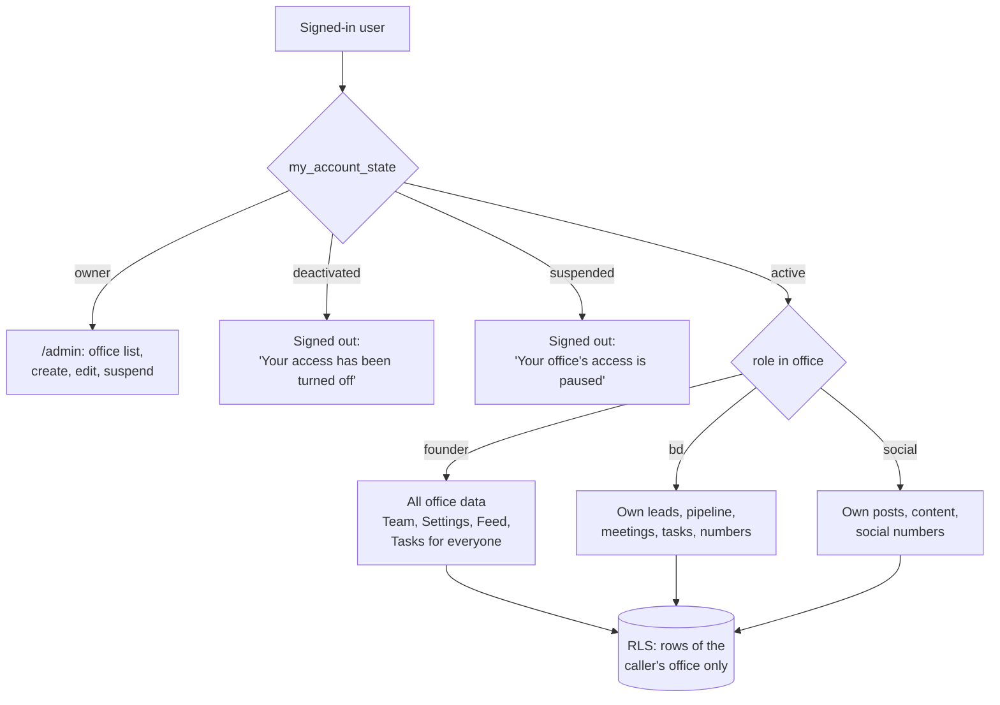
```mermaid
flowchart TD
  U[Signed-in user] --> Q{my_account_state}
  Q -->|owner| OW["/admin: office list,<br/>create, edit, suspend"]
  Q -->|deactivated| X1[Signed out:<br/>'Your access has been turned off']
  Q -->|suspended| X2[Signed out:<br/>'Your office's access is paused']
  Q -->|active| R{role in office}
  R -->|founder| FO[All office data<br/>Team, Settings, Feed,<br/>Tasks for everyone]
  R -->|bd| BD[Own leads, pipeline,<br/>meetings, tasks, numbers]
  R -->|social| SM[Own posts, content,<br/>social numbers]
  FO & BD & SM --> W[(RLS: rows of the<br/>caller's office only)]
```

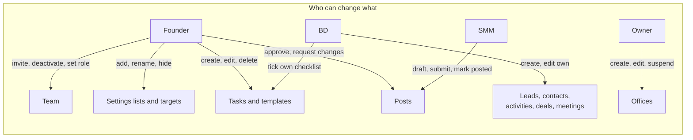
```mermaid
flowchart LR
  subgraph Change["Who can change what"]
    F1[Founder] -->|invite, deactivate, set role| T[Team]
    F1 -->|add, rename, hide| L[Settings lists and targets]
    F1 -->|create, edit, delete| K[Tasks and templates]
    F1 -->|approve, request changes| PO[Posts]
    B1[BD] -->|create, edit own| LE[Leads, contacts,<br/>activities, deals, meetings]
    B1 -->|tick own checklist| K
    S1[SMM] -->|draft, submit, mark posted| PO
    O1[Owner] -->|create, edit, suspend| OF[Offices]
  end
```

The full permission matrix follows. Every rule there applies **inside the caller's office only** (section 3).

### 01 — Product spec (from `docs/01-product-spec.md`)

#### 2. Users

The app serves many independent **offices** (agencies or companies). Everything below describes one office; offices never see each other's staff or data. See `docs/11-offices.md`.


| Role | Count | What they do |
|---|---|---|
| Founder | exactly 1 per office | Everything a BD does (own leads, Upwork, pipeline). Also manages the team, targets, settings and tasks, and sees all data. |
| BD | 1 to about 10 | Adds leads, logs activities, works their pipeline, completes tasks. Sees only their own work. |
| Social media manager (SMM) | 0 to a few | Writes and publishes the posts the founder schedules on the brand's social accounts, marks them as posted, and records results. Sees only their own posts and social numbers; no sales data. See `docs/09-social-media.md`. |

The SMM role was added in M10 (`docs/09-social-media.md`). There are no other roles inside an office. Separately, a **platform admin** (the app's owner) creates and suspends offices but can't see their data (`docs/11-offices.md`).

Example team used across these docs:

| Name | Role | Niche | Time zone |
|---|---|---|---|
| Zain | Founder | All, Upwork | Asia/Karachi |
| Ahmed | BD | Dental | Asia/Karachi |
| Sara | BD | Law | Asia/Karachi |
| Bilal | BD | AI SaaS | Europe/Berlin |

### 03 — Permissions and access (from `docs/03-permissions.md`)

#### 1. Principle

Row Level Security (RLS) in Postgres is the only security boundary. From M14 the first boundary is the **office**: every rule below applies only inside the caller's own office, and nothing is readable, writable or counted across offices (`docs/11-offices.md` section 4). The UI hides things a user can't do, but hiding is for comfort, not safety. The founder's department view (docs/07, Navigation) is the same kind of hiding: a UX filter over what RLS already allows. Every rule below is already enforced by the migration and checked by `supabase/tests/02_smoke_test.sql`.


#### 2. Matrix

| Data | BD | SMM | Founder |
|---|---|---|---|
| Own profile | read; edit name and time zone | same as BD | read and edit everything |
| Other profiles | read names only (for display) | read names only | read and edit; invite, deactivate, reactivate, set role |
| Settings lists, campaigns | read | read | add, edit, hide |
| Outcome labels, stage labels and probabilities | read | read | rename; change probability |
| Targets | read own | read own | read all; set |
| Leads and contacts | own leads only: create, read, edit | none | all: create, read, edit, delete, reassign |
| Lead delete | no (use Bad fit / Not interested) | no | yes |
| Activities | on own leads: log, read, edit own | none | all; delete |
| Opportunities | own: create, read, move, edit | none | all; delete |
| Stage and ownership history | own | none | all |
| Tasks | read own; tick own checklist and lead-fix tasks | same as BD | create, edit, delete, read all |
| Task templates | none | none | all |
| Feed | none | none | all |
| Metrics | own row only | own social numbers only | everyone |
| Social accounts, content pillars | read | read | add, edit, hide |
| Posting schedules | none | read own | all |
| Posts | none | own: read; create ideas for self; edit work fields and results; move status (see docs/09) | all: create, edit brief, approve, request changes, cancel, delete |
| Post comments and history | none | on own posts | all |
| Meetings (M11) | on own leads: book, read, reschedule, mark held / no-show, cancel, undo | none | all; delete |
| Import leads from CSV (M12) | only if the founder turned it on; the leads are the BD's own | none | yes; can give rows to any BD (Owner email column) and turn the permission on or off per BD |
| Notifications (M11) | own only: read, mark read, delete; mute groups | same as BD | same (own only) |
| Offices (M16) | none | none | own office: rename, default time zone; seat limit read-only. Platform admins: create, edit, suspend, reactivate any office; list only (docs/11 section 6), never its data |
| Google Calendar connection (M11) | own only: connect, disconnect, auto-add; the stored token is never readable | none | own; sees every member's connection status (not the token) |

Notes:
- M11: notifications and meetings follow the same RLS as their lead or recipient; Google Calendar calls run in the owner's own session with their own token. The service-role key is not used for any of it (docs/10).
- A BD cannot create a lead owned by someone else, or change a lead's owner.
- CSV import (M12): the database checks `can_import_leads()` on upload and again on import, so turning it off stops an import already in preview. The import runs with the user's own rights, so the same RLS as Add lead applies to every row.
- A BD cannot change anything on a task except its completion, and cannot complete count tasks by hand.
- The founder can have their own leads, tasks and targets, like a BD.
- A deactivated user can read nothing, even with a valid session.
- An SMM can't insert leads or opportunities (policies check `current_user_role()`), and every other sales policy needs lead ownership, which an SMM never has.
- An SMM can't approve their own post, change its scheduled time, assignee, account, title or brief (DB trigger).

### 09 — Social media module (from `docs/09-social-media.md`)

A third role, the **Social media manager (SMM)**, and a content-scheduling module. The founder hires an
SMM, assigns posts (which account, what to post, which day and time), sets recurring posting schedules,
reviews drafts and tracks whether posts go out on time. The SMM sees their schedule, writes the posts,
submits them for approval, publishes them by hand on each platform, and marks them as posted with the
live link.

Rules marked **(DB)** are enforced in SQL (migration `20260925000100_social_module.sql`); **(App)** rules
are built in TypeScript and mirror the database.


#### 1. Role and access

- New role `social`, shown as **"Social media manager"**. It is added to `user_role` in its own migration
  (`20260925000000_social_enums.sql`), because Postgres can't use a new enum value in the transaction
  that adds it. The same file adds `posts_published` to `task_metric` and `target_metric`.
- **Invite:** Team → Invite has a **Role** field: BD (default) or Social media manager. The trigger still
  creates every new profile as `bd`; the invite server action then sets the role with the admin client,
  as it already does for niche and time zone. The founder can switch BD ↔ SMM in Edit. The founder role
  never changes (existing guard).
- **SMM navigation:** My Day, Content, Tasks, Performance (own social numbers only), Profile.
  - No Leads, Pipeline, Feed, Team or Settings. The proxy sends them to `/my-day` with the toast
    "That page isn't part of your role."
- **Database (DB):**
  - `public.current_user_role()` (security definer, stable).
  - `leads_insert` and `opportunities_insert` allow only founder or bd. Every other lead, contact,
    activity and opportunity policy already requires lead ownership (`can_access_lead`), which an SMM
    never has, so an SMM can't read or create sales data.
  - `metrics_scoreboard` and `metrics_daily` exclude SMMs (re-created in the new migration).
- **Tasks:** unchanged for SMMs. The founder can assign checklist tasks ("Design 5 carousel templates")
  and count tasks with the new metric **Posts published**: posts marked posted on that day in the SMM's
  time zone. `count_task_progress` and `check_count_tasks` handle it, and the check runs when a post
  becomes posted.
- **Targets:** a "Posts published" column, for SMMs only (greyed out for BDs; sales metrics are greyed
  out for SMMs).

## 3. Office boundary (multi-tenancy)

Every business row has an `office_id`. The database, not the app, keeps offices apart. It uses five pieces:

1. **`current_office_id()`** returns the caller's office, but only while they are an active member of an active office. Otherwise it returns null, so a deactivated user, a suspended office or the platform owner reads nothing.
2. **A restrictive `office_boundary` policy** on every business table: `office_id = current_office_id()`. It is ANDed with the role policies from section 2.
3. **`office_definer`**, a NOLOGIN role without BYPASSRLS, owns the `security definer` functions. So even functions that normally skip RLS stop at the office wall. A short, reviewed list stays owned by `postgres`, and a SQL test fails if that list changes.
4. **The `zz_office_refs` trigger** on every table. It fills `office_id` from the parent row, refuses references into another office, and refuses moving a row to another office.
5. **Composite foreign keys** for stages and outcomes, `(office_id, key)`, so a deal or activity can only use its own office's pipeline stages and outcomes.

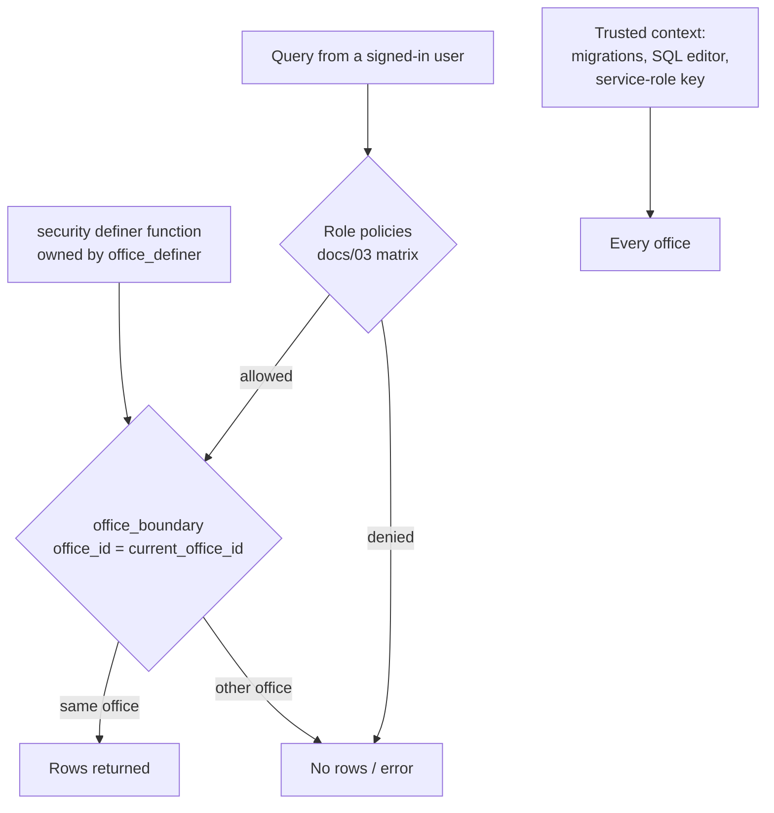
```mermaid
flowchart TD
  Q[Query from a signed-in user] --> R{Role policies<br/>docs/03 matrix}
  R -->|allowed| W{office_boundary<br/>office_id = current_office_id}
  R -->|denied| N[No rows / error]
  W -->|same office| OK[Rows returned]
  W -->|other office| N
  SD[security definer function<br/>owned by office_definer] --> W
  TR[Trusted context:<br/>migrations, SQL editor,<br/>service-role key] --> ALL[Every office]
```

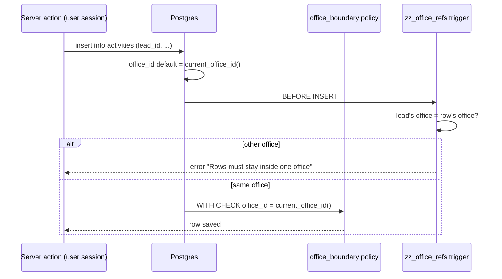
```mermaid
sequenceDiagram
  participant App as Server action (user session)
  participant PG as Postgres
  participant Pol as office_boundary policy
  participant Trg as zz_office_refs trigger
  App->>PG: insert into activities (lead_id, ...)
  PG->>PG: office_id default = current_office_id()
  PG->>Trg: BEFORE INSERT
  Trg->>Trg: lead's office = row's office?
  alt other office
    Trg-->>App: error "Rows must stay inside one office"
  else same office
    PG->>Pol: WITH CHECK office_id = current_office_id()
    Pol-->>App: row saved
  end
```

**Service-role key rules.** The key lives only in `src/lib/supabase/admin.ts`. It is used only by server actions that first check the caller:
- **A founder**, only for members of their own office: adding members, invites, bans, passwords, and niche and time zone on a new profile.
- **The platform owner**, only to create a new office's founder account.
- **`/setup`**, while no office exists.

The full spec follows. It was written for M13–M18; the owner changes from M19 are included.

### 03 — Permissions and access (from `docs/03-permissions.md`)

#### 4. Where the service-role key may be used

From M16 also: a platform admin creating a new office's founder user. Every founder action checks the target member is in the founder's own office (`docs/11-offices.md` section 7).

Only in `src/lib/supabase/admin.ts`, imported only by server actions that first confirm the caller is an active founder:

- add a member with a password, and invite / resend invite (when email is on)
- set a member's password (never the founder's)
- deactivate and reactivate (ban / unban)
- set role, niche and time zone on a newly added profile

The key is never sent to the browser. It must not be prefixed `NEXT_PUBLIC_`.

### 11 — Offices (M13–M18) (from `docs/11-offices.md`)

One app, many independent offices. Each office is a separate customer (an agency or company) with its own founder, staff and data. **No office can see, change or count anything from another office.**

Background and business reasons: `docs/SAAS-PLAN.md`. This page is the spec.


#### 1. The rule every other doc now follows

Everything in docs 01–10 describes **one office**. Wherever they say "the founder", "the team", "everyone", "all leads", "all tasks", "the feed" or "the settings", read **"in the same office"**.

- The founder of office A is a founder only in office A.
- A BD's "own" data is also, by definition, in their office.
- Metrics, search, the feed, notifications, realtime and CSV import never cross offices.


#### 2. Words

| Word | Meaning |
|---|---|
| **Office** | One customer. Has a name, a default time zone, a status and a seat limit. Everything else belongs to exactly one office. |
| **Member** | A profile in an office: its founder, a BD or an SMM. A person (email) belongs to **one** office only. |
| **Platform admin** | You, the app's owner. Creates offices, suspends and reactivates them, changes seat limits. **Cannot see any office's data** (leads, contacts, activities, deals, posts, tasks, feed, notifications, metrics), only the office list in section 6. From M19 the platform admin is the **platform owner**: a separate account that belongs to **no office** and has no profile. It sees only the Offices dashboard. An office member can never be an owner. |


#### 4. Security

RLS is still the only security boundary (docs/03). Migration `20261002000100_office_boundary.sql` builds the wall like this:

- **`current_office_id()`** returns the caller's office, but only while they're an active member of an active office. Otherwise it returns null, so a deactivated user or a suspended office reads nothing. `is_active_user()`, `is_founder()`, `current_user_role()` and `can_import_leads()` build on it.
- **One restrictive policy per business table**, `office_boundary`: `office_id = current_office_id()`. Restrictive policies are ANDed with the existing ones, so every rule in docs/03 now also stops at the office wall.
- **Trusted contexts see every office, as before:** migrations, the SQL editor, the service-role key, and the triggers they fire. `is_trusted_context()` means no signed-in user and not the `anon` role.
- **`security definer` functions run inside the wall.** The `postgres` role bypasses RLS, so these functions are owned by `office_definer` instead: a NOLOGIN role without BYPASSRLS. Inside them, only the office wall applies, through one permissive `office_definer_all` policy per table. They still do their own role checks, as before.
- **A short, reviewed list of functions stays owned by `postgres`.** These read only the caller's own profile, are the platform admin's, or are sign-up and setup:
  - `current_office_id`, `is_active_user`, `is_founder`, `current_user_role`, `can_import_leads`, `my_account_state`
  - `is_platform_admin`, `admin_office_summary`, `create_office`, `discard_empty_office`, `setup_first_office`, `seed_office_defaults`
  - `handle_new_user`, `office_refs`, `office_seat_error`, `trg_pending_member_insert`, `trg_platform_admin_not_member`, `trg_profile_seats`

  `supabase/tests/07_offices_test.sql` fails if this list changes. A new function added without review is caught.
- **Joins inside functions** also match on office (stage and outcome lookups), because trusted contexts see every office.

The functions this covers (they now run inside the wall):
  - `log_activity`, `book_meeting`, `ensure_recurring_tasks`, `tasks_with_progress`, `count_task_progress`
  - `metrics_scoreboard`, `metrics_by_dimension`, `metrics_daily`, `pipeline_summary`, `active_mrr`, `social_metrics`
  - `ensure_post_slots`, `mark_missed_posts`, `request_post_changes`, `team_calendar_status`, `prune_my_notifications`
  - `import_conflicts`, `import_lead_batch`, and every trigger function

- **Triggers that look for "the founder"** now look for the founder **of the row's office**. Today they take any founder in the database: notification routing, lead import and the hardening migration.
- **Realtime** subscriptions (feed, notifications) already pass through RLS. The two-office tests prove that no event crosses offices.
- **The platform admin's office list** comes from `admin_office_summary()`. It is `security definer`, checks `is_platform_admin()`, and returns only the columns in section 6. It returns no names of leads, contacts or deals.


#### 7. Service-role key

It is still used only in `src/lib/supabase/admin.ts`. Two kinds of caller may use it, and each checks the caller first:

1. **A founder** (active, office active): the existing uses in docs/03 section 4, for members of **their own office only**. The action checks that the target profile's `office_id` equals the founder's.
2. **A platform admin**: creating an office's founder user. Nothing else. Suspend, reactivate and edit are plain updates on `offices` through RLS (`offices_update` policy and the `guard_office_update` trigger), not the service-role key.
3. **`/setup`**, while no office exists: it creates the first office and its founder (no caller to check yet).

## 4. Auth flows

Email and password through Supabase Auth, with cookies handled by `@supabase/ssr`. `src/proxy.ts` refreshes the session on every request, sends signed-out users to `/login`, and keeps each role off pages outside its work. **Every new account must have a reservation first.** The sign-up trigger `handle_new_user` reads a `pending_members` row (office and role) or a `pending_platform_admins` row (owner). With no reservation, the account is refused.

### Sign in

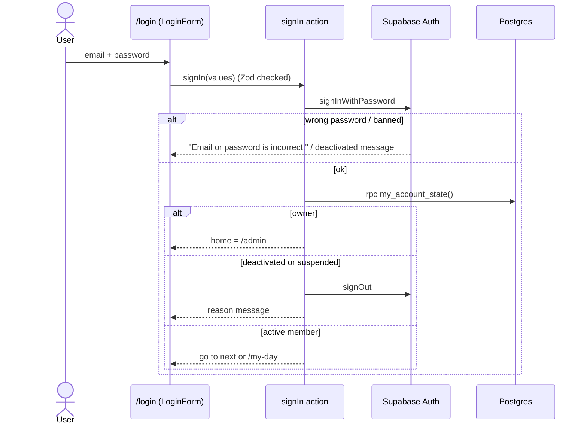
```mermaid
sequenceDiagram
  actor U as User
  participant L as /login (LoginForm)
  participant A as signIn action
  participant SB as Supabase Auth
  participant DB as Postgres
  U->>L: email + password
  L->>A: signIn(values) (Zod checked)
  A->>SB: signInWithPassword
  alt wrong password / banned
    SB-->>L: "Email or password is incorrect." / deactivated message
  else ok
    A->>DB: rpc my_account_state()
    alt owner
      A-->>L: home = /admin
    else deactivated or suspended
      A->>SB: signOut
      A-->>L: reason message
    else active member
      A-->>L: go to next or /my-day
    end
  end
```

### First install: `/setup`

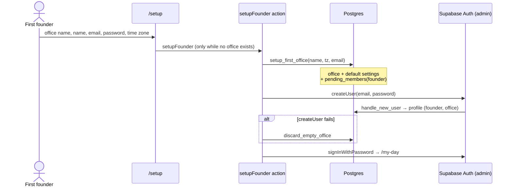
```mermaid
sequenceDiagram
  actor Z as First founder
  participant S as /setup
  participant A as setupFounder action
  participant DB as Postgres
  participant SB as Supabase Auth (admin)
  Z->>S: office name, name, email, password, time zone
  S->>A: setupFounder (only while no office exists)
  A->>DB: setup_first_office(name, tz, email)
  Note over DB: office + default settings<br/>+ pending_members(founder)
  A->>SB: createUser(email, password)
  SB->>DB: handle_new_user → profile (founder, office)
  alt createUser fails
    A->>DB: discard_empty_office
  end
  A->>SB: signInWithPassword → /my-day
```

### Founder adds a member (password or invite email)

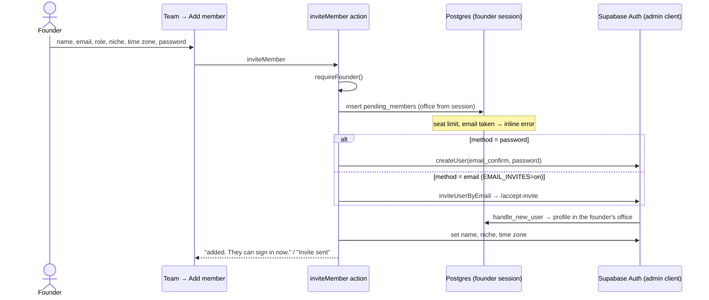
```mermaid
sequenceDiagram
  actor F as Founder
  participant T as Team → Add member
  participant A as inviteMember action
  participant DB as Postgres (founder session)
  participant AD as Supabase Auth (admin client)
  F->>T: name, email, role, niche, time zone, password
  T->>A: inviteMember
  A->>A: requireFounder()
  A->>DB: insert pending_members (office from session)
  Note over DB: seat limit, email taken → inline error
  alt method = password
    A->>AD: createUser(email_confirm, password)
  else method = email (EMAIL_INVITES=on)
    A->>AD: inviteUserByEmail → /accept-invite
  end
  AD->>DB: handle_new_user → profile in the founder's office
  A->>AD: set name, niche, time zone
  A-->>T: "added. They can sign in now." / "Invite sent"
```

### Invite link → accept

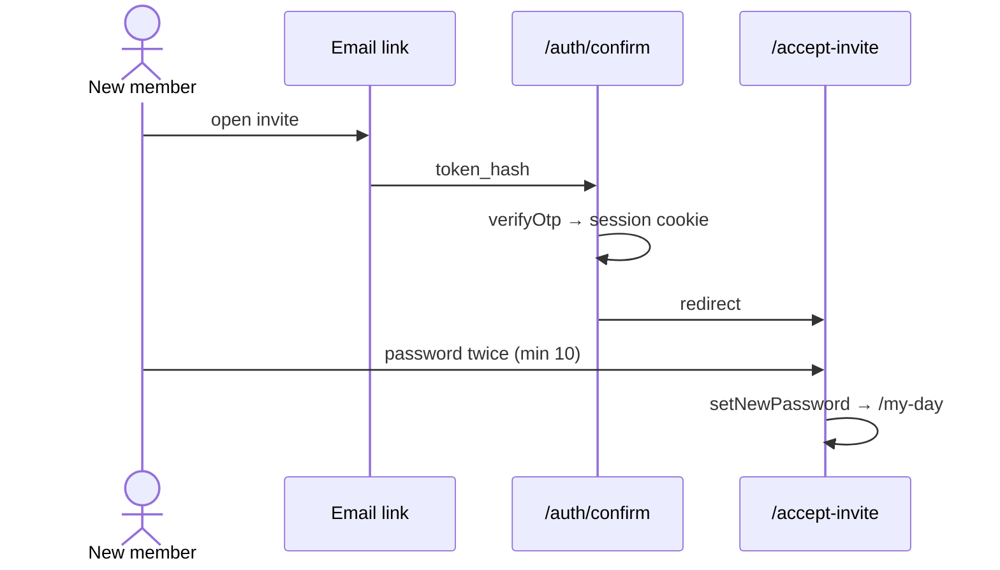
```mermaid
sequenceDiagram
  actor N as New member
  participant M as Email link
  participant C as /auth/confirm
  participant P as /accept-invite
  N->>M: open invite
  M->>C: token_hash
  C->>C: verifyOtp → session cookie
  C->>P: redirect
  N->>P: password twice (min 10)
  P->>P: setNewPassword → /my-day
```

### Password reset

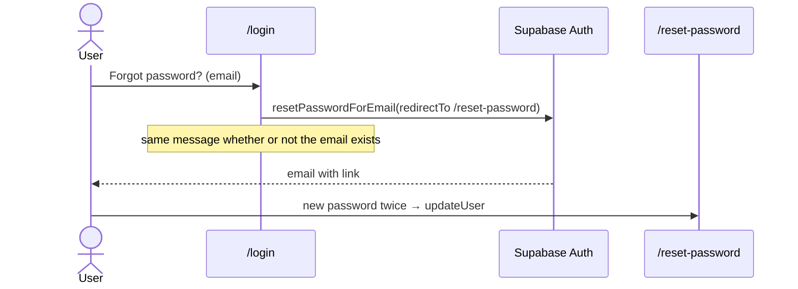
```mermaid
sequenceDiagram
  actor U as User
  participant L as /login
  participant SB as Supabase Auth
  participant R as /reset-password
  U->>L: Forgot password? (email)
  L->>SB: resetPasswordForEmail(redirectTo /reset-password)
  Note over L: same message whether or not the email exists
  SB-->>U: email with link
  U->>R: new password twice → updateUser
```

### Deactivate and reactivate a member

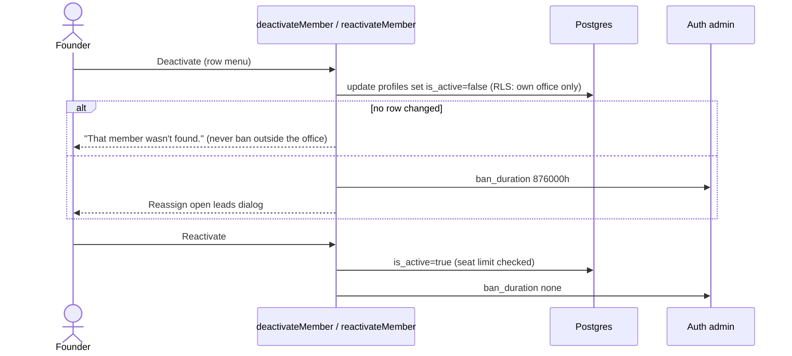
```mermaid
sequenceDiagram
  actor F as Founder
  participant A as deactivateMember / reactivateMember
  participant DB as Postgres
  participant AD as Auth admin
  F->>A: Deactivate (row menu)
  A->>DB: update profiles set is_active=false (RLS: own office only)
  alt no row changed
    A-->>F: "That member wasn't found." (never ban outside the office)
  else
    A->>AD: ban_duration 876000h
    A-->>F: Reassign open leads dialog
  end
  F->>A: Reactivate
  A->>DB: is_active=true (seat limit checked)
  A->>AD: ban_duration none
```

### Platform owner creates an office

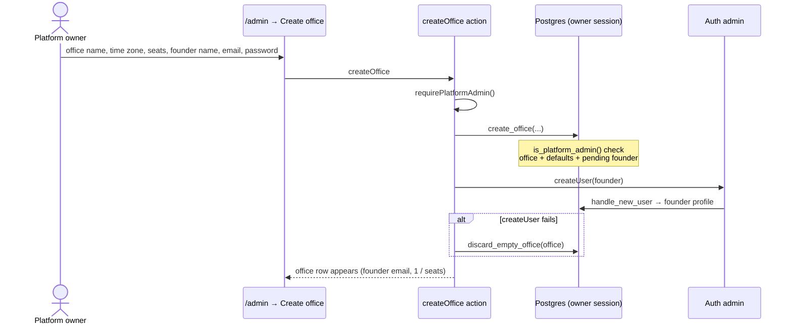
```mermaid
sequenceDiagram
  actor O as Platform owner
  participant V as /admin → Create office
  participant A as createOffice action
  participant DB as Postgres (owner session)
  participant AD as Auth admin
  O->>V: office name, time zone, seats, founder name, email, password
  V->>A: createOffice
  A->>A: requirePlatformAdmin()
  A->>DB: create_office(...)
  Note over DB: is_platform_admin() check<br/>office + defaults + pending founder
  A->>AD: createUser(founder)
  AD->>DB: handle_new_user → founder profile
  alt createUser fails
    A->>DB: discard_empty_office(office)
  end
  A-->>V: office row appears (founder email, 1 / seats)
```

### Creating the platform owner

The owner has no screen for this. Run `pnpm owner:add <email> [--cloud] [--reset]` (`scripts/platform-owner.ts`). With the service-role key, it inserts `pending_platform_admins`, creates the account and prints a generated password once. The sign-up trigger adds `platform_admins` and no profile.

The detailed flows from the earlier docs follow. Where they describe the single-office era (for example "the first user becomes founder"), section 15 marks the difference.

### 03 — Permissions and access (from `docs/03-permissions.md`)

#### 3. Auth flows

##### First setup (founder)

From M16: `/setup` creates the first **office**, its founder and makes that person a platform admin; later offices are created on `/admin` (`docs/11-offices.md` sections 5–6). Every new member needs a `pending_members` reservation in their office before the auth user is created. The steps below describe the single-office setup they replace.

1. Create the Supabase project. In **Auth → Providers → Email**, disable "Allow new users to sign up" after step 3.
2. Run migrations.
3. The founder signs up once (a dev-only `/setup` page, or the Supabase dashboard "Add user"). The trigger makes the first user the founder.
4. Disable public sign-up. From now on, users join only by invite.

`/setup` must refuse to work if any profile exists. Remove it or keep it behind that check.

##### Add a member with a password (default)
Invite emails need a sending domain (custom SMTP). Until one exists, the founder adds people directly:
1. Team → **Add member**: name, email, role, niche (BD), time zone, and a password typed twice (min 10 characters).
2. A server action checks the caller is the founder, then calls `auth.admin.createUser({ email, password, email_confirm: true })` with the admin client. No email is sent.
3. The trigger creates the profile as `bd`; the action sets role, niche and time zone, as for invites.
4. The founder shares the password; the member signs in on `/login`. Team shows **Not signed in yet** until their first sign-in.

**Set password.** Team → row menu → **Set password** replaces a member's password (`auth.admin.updateUserById(id, { password })`) after the founder check. Not offered for the founder, who uses Profile. The app never shows, stores or logs passwords.

**Email invites are off** unless the server env has `EMAIL_INVITES=on`. While off, the form's "Send an invite email" option and its **Send invite** button are disabled, **Resend invite** is disabled, and the server actions refuse them. The steps below apply once email is turned on.

##### Invite a BD (only when `EMAIL_INVITES=on`)
1. Founder fills the Invite form: name, email, niche, time zone.
2. A server action checks the caller is the founder, then calls `auth.admin.inviteUserByEmail(email, { data: { full_name }, redirectTo: <site>/accept-invite })` with the admin client.
3. The trigger creates the profile with role `bd`.
4. The action then updates that profile with niche and time zone, using the admin client.
5. The BD opens the email link, sets a password on `/accept-invite`, and lands on `/my-day`.
6. Until they finish step 5, Team shows them as **Invited** (auth user has no `last_sign_in_at`). The founder can resend the invite.

The role is never taken from user metadata, because users can edit their own metadata.

##### Invite with a role (M10)
The Invite form has a Role field: BD (default) or Social media manager. The trigger still creates the profile as `bd`; the invite action sets the role with the admin client after the founder check, like niche and time zone. The founder can switch BD ↔ SMM in Edit. SMMs are sent from Leads, Pipeline, Feed, Team and Settings to `/my-day` with the toast "That page isn't part of your role."

##### Deactivate
1. The founder clicks Deactivate on a member.
2. A server action sets `profiles.is_active = false` and bans the auth user (`auth.admin.updateUserById(id, { ban_duration: '876000h' })`) so they can't sign in.
3. The action then opens the Reassign dialog for their open leads.
4. Reactivate reverses both (`ban_duration: 'none'`).

The founder cannot be deactivated or demoted; the database rejects it.

##### Sessions
- `@supabase/ssr` middleware refreshes the session on every request.
- Middleware redirects signed-out users to `/login`.
- It redirects BDs away from founder-only routes (`/feed`, `/team`, `/settings/*`) to `/my-day`, and shows the toast "That page is for the founder."
- Load the profile once in the `(app)` layout. Pass the role and time zone down through a React context.

##### Password reset
`/login` has "Forgot password?", which calls `resetPasswordForEmail` and sends the user to `/reset-password`.

### 11 — Offices (M13–M18) (from `docs/11-offices.md`)

#### 5. Sign-up, members and seats

##### Creating a member (every path)
1. The server action finds the caller's office **from the caller's own profile**, never from form input.
2. It inserts a `pending_members` row with that office and the chosen role.
3. It creates the auth user as today (add with a password, or invite when email is on).
4. The `handle_new_user` trigger reads and deletes the `pending_members` row, then creates the profile with that office and role.
   - With **no** row, the trigger raises an error and the auth user isn't created, so a stray sign-up can't produce a profile.
   - "The first user becomes founder" is gone. A founder is created only through `create_office` or `/setup`.
5. The action sets niche and time zone as today.

The new profile starts with the office's time zone. The Add member form starts with it too, and the founder can change it.

A reservation left behind by a failed add is removed by the action; any older than 10 minutes are cleared the next time any reservation is made.

##### An email already has an account
Emails are unique across the whole app, because Supabase Auth allows one account per email. Adding an email that already has an account, in any office, fails with **"This email already has an account. Use a different email."** The message never says which office has it.

##### Seat limit
A trigger on `profiles` refuses to add or reactivate an active member when the office already has `seat_limit` active members. It also runs before the auth user is created (the pending row checks it), so no orphan auth user is left. The Team form shows the error inline:

> "Your office is using all {n} seats. Deactivate someone or contact us for more seats."

##### Suspended office
Every member's data access stops (section 4). Signing in is refused, and an open session is signed out on its next page load. `/login` then shows:

> "Your office's access is paused. Contact us to turn it back on."

`my_account_state()` tells the app why a signed-in user can't read anything: `deactivated` or `suspended`. Reactivating restores everything; nothing is deleted. `my_account_state()` returns `owner` for the platform owner, whose home is `/admin`.

## 5. Data model

There are 35 tables in `public`, all with Row Level Security on. The migrations in `supabase/migrations/` (applied in filename order) are the source of truth. The diagrams below are generated from the local database. Every business table also has `office_id → offices` (section 3); that line is drawn only in the first diagram.

### Why each table exists

| Table | Why it exists |
|---|---|
| `offices` | One customer (agency or company): name, default time zone, status (active or suspended), seat limit. |
| `platform_admins` | The platform owner accounts. They point at auth users with no profile, so they sit in no office. |
| `pending_members` | A reservation: which office and role a new account joins. The sign-up trigger reads it and deletes it. |
| `pending_platform_admins` | A reservation for a new platform owner account. Service-role key only. |
| `profiles` | One row per office member: name, role, time zone, primary niche, active flag, CSV import permission. |
| `niches`, `channels`, `lead_sources`, `lost_reasons` | The office's editable lists. Hidden, never deleted, so reports keep working. |
| `activity_types` | Named activity types, each with a **category** (what metrics count) and a default channel. |
| `outcomes` | The fixed outcome keys, with flags (reply, positive, meeting) and a renamable label. |
| `stages` | The fixed pipeline stage keys, with a renamable label and a probability. |
| `campaigns` | Named outreach campaigns. Activities copy the lead's campaign for reports by campaign. |
| `targets` | Weekly target per person per metric. Daily and range targets are derived from it. |
| `leads` | One company pursued by one owner: company, location, classification, status, next action, completeness. |
| `contacts` | People at a lead's company; exactly one is primary. |
| `activities` | Every touch or reply, with an outcome. The base of all activity metrics. |
| `opportunities` | Real buying interest moving through stages. A won opportunity is a deal. |
| `opportunity_stage_events` | Every stage change, with the owner at that time. Counts meetings done and proposals sent. |
| `lead_owner_events` | Every ownership change, including the first owner. |
| `lead_import_batches` | One uploaded CSV file: staging rows, errors, status and counts (the audit trail). |
| `meetings` | A booked meeting with an exact start and time zone, its status and Google sync state. |
| `task_templates` | Tasks that repeat on weekdays. |
| `tasks` | One task per assignee per day: count, checklist or lead fix. |
| `feed_events` | The live activity feed, written by triggers. The founder reads it. |
| `notifications` | "What happened" items, one row per recipient, routed from feed events. |
| `notification_prefs` | Per person and group: show in app, show as a browser alert. |
| `google_connections` | One per user: Google email, encrypted refresh token (never selectable), status. |
| `calendar_cleanup` | Calendar events that the old owner's session must delete after a reassignment or delete. |
| `social_accounts` | The office's social accounts that the SMM posts to. |
| `content_pillars` | Topic list for posts. |
| `posting_schedules` | Recurring posting slots that create planned posts. |
| `posts` | One post: brief, work fields, status, times, live link, results. |
| `post_comments` | Review thread on a post: comments, change requests, approvals, status notes. |
| `post_status_events` | Every post status change. |

### Diagrams

#### Offices and people

Tables drawn without fields here are in another diagram (`auth_users` is Supabase Auth's `auth.users`): `auth_users`, `niches`.

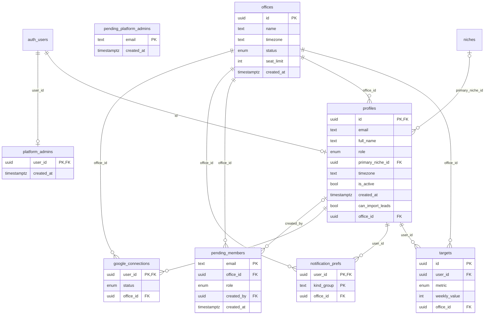
```mermaid
erDiagram
  offices {
    uuid id PK
    text name
    text timezone
    enum status
    int seat_limit
    timestamptz created_at
  }
  profiles {
    uuid id PK,FK
    text email
    text full_name
    enum role
    uuid primary_niche_id FK
    text timezone
    bool is_active
    timestamptz created_at
    bool can_import_leads
    uuid office_id FK
  }
  platform_admins {
    uuid user_id PK,FK
    timestamptz created_at
  }
  pending_members {
    text email PK
    uuid office_id FK
    enum role
    uuid created_by FK
    timestamptz created_at
  }
  pending_platform_admins {
    text email PK
    timestamptz created_at
  }
  targets {
    uuid id PK
    uuid user_id FK
    enum metric
    int weekly_value
    uuid office_id FK
  }
  notification_prefs {
    uuid user_id PK,FK
    text kind_group PK
    uuid office_id FK
  }
  google_connections {
    uuid user_id PK,FK
    enum status
    uuid office_id FK
  }
  auth_users ||--o| platform_admins : "user_id"
  auth_users ||--o| profiles : "id"
  niches |o--o{ profiles : "primary_niche_id"
  offices ||--o{ google_connections : "office_id"
  offices ||--o{ notification_prefs : "office_id"
  offices ||--o{ pending_members : "office_id"
  offices ||--o{ profiles : "office_id"
  offices ||--o{ targets : "office_id"
  profiles |o--o{ pending_members : "created_by"
  profiles ||--o{ google_connections : "user_id"
  profiles ||--o{ notification_prefs : "user_id"
  profiles ||--o{ targets : "user_id"
```

#### Sales: leads, activities, deals, meetings

Tables drawn without fields here are in another diagram (`auth_users` is Supabase Auth's `auth.users`): `activity_types`, `campaigns`, `channels`, `lead_sources`, `lost_reasons`, `niches`, `outcomes`, `profiles`, `stages`.

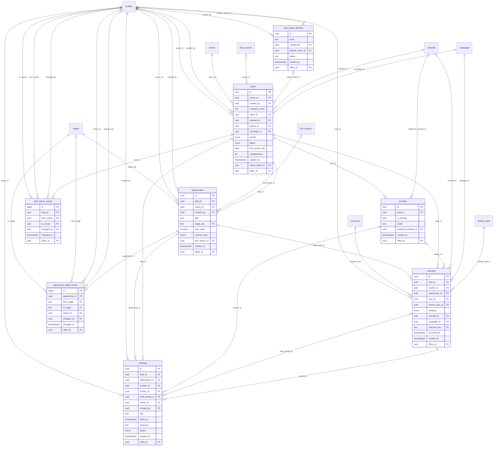
```mermaid
erDiagram
  leads {
    uuid id PK
    uuid owner_id FK
    uuid created_by FK
    text company_name
    uuid niche_id FK
    uuid channel_id FK
    uuid source_id FK
    uuid campaign_id FK
    enum priority
    enum status
    date next_action_due
    int completeness
    timestamptz created_at
    uuid import_batch_id FK
    uuid office_id FK
  }
  contacts {
    uuid id PK
    uuid lead_id FK
    bool is_primary
    text email
    uuid preferred_channel_id FK
    timestamptz created_at
    uuid office_id FK
  }
  activities {
    uuid id PK
    uuid lead_id FK
    uuid contact_id FK
    uuid opportunity_id FK
    uuid user_id FK
    uuid activity_type_id FK
    enum category
    uuid channel_id FK
    uuid campaign_id FK
    text outcome_key FK
    timestamptz occurred_at
    timestamptz created_at
    uuid office_id FK
  }
  opportunities {
    uuid id PK
    uuid lead_id FK
    uuid owner_id FK
    uuid created_by FK
    text title
    text stage_key FK
    numeric won_value
    enum contract_type
    uuid lost_reason_id FK
    timestamptz created_at
    uuid office_id FK
  }
  opportunity_stage_events {
    bigint id PK
    uuid opportunity_id FK
    text from_stage FK
    text to_stage FK
    uuid owner_id FK
    uuid changed_by FK
    timestamptz changed_at
    uuid office_id FK
  }
  lead_owner_events {
    bigint id PK
    uuid lead_id FK
    uuid from_owner FK
    uuid to_owner FK
    uuid changed_by FK
    timestamptz changed_at
    uuid office_id FK
  }
  meetings {
    uuid id PK
    uuid lead_id FK
    uuid opportunity_id FK
    uuid contact_id FK
    uuid activity_id FK
    uuid held_activity_id FK
    uuid owner_id FK
    uuid created_by FK
    text title
    timestamptz starts_at
    text timezone
    enum status
    timestamptz created_at
    uuid office_id FK
  }
  lead_import_batches {
    uuid id PK
    text code
    uuid created_by FK
    uuid default_owner_id FK
    text status
    timestamptz created_at
    uuid office_id FK
  }
  activities |o--o{ meetings : "activity_id"
  activities |o--o{ meetings : "held_activity_id"
  activity_types ||--o{ activities : "activity_type_id"
  campaigns |o--o{ activities : "campaign_id"
  campaigns |o--o{ leads : "campaign_id"
  channels |o--o{ activities : "channel_id"
  channels |o--o{ contacts : "preferred_channel_id"
  channels ||--o{ leads : "channel_id"
  contacts |o--o{ activities : "contact_id"
  contacts |o--o{ meetings : "contact_id"
  lead_import_batches |o--o{ leads : "import_batch_id"
  lead_sources |o--o{ leads : "source_id"
  leads ||--o{ activities : "lead_id"
  leads ||--o{ contacts : "lead_id"
  leads ||--o{ lead_owner_events : "lead_id"
  leads ||--o{ meetings : "lead_id"
  leads ||--o{ opportunities : "lead_id"
  lost_reasons |o--o{ opportunities : "lost_reason_id"
  niches ||--o{ leads : "niche_id"
  opportunities |o--o{ activities : "opportunity_id"
  opportunities |o--o{ meetings : "opportunity_id"
  opportunities ||--o{ opportunity_stage_events : "opportunity_id"
  outcomes ||--o{ activities : "outcome_key"
  profiles |o--o{ lead_import_batches : "default_owner_id"
  profiles |o--o{ lead_owner_events : "changed_by"
  profiles |o--o{ lead_owner_events : "from_owner"
  profiles |o--o{ opportunity_stage_events : "changed_by"
  profiles ||--o{ activities : "user_id"
  profiles ||--o{ lead_import_batches : "created_by"
  profiles ||--o{ lead_owner_events : "to_owner"
  profiles ||--o{ leads : "created_by"
  profiles ||--o{ leads : "owner_id"
  profiles ||--o{ meetings : "created_by"
  profiles ||--o{ meetings : "owner_id"
  profiles ||--o{ opportunities : "created_by"
  profiles ||--o{ opportunities : "owner_id"
  profiles ||--o{ opportunity_stage_events : "owner_id"
  stages |o--o{ opportunity_stage_events : "from_stage"
  stages ||--o{ opportunities : "stage_key"
  stages ||--o{ opportunity_stage_events : "to_stage"
```

#### Settings lists (per office)

Tables drawn without fields here are in another diagram (`auth_users` is Supabase Auth's `auth.users`): `profiles`.

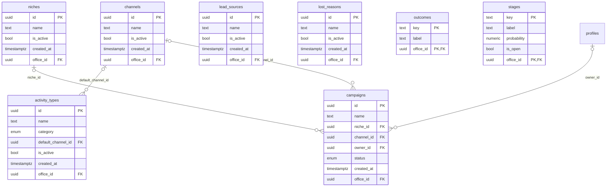
```mermaid
erDiagram
  niches {
    uuid id PK
    text name
    bool is_active
    timestamptz created_at
    uuid office_id FK
  }
  channels {
    uuid id PK
    text name
    bool is_active
    timestamptz created_at
    uuid office_id FK
  }
  lead_sources {
    uuid id PK
    text name
    bool is_active
    timestamptz created_at
    uuid office_id FK
  }
  lost_reasons {
    uuid id PK
    text name
    bool is_active
    timestamptz created_at
    uuid office_id FK
  }
  activity_types {
    uuid id PK
    text name
    enum category
    uuid default_channel_id FK
    bool is_active
    timestamptz created_at
    uuid office_id FK
  }
  outcomes {
    text key PK
    text label
    uuid office_id PK,FK
  }
  stages {
    text key PK
    text label
    numeric probability
    bool is_open
    uuid office_id PK,FK
  }
  campaigns {
    uuid id PK
    text name
    uuid niche_id FK
    uuid channel_id FK
    uuid owner_id FK
    enum status
    timestamptz created_at
    uuid office_id FK
  }
  channels |o--o{ activity_types : "default_channel_id"
  channels |o--o{ campaigns : "channel_id"
  niches |o--o{ campaigns : "niche_id"
  profiles |o--o{ campaigns : "owner_id"
```

#### Tasks, feed and notifications

Tables drawn without fields here are in another diagram (`auth_users` is Supabase Auth's `auth.users`): `campaigns`, `leads`, `meetings`, `niches`, `opportunities`, `posts`, `profiles`.

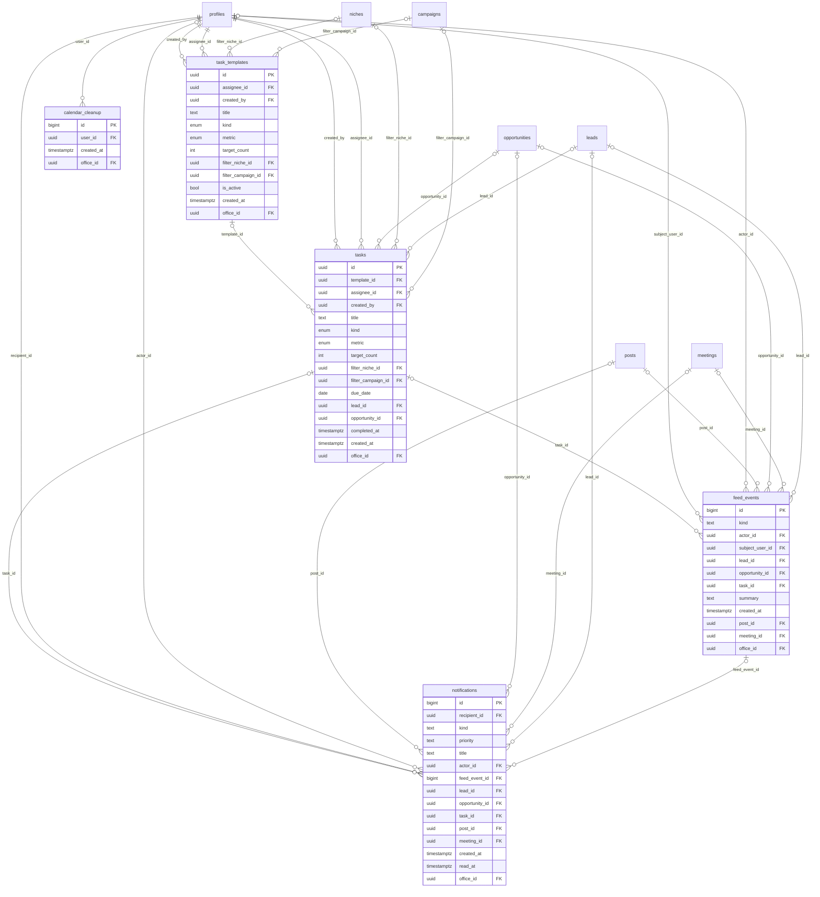
```mermaid
erDiagram
  task_templates {
    uuid id PK
    uuid assignee_id FK
    uuid created_by FK
    text title
    enum kind
    enum metric
    int target_count
    uuid filter_niche_id FK
    uuid filter_campaign_id FK
    bool is_active
    timestamptz created_at
    uuid office_id FK
  }
  tasks {
    uuid id PK
    uuid template_id FK
    uuid assignee_id FK
    uuid created_by FK
    text title
    enum kind
    enum metric
    int target_count
    uuid filter_niche_id FK
    uuid filter_campaign_id FK
    date due_date
    uuid lead_id FK
    uuid opportunity_id FK
    timestamptz completed_at
    timestamptz created_at
    uuid office_id FK
  }
  feed_events {
    bigint id PK
    text kind
    uuid actor_id FK
    uuid subject_user_id FK
    uuid lead_id FK
    uuid opportunity_id FK
    uuid task_id FK
    text summary
    timestamptz created_at
    uuid post_id FK
    uuid meeting_id FK
    uuid office_id FK
  }
  notifications {
    bigint id PK
    uuid recipient_id FK
    text kind
    text priority
    text title
    uuid actor_id FK
    bigint feed_event_id FK
    uuid lead_id FK
    uuid opportunity_id FK
    uuid task_id FK
    uuid post_id FK
    uuid meeting_id FK
    timestamptz created_at
    timestamptz read_at
    uuid office_id FK
  }
  calendar_cleanup {
    bigint id PK
    uuid user_id FK
    timestamptz created_at
    uuid office_id FK
  }
  campaigns |o--o{ task_templates : "filter_campaign_id"
  campaigns |o--o{ tasks : "filter_campaign_id"
  feed_events |o--o{ notifications : "feed_event_id"
  leads |o--o{ feed_events : "lead_id"
  leads |o--o{ notifications : "lead_id"
  leads |o--o{ tasks : "lead_id"
  meetings |o--o{ feed_events : "meeting_id"
  meetings |o--o{ notifications : "meeting_id"
  niches |o--o{ task_templates : "filter_niche_id"
  niches |o--o{ tasks : "filter_niche_id"
  opportunities |o--o{ feed_events : "opportunity_id"
  opportunities |o--o{ notifications : "opportunity_id"
  opportunities |o--o{ tasks : "opportunity_id"
  posts |o--o{ feed_events : "post_id"
  posts |o--o{ notifications : "post_id"
  profiles |o--o{ feed_events : "actor_id"
  profiles |o--o{ feed_events : "subject_user_id"
  profiles |o--o{ notifications : "actor_id"
  profiles ||--o{ calendar_cleanup : "user_id"
  profiles ||--o{ notifications : "recipient_id"
  profiles ||--o{ task_templates : "assignee_id"
  profiles ||--o{ task_templates : "created_by"
  profiles ||--o{ tasks : "assignee_id"
  profiles ||--o{ tasks : "created_by"
  task_templates |o--o{ tasks : "template_id"
  tasks |o--o{ feed_events : "task_id"
  tasks |o--o{ notifications : "task_id"
```

#### Social media module

Tables drawn without fields here are in another diagram (`auth_users` is Supabase Auth's `auth.users`): `campaigns`, `profiles`.

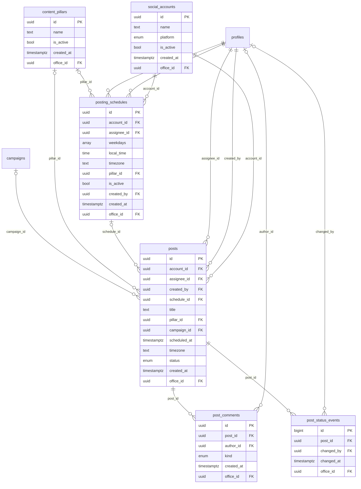
```mermaid
erDiagram
  social_accounts {
    uuid id PK
    text name
    enum platform
    bool is_active
    timestamptz created_at
    uuid office_id FK
  }
  content_pillars {
    uuid id PK
    text name
    bool is_active
    timestamptz created_at
    uuid office_id FK
  }
  posting_schedules {
    uuid id PK
    uuid account_id FK
    uuid assignee_id FK
    array weekdays
    time local_time
    text timezone
    uuid pillar_id FK
    bool is_active
    uuid created_by FK
    timestamptz created_at
    uuid office_id FK
  }
  posts {
    uuid id PK
    uuid account_id FK
    uuid assignee_id FK
    uuid created_by FK
    uuid schedule_id FK
    text title
    uuid pillar_id FK
    uuid campaign_id FK
    timestamptz scheduled_at
    text timezone
    enum status
    timestamptz created_at
    uuid office_id FK
  }
  post_comments {
    uuid id PK
    uuid post_id FK
    uuid author_id FK
    enum kind
    timestamptz created_at
    uuid office_id FK
  }
  post_status_events {
    bigint id PK
    uuid post_id FK
    uuid changed_by FK
    timestamptz changed_at
    uuid office_id FK
  }
  campaigns |o--o{ posts : "campaign_id"
  content_pillars |o--o{ posting_schedules : "pillar_id"
  content_pillars |o--o{ posts : "pillar_id"
  posting_schedules |o--o{ posts : "schedule_id"
  posts ||--o{ post_comments : "post_id"
  posts ||--o{ post_status_events : "post_id"
  profiles |o--o{ post_comments : "author_id"
  profiles |o--o{ post_status_events : "changed_by"
  profiles ||--o{ posting_schedules : "assignee_id"
  profiles ||--o{ posting_schedules : "created_by"
  profiles ||--o{ posts : "assignee_id"
  profiles ||--o{ posts : "created_by"
  social_accounts ||--o{ posting_schedules : "account_id"
  social_accounts ||--o{ posts : "account_id"
```

### 09 — Social media module (from `docs/09-social-media.md`)

#### 2. Data model

##### social_accounts
The brand accounts the SMM posts to. Founder manages; every active user can read.

| Field | Notes |
|---|---|
| name* | "BlueBugs LinkedIn page", "Zain personal LinkedIn" |
| platform* | linkedin_page, linkedin_profile, instagram, facebook, x, tiktok, youtube, other |
| profile_url | |
| audience_timezone* | IANA; default America/New_York; where the audience lives |
| is_active, sort_order, created_at | hide, don't delete |

##### content_pillars
A label list like niches (add, rename, reorder, hide). Defaults: Case study, Tip or how-to, Behind the
scenes, Offer, Industry news, Client result.

##### posting_schedules
Recurring slots, e.g. "LinkedIn page, Mon/Wed/Fri, 9:00 AM New York, assigned to Hina". Founder only;
the SMM can read their own.

| Field | Notes |
|---|---|
| account_id*, assignee_id* | |
| weekdays* | ISO 1–7 |
| local_time*, timezone* | timezone defaults from the account's audience_timezone |
| pillar_id, default_format | copied to each slot |
| needs_approval | default true |
| draft_lead_hours | default 24: draft is due this many hours before posting time |
| starts_on*, ends_on | |
| is_active, created_by, created_at | |

##### posts
One row per post.

| Group | Fields |
|---|---|
| Assignment | account_id*, assignee_id*, created_by, schedule_id (null if one-off) |
| Brief (founder) | title*, brief, pillar_id, format, campaign_id, needs_approval |
| Timing | scheduled_at (null only for ideas), timezone (display zone), draft_due_at (default scheduled_at − draft lead hours) |
| Status | idea, planned, drafting, in_review, changes_requested, approved, posted, missed, cancelled |
| Work (SMM) | caption, hashtags, first_comment, cta_link, media_links[] (Drive / Canva / Dropbox links; no uploads) |
| Posting | posted_at, post_url |
| Results (manual) | impressions, reactions, comments_count, shares, clicks, results_recorded_at |

Formats: text, image, carousel, video, reel, story, article, poll. Unique `(schedule_id, scheduled_at)`
where schedule_id is set.

##### post_comments
The review conversation: post_id, author_id, kind (comment, change_request, approval, status_note), body.

##### post_status_events
History written by trigger: post_id, from_status, to_status, changed_by, changed_at.

##### feed_events
New kinds: post_submitted, post_approved, changes_requested, post_published, post_missed, written by
triggers ("Hina submitted 'How AI intake cuts missed calls' for review").

### 11 — Offices (M13–M18) (from `docs/11-offices.md`)

#### 3. Data model changes

##### offices (new)
| Field | Notes |
|---|---|
| id | uuid |
| name | required, 1–80 characters. Shown in the sidebar and in invite emails. Not unique (two offices may share a name). |
| timezone | IANA name. Default time zone for new members of this office (replaces the hard-coded `Asia/Karachi`). |
| status | `active` or `suspended` |
| seat_limit | int, null = no limit. Counts **active** members, founder included. |
| suspended_at, created_at, updated_at | |

##### platform_admins (new)
`user_id` (primary key, references `auth.users`). The owner has no profile, so RLS gives them no office's data. Owners are created with `pnpm owner:add <email> [--cloud]` (`scripts/platform-owner.ts`): it reserves the email in `pending_platform_admins` (service-role only), then creates the account, and the sign-up trigger adds the `platform_admins` row. M14 made the existing founder an admin; M19 (`20261003000000_platform_owner.sql`) removed that.

##### pending_members (new)
A reservation made **before** an auth user is created, so the sign-up trigger knows which office and role the new person joins. Invite calls can't carry trusted data, so this table is how the office is passed.

| Field | Notes |
|---|---|
| email | primary key, stored lower-case |
| office_id | the office the person joins |
| role | `founder`, `bd` or `social` |
| created_by, created_at | |

- Founders can insert and delete rows for their own office, with role `bd` or `social` only. Platform admins create `founder` rows through `create_office`.
- The sign-up trigger reads the row and deletes it.

##### office_id on every business table
Every table except `offices`, `platform_admins` and `pending_members` gets `office_id uuid not null default current_office_id() references offices`. That covers:
- `profiles`
- the settings lists: niches, channels, lead_sources, lost_reasons, activity_types, outcomes, stages, campaigns, content_pillars, social_accounts
- the working tables: targets, leads, contacts, activities, opportunities, the history tables, tasks, task_templates, feed_events, posts, post_comments, post_status_events, posting_schedules, meetings, notifications, notification_prefs, google_connections, calendar_cleanup, lead_import_batches

Rows written by triggers copy `office_id` from the row that caused them. They never rely on the default, because triggers can run without a signed-in user.

##### Rows stay inside their office
The database refuses any row that points at a row in another office. For example, a lead in office A can't use a niche, campaign or owner from office B, and an activity can't point at a lead from another office.
- Row Level Security (RLS) doesn't protect this on its own: foreign-key checks skip RLS.
- Every business table has one trigger, `zz_office_refs` (function `office_refs()`), built from its single-column foreign keys. It:
  - fills `office_id` from the first parent row when it's empty (rows written without a signed-in user)
  - refuses a row whose parents are in another office: "Rows must stay inside one office"
  - refuses changing a row's office
- Stage and outcome references are composite foreign keys, `(office_id, stage_key)` and `(office_id, outcome_key)`, so they can only use the same office's rows.

##### Uniqueness becomes per office
| Was | Becomes |
|---|---|
| one founder in the whole database (`profiles_single_founder`) | one founder per office |
| list names unique (niches, channels, lead_sources, lost_reasons, campaigns, content_pillars, …) | unique per `(office_id, name)` |
| `stages.key`, `outcomes.key` primary keys | primary key `(office_id, key)`; references to them include `office_id` |

Stage and outcome **keys and flags are identical in every office**, because the code relies on them. Only labels and probabilities differ.

`lead_import_batches.code` stays unique across the whole app. Its number means nothing to an office.

##### Default settings for a new office
`create_office` inserts the defaults from docs/02 section 3 for the new office:
- niches, channels, lead sources, lost reasons, activity types, outcomes, stages
- the hidden **CSV import** lead source

Today these rows are inserted once by the first migration. Move them into one function that both the migration and `create_office` use.

##### Indexes
Large tables (leads, contacts, activities, opportunities, feed_events, notifications, tasks, posts, meetings) get indexes that start with `office_id`, matching how screens filter.

### 02 — Data model (from `docs/02-data-model.md`)

The migration `supabase/migrations/20260924000000_init.sql` is the source of truth. This page explains it.

From M14 every table below also has `office_id`, and every rule applies within one office. Offices, platform admins, pending members and the office boundary are in `docs/11-offices.md` section 3.


#### 1. Map

```
profiles (team) ──< leads ──< contacts
                     │  └──< activities >── activity_types, outcomes
                     │  └──< opportunities ──< opportunity_stage_events
                     │  └──< lead_owner_events
profiles ──< tasks (optionally linked to a lead or opportunity)
profiles ──< task_templates (repeat on weekdays) ──> tasks
profiles ──< targets
settings lists: niches, channels, lead_sources, lost_reasons, activity_types, outcomes, stages, campaigns
feed_events: written by triggers; founder reads
```


#### 2. Conventions

- Primary keys are UUIDs (history tables use bigint identity).
- All timestamps are `timestamptz` in UTC.
- `next_action_due` and `tasks.due_date` are plain **dates in the owner's or assignee's time zone**.
- Money is `numeric(12,2)` in USD.
- Phones are stored in E.164 format (`+15125550100`) and displayed nicely.
- Nothing that feeds a report is hard-deleted by BDs. Lists are hidden (`is_active = false`), never deleted.


#### 3. Tables

##### profiles
One row per team member, created automatically when an auth user is created.

| Field | Notes |
|---|---|
| id | = auth user id |
| email, full_name | |
| office_id | (M14) the member's office; one office per person |
| role | `founder`, `bd` or `social`. One founder per office, created with the office (docs/11). |
| primary_niche_id | Pre-fills the niche on new leads |
| timezone | IANA name, e.g. `Asia/Karachi`. Drives "today" for this user. |
| is_active, deactivated_at | Deactivated users can't read anything (RLS) and are banned in Auth |

##### Settings lists
| Table | Editable by founder | Default values |
|---|---|---|
| niches | add, rename, reorder, hide | AI SaaS, Dental, Law, Agency Partnerships |
| channels | same | LinkedIn, Email, Upwork, Phone, Referral |
| lead_sources | same | Manual research, LinkedIn Sales Navigator, Apollo, Google Maps, Upwork job post, Referral, Inbound, Other |
| lost_reasons | same | Price, Went with someone else, No response, Not a fit, Timing, Other |
| activity_types | same, plus pick a **category** and default channel | see below |
| outcomes | **label only** | see below |
| stages | **label and probability only** | see below |
| campaigns | add, edit, set status (active/paused/completed) | none |

**Activity types and categories.** The category is what the metrics count; the name is just a label.

| Default type | Category | Default channel |
|---|---|---|
| LinkedIn connection request | outreach | LinkedIn |
| LinkedIn message | outreach | LinkedIn |
| Cold email | outreach | Email |
| Upwork proposal | outreach | Upwork |
| LinkedIn follow-up | follow_up | LinkedIn |
| Email follow-up | follow_up | Email |
| Upwork follow-up | follow_up | Upwork |
| Reply received | inbound_reply | lead's channel |
| Phone call | call | Phone |
| Meeting held | meeting | lead's channel |
| Proposal sent | proposal | lead's channel |
| Other | other | lead's channel |

**Outcomes.** Keys and flags are fixed; the label can be renamed. The last column limits which outcomes the log form offers for each category.

| key | Label | Reply | Positive | Meeting | Allowed for |
|---|---|---|---|---|---|
| no_response | No response | – | – | – | outreach, follow_up, call, proposal, other |
| bounced | Bounced / wrong contact | – | – | – | outreach, follow_up, call |
| interested | Interested | ✓ | ✓ | – | inbound_reply, call, meeting, proposal, other |
| not_now | Not now | ✓ | – | – | inbound_reply, call, meeting, proposal, other |
| not_interested | Not interested | ✓ | – | – | inbound_reply, call, meeting, proposal, other |
| meeting_booked | Meeting booked | ✓ | ✓ | ✓ | inbound_reply, call, other |
| done | Done | – | – | – | meeting, proposal, other |

"Done" is the neutral outcome for a meeting held or a proposal sent when nothing else applies.

**Stages.**

| key | Label | Probability | Open |
|---|---|---|---|
| qualified | Qualified | 20% | ✓ |
| meeting_done | Meeting done | 40% | ✓ |
| proposal_sent | Proposal sent | 60% | ✓ |
| negotiation | Negotiation | 75% | ✓ |
| won | Won | 100% | – |
| lost | Lost | 0% | – |

##### campaigns
name (unique), niche, channel, owner (optional), status, notes. BDs pick a campaign on a lead (optional). Activities copy the lead's campaign automatically.

##### targets
`(user_id, metric, weekly_value)`, one row per person per metric. Metrics: leads_added, outreach, follow_ups, replies, meetings_booked, proposals_sent. How targets become daily or range targets is in `docs/05-metrics.md`.

##### leads
A company being pursued by one owner.

| Group | Fields |
|---|---|
| Ownership | owner_id (current owner), created_by (who added it; gets credit for "leads added" forever) |
| Company | company_name*, website, domain (auto from website), company_linkedin_url, company_phone, company_email, sub_niche, company_size (1-10, 11-50, 51-200, 201-500, 500+) |
| Location | address, city, state_region, country (default United States), lead_timezone (the prospect's local time zone) |
| Online presence | google_maps_url, google_rating (0–5), google_review_count, upwork_job_url |
| Classification | niche_id*, channel_id*, source_id, campaign_id, priority (high/medium/low), tags[] |
| Sales context | pain_point, offer, notes |
| Status | status (automatic, see docs/04), next_action, next_action_due |
| Derived | last_activity_at, completeness (0–100), created_at, updated_at |

`*` = required by the database. The app requires more; see docs/04, section 2.

##### contacts
People at the lead's company. A lead has at least one (enforced by the app when creating the lead); exactly one can be primary.

first_name*, last_name, job_title, is_decision_maker, is_primary, email, email_status (unverified / valid / invalid / bounced), secondary_email, phone, mobile_phone, linkedin_url, other_social_url, preferred_channel_id, notes.

##### activities
lead_id*, contact_id, opportunity_id, user_id (who did it; defaults to the caller), activity_type_id*, category (copied from the type), channel_id (defaults from the type, else the lead), campaign_id (defaults from the lead), outcome_key*, occurred_at (default now; can be backdated), notes.

Create activities with the RPC `log_activity(...)`. It inserts the activity and updates the lead's next action in one transaction.

##### opportunities
lead_id*, owner_id (always the lead's owner), created_by, title* (the offer), stage_key, estimated_value, expected_close_date, stage_changed_at, notes.

- **Won fields:** won_value and contract_type (both required to enter Won), monthly_amount, won_at (auto), contract_ended_at (set by hand when a monthly contract stops).
- **Lost fields:** lost_reason_id (required to enter Lost), lost_note, lost_at (auto).

A lead can have several opportunities over time (a website job first, AI intake later).

##### History tables (written by triggers, read-only)
- `opportunity_stage_events`: every stage change, with the owner at that moment. Meetings done and proposals sent are counted from here.
- `lead_owner_events`: every ownership change, including the first owner.
- `feed_events`: the live feed. kind, actor, subject_user (whose work it is), lead/opportunity/task links, summary.

##### Tasks
- `task_templates`: repeat-on-weekdays definitions. Kind is count or checklist.
- `tasks`: one row per assignee per day.

| Field | Notes |
|---|---|
| kind | count, checklist or lead_fix |
| metric, target_count | count tasks only. Metrics: leads_added, outreach, follow_ups, replies, meetings_booked |
| filter_niche_id, filter_campaign_id | count tasks: only count matching work |
| due_date | the assignee's local date |
| lead_id, opportunity_id | optional links; lead_fix requires lead_id |
| completed_at | set automatically for count tasks, by the BD for the others |
| template_id | set when created from a template; unique per template and day |


#### 4. Database functions the app calls

| Function | Use |
|---|---|
| `log_activity(p_lead_id, p_activity_type_id, p_outcome_key, p_occurred_at, p_contact_id, p_opportunity_id, p_notes, p_next_action, p_next_action_due, p_clear_next_action)` | Log activity and set or clear the next action |
| `ensure_recurring_tasks(p_user, p_day)` | Create a day's repeating tasks. Call when My Day or Tasks loads. Safe to repeat. |
| `tasks_with_progress(p_from, p_to, p_assignee?)` | Tasks with live progress and status (open / done / overdue) |
| `metrics_scoreboard(p_from, p_to)` | One row per person |
| `metrics_by_dimension(p_from, p_to, 'niche' \| 'channel' \| 'campaign', p_user?)` | Breakdown |
| `metrics_daily(p_from, p_to, p_tz, p_user?)` | Consistency grid |
| `pipeline_summary(p_user?, p_stuck_days?)` | Current pipeline by stage |
| `active_mrr(p_user?)` | Current monthly recurring revenue |

All of these respect RLS. A BD calling them gets only their own numbers.


#### 5. Things handled automatically by triggers

- A profile is created on sign-up, in the office and role reserved in `pending_members` (docs/11 section 5). No reservation, no account.
- `domain` is derived from `website`.
- `completeness` is recalculated when lead or contact fields change.
- Lead status changes after each activity and opportunity change.
- Stage history, ownership history, and moving open opportunities with a reassigned lead.
- Won and lost timestamps, and clearing won fields when an opportunity is lost.
- Count tasks are marked complete when they reach their target.
- Feed events.


#### 6. Social media module (M10)

Added by `20260925000000_social_enums.sql` (enum values) and `20260925000100_social_module.sql`.
Full field lists and rules are in `docs/09-social-media.md`, section 2.

| Table | Purpose |
|---|---|
| social_accounts | Brand accounts the SMM posts to: name, platform, profile URL, audience time zone, hide |
| content_pillars | Topic label list (hide, never delete) |
| posting_schedules | Recurring slots: account, assignee, weekdays, local time + time zone, pillar, format, needs approval, draft lead hours, start/end |
| posts | One post: brief (founder), work fields (SMM), status, scheduled/draft-due/posted times, live link, manual results |
| post_comments | Review thread: comment, change request, approval, status note |
| post_status_events | Every status change (trigger) |

- New role value `social` on `user_role`; new metric `posts_published` on `task_metric` and `target_metric`.
- `feed_events.kind` adds post_submitted, post_approved, changes_requested, post_published, post_missed.
- New functions: `current_user_role()`, `ensure_post_slots(p_from, p_to)`, `mark_missed_posts()`,
  `request_post_changes(p_post, p_body)`, `social_metrics(p_from, p_to, p_user?)`.
- `metrics_scoreboard` and `metrics_daily` now exclude SMMs; `count_task_progress` counts posts_published.


#### 7. Meetings, notifications and Google Calendar (M11)

Added by `20260929000100_google_calendar.sql`, `20260929000200_meetings.sql` and `20260929000300_notifications.sql`.
Full field lists and rules are in `docs/10-meetings-notifications.md`.

| Table | Purpose |
|---|---|
| meetings | A booked meeting: lead, contact, exact start (UTC) + its time zone, duration, location or link, agenda, reminders, status (scheduled, held, no_show, cancelled) and Google sync state. Owner follows the lead. |
| notifications | "What happened" items, one row per recipient, written by a trigger on feed_events. Only `read_at` can change. |
| notification_prefs | Per user and group (meetings, deals, leads, tasks, social): in app on/off, browser alert on/off. |
| google_connections | One per user: Google email, calendar, encrypted refresh token (never selectable), status, auto-add. |
| calendar_cleanup | Calendar events the old owner's session must delete (after reassignment or lead deletion). |

Also: `profiles.meeting_reminders` (default reminders), `feed_events.meeting_id`, and new feed kinds `meeting_booked`, `meeting_rescheduled`, `meeting_cancelled`, `meeting_held`, `meeting_no_show`, `task_assigned`, `post_assigned`, `post_comment`.
Functions: `book_meeting`, `my_google_token`, `save_google_connection`, `mark_google_needs_reconnect`, `team_calendar_status`, `prune_my_notifications`.


#### 8. CSV lead import (M12)

##### profiles.can_import_leads
Boolean, default false. The founder turns it on per BD; only the founder can change it (`guard_profile_update`). `can_import_leads()` is true for the founder, or an active BD with the flag.

##### lead_import_batches
One row per uploaded file: the audit log and the staging area.

| Column | Notes |
|---|---|
| `code` | `IMP-2026-00124`, from a sequence |
| `created_by`, `created_by_role` | who uploaded (role recorded from the profile) |
| `filename`, `file_sha256` | the file, to spot the same file imported twice |
| `default_owner_id` | owner for rows without an Owner email |
| `status` | `validated` → `imported`, `failed` or `cancelled` |
| `total_rows`, `valid_rows`, `invalid_rows`, `duplicate_rows`, `warning_count`, `imported_rows` | counts |
| `errors` (jsonb, first 200), `error_summary` | what was wrong |
| `rows` (jsonb) | the validated, normalised rows; cleared after import or failure |
| `expires_at` | 30 minutes after upload |

RLS: read your own (founder: all); insert only with `can_import_leads()`; updates only as allowed by `guard_import_batch_update` (validated → failed / cancelled by the owner; → imported only inside `import_lead_batch`). At most 10 uploads per person per 10 minutes.

##### leads.import_batch_id
Null for leads added by hand. Imported leads also get the source **CSV import** (a hidden `lead_sources` row).

##### Functions
- `import_conflicts(batch)`: rows that match an existing lead of the same owner (docs/04 section 10).
- `import_lead_batch(batch)`: the import. One transaction; returns the number of leads.


#### 9. Offices (M13–M18)

`offices`, `platform_admins`, `pending_members`, `office_id` on every table, per-office uniqueness, default settings per office and the new functions (`current_office_id`, `create_office`, `admin_office_summary`) are specified in `docs/11-offices.md` section 3.

## 6. Business rules

These rules are enforced in the database (triggers, checks and RLS) and mirrored in the UI with Zod. Don't re-implement a database rule in TypeScript (CLAUDE.md rule 4).

### Lead status (automatic)

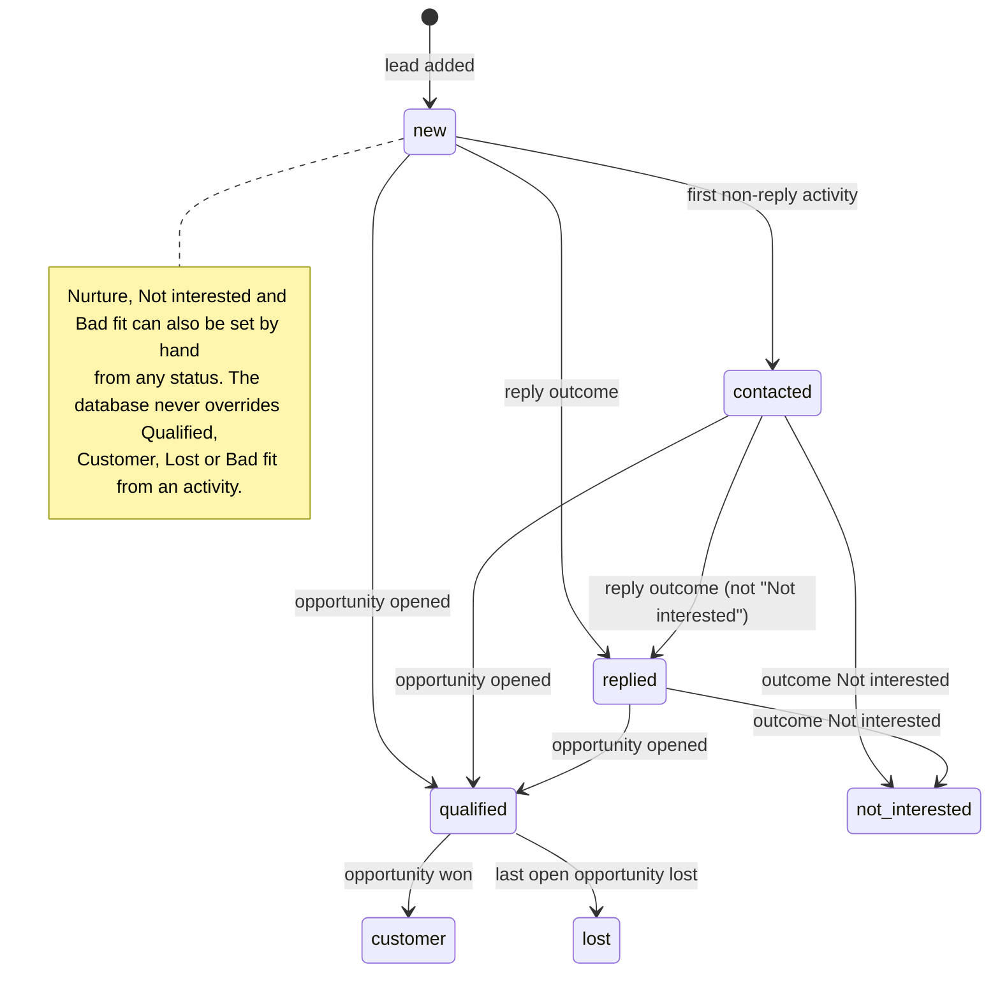
```mermaid
stateDiagram-v2
  [*] --> new: lead added
  new --> contacted: first non-reply activity
  new --> replied: reply outcome
  contacted --> replied: reply outcome (not "Not interested")
  new --> qualified: opportunity opened
  contacted --> qualified: opportunity opened
  replied --> qualified: opportunity opened
  qualified --> customer: opportunity won
  qualified --> lost: last open opportunity lost
  contacted --> not_interested: outcome Not interested
  replied --> not_interested: outcome Not interested
  note right of new
    Nurture, Not interested and Bad fit can also be set by hand
    from any status. The database never overrides Qualified,
    Customer, Lost or Bad fit from an activity.
  end note
```

The exact rules are in "2. Lead statuses" below. The diagram shows the automatic moves.

### Pipeline stages

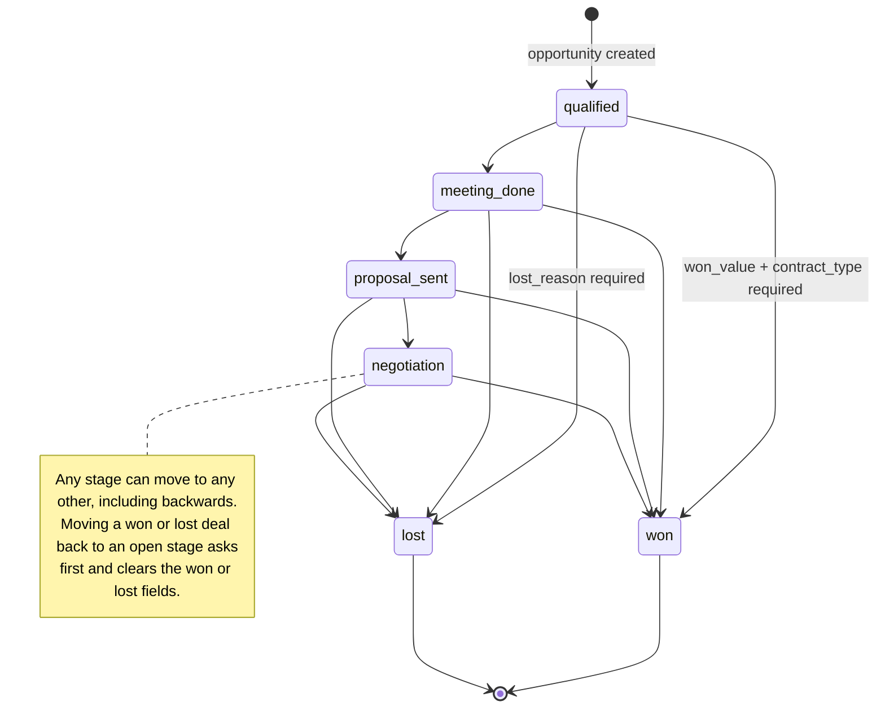
```mermaid
stateDiagram-v2
  [*] --> qualified: opportunity created
  qualified --> meeting_done
  meeting_done --> proposal_sent
  proposal_sent --> negotiation
  qualified --> won: won_value + contract_type required
  meeting_done --> won
  proposal_sent --> won
  negotiation --> won
  qualified --> lost: lost_reason required
  meeting_done --> lost
  proposal_sent --> lost
  negotiation --> lost
  won --> [*]
  lost --> [*]
  note right of negotiation
    Any stage can move to any other, including backwards.
    Moving a won or lost deal back to an open stage asks
    first and clears the won or lost fields.
  end note
```

Every stage change writes `opportunity_stage_events`, with the owner at that moment. "Meetings done" and "proposals sent" are counted from those events.

### Count tasks complete themselves

```mermaid
sequenceDiagram
  participant BD
  participant DB as Postgres
  BD->>DB: log_activity / insert lead
  DB->>DB: trigger → check_count_tasks(user, time)
  DB->>DB: count_task_progress(task) ≥ target_count?
  alt reached
    DB->>DB: tasks.completed_at = now()
    DB->>DB: feed_events 'task_completed' → notification to founder
  end
```

### Activity feed and notifications

```mermaid
flowchart LR
  L[lead / activity / opportunity /<br/>task / post / meeting change] -->|trigger| FE[(feed_events)]
  FE -->|route_feed_event trigger| N[(notifications<br/>one row per recipient)]
  FE -->|Realtime| FD[Founder's /feed]
  N -->|Realtime| BELL[Bell + /notifications]
```

Other rules in the sections below: the completeness score (0–100, recomputed by triggers), validation and clean-up, duplicate warnings, reassignment, deleting, time zones (today and this week use the viewer's profile time zone), CSV import, posts (status flow, missed posts, schedules), meetings and notifications.

### Post status (social module)

```mermaid
stateDiagram-v2
  [*] --> idea: SMM suggests an idea
  [*] --> planned: founder or a schedule creates
  idea --> planned: founder schedules it
  planned --> drafting: assignee
  drafting --> in_review: assignee submits
  drafting --> posted: only if no approval needed
  in_review --> approved: founder
  in_review --> changes_requested: founder, with a comment
  changes_requested --> drafting: assignee
  changes_requested --> in_review: assignee
  approved --> posted: live link added
  approved --> in_review: caption edited after approval
  planned --> missed: 2h past, not posted
  drafting --> missed
  in_review --> missed
  changes_requested --> missed
  approved --> missed
  missed --> posted: posted late
  posted --> [*]
  note right of planned
    The founder can cancel a post from any status.
  end note
```

### Meeting status

```mermaid
stateDiagram-v2
  [*] --> scheduled: Meeting booked outcome
  scheduled --> scheduled: reschedule
  scheduled --> held
  scheduled --> no_show
  scheduled --> cancelled: reason required
  held --> scheduled: undo
  no_show --> scheduled: undo
```

### Suggested activity types (Log activity → Type)

The Type list shows first the types that fit where the lead is. Every other active type stays available under a collapsible **More types (N)** row at the bottom of the list. **Nothing is disabled or refused**: any type can still be logged, and the database doesn't check this.

- **Stage** = the lead's status, except that a lead with an upcoming scheduled meeting counts as **Meeting booked**. Customer, Lost, Not interested and Bad fit are never overridden.
- **Order:** suggested types are grouped by category, in the order below. The default type is the first suggested one.
- **More types:** choosing it expands or collapses the list in place; it never becomes the value. A type picked from More joins the suggested part, so the field keeps its name when the list collapses.
- **Code:** `src/lib/activity-suggestions.ts` (`leadStage`, `SUGGESTED_CATEGORIES`, `splitTypesByStage`, unit-tested in `tests/unit/activity-suggestions.test.ts`). `getLeadForLog` returns `hasUpcomingMeeting`.

| Stage | Suggested categories (shown first, in this order) | Under More types |
|---|---|---|
| New | outreach, call, other | follow-up, inbound reply, meeting, proposal |
| Contacted | follow-up, outreach, inbound reply, call, other | meeting, proposal |
| Replied | follow-up, inbound reply, call, meeting, proposal, other | outreach |
| Meeting booked (upcoming meeting) | meeting, call, follow-up, inbound reply, other | outreach, proposal |
| Qualified | proposal, follow-up, call, meeting, inbound reply, other | outreach |
| Nurture | follow-up, inbound reply, call, other | outreach, meeting, proposal |
| Customer, Lost, Not interested, Bad fit | follow-up, call, inbound reply, other | outreach, meeting, proposal |

```mermaid
flowchart TD
  O[Open Log activity] --> S{Lead stage}
  S -->|status, or Meeting booked<br/>when a meeting is ahead| G[Suggested types first]
  G --> M[More types row]
  M -->|choose it| X[Expand or collapse<br/>the other types]
  G -->|pick| V[Type set]
  X -->|pick| V
  V --> OC[Outcome list follows the type's category]
```

### Client Acquisition OS: what's built and how to walk through it (from `docs/UI-WALKTHROUGH.md`)

#### 5. Things the app does by itself (worth noticing)

- **Lead status** changes from what's logged (New → Contacted → Replied → Qualified → Customer / Lost).
  It never overrides Qualified, Customer, Lost or Bad fit because of an activity.
- **Completeness** is recalculated whenever a lead or contact changes.
- **Count tasks** tick themselves the moment the number is reached, and post to the Feed.
- **Reassigning a lead** moves its open opportunities with it; won or lost ones stay credited to the original owner.
- **Time zones**: "today", "overdue" and "this week" follow each person's own time zone. Log in as Bilal
  (Berlin) to see dates that differ from Karachi late in the evening.
- **Numbers** on My Day and Performance all come from the database's metric functions, so every
  screen agrees.

---

### 09 — Social media module (from `docs/09-social-media.md`)

#### 3. Rules

##### Status flow (DB)

| From | To | Who |
|---|---|---|
| idea | planned | founder (schedules it) |
| planned | drafting | assignee |
| drafting | in_review | assignee; needs a caption, or media links for image, carousel, video, reel |
| in_review | approved / changes_requested | founder only, never the assignee; a change request needs a `change_request` comment |
| changes_requested | drafting / in_review | assignee |
| approved | posted | assignee |
| drafting | posted | assignee, only when needs_approval is false |
| missed | posted | assignee ("posted late") |
| any | cancelled | founder |

The founder may also make any of the assignee's moves (to help out), except approving counts as the
founder's review.

##### Who edits what (DB)
- Only the founder creates posts, except that an SMM may create `idea` posts assigned to themself
  (**Suggest an idea**).
- Only the founder changes account, assignee, scheduled time, needs approval, brief and title.
- The SMM edits caption, hashtags, first comment, CTA link, media links and results, and moves status
  along the flow above.
- Editing the caption of an approved post that needs approval moves it back to in_review with an
  automatic status note.

##### Posting (DB)
- **Mark as posted** needs the live post URL. posted_at defaults to now and can be backdated up to 24h.
- **On time** = posted_at ≤ scheduled_at + 60 minutes. Otherwise late.

##### Missed (DB)
- `mark_missed_posts()` (security definer, idempotent) sets `missed` on posts 2 hours past their
  scheduled time that aren't posted, cancelled or ideas, with one `post_missed` feed event per post.
- No background jobs: Content, My Day, Performance and Feed call it on load.

##### Recurring schedules (DB)
- `ensure_post_slots(p_from, p_to)` (security definer, idempotent) creates `planned` posts for every
  active schedule on each matching weekday, at local_time in the schedule's time zone (DST-correct).
  - Title "<Account> post, <pillar or 'Open topic'>"; pillar, format and needs approval copied;
    draft_due_at = scheduled_at − draft lead hours.
  - Callers: the founder (all schedules) or an SMM (their own). Content calls it for the visible range,
    capped at 28 days ahead.
- Editing a schedule changes future, untouched (planned) slots only. Stopping a schedule cancels its
  future planned slots.

##### Time zones (App)
Always show both: "Tue 30 Sep, 9:00 AM New York (6:00 PM your time)". Helpers live in `lib/dates.ts`.

##### Character limits (App, warning only)
X 280, LinkedIn 3,000, Instagram 2,200, Facebook 63,206, TikTok 2,200, YouTube 5,000 (in
`lib/social.ts`; verify current limits). The counter turns amber at 90% and red above the limit.

### 04 — Business rules (from `docs/04-business-rules.md`)

Rules marked **(DB)** are already in the migration; the app only has to respect them. Rules marked **(App)** must be built in TypeScript.


#### 1. Lead entry: what a BD must record

The app's goal is detailed leads, so the form asks for a lot but requires only what makes a lead workable.

##### Required to save (App, Zod)
| Field | Rule |
|---|---|
| Company name | 2–120 characters, trimmed |
| Niche | from list; pre-filled with the user's primary niche |
| Channel | from list |
| Primary contact first name | 1–60 characters |
| One way to reach them | at least one of: contact email, contact phone or mobile, contact LinkedIn URL, company phone, or (channel = Upwork) Upwork job URL |

##### Validation and clean-up (App, before saving)
| Field | Clean-up | Valid when |
|---|---|---|
| Website | trim; add `https://` if missing; lowercase host | parses as URL with a dot in the host |
| Company LinkedIn | strip query string and trailing slash; force `https://www.linkedin.com/company/<slug>` | path starts with `/company/` or `/school/` |
| Contact LinkedIn | same; force `https://www.linkedin.com/in/<slug>` | path starts with `/in/` |
| Emails | trim, lowercase | standard email pattern |
| Phones | any format is accepted. If libphonenumber-js recognises it as valid for the lead country (US if blank), store E.164; otherwise keep it as typed | none (never blocks saving) |
| Google Maps URL | trim | host contains `google.` or `goo.gl` or `maps.app.goo.gl` |
| Upwork job URL | trim | host ends with `upwork.com` |
| Google rating | one decimal | 0.0–5.0 |
| Review count | integer | ≥ 0 |
| Tags | trim, lowercase, dedupe; max 10, 30 chars each | |
| Lead time zone | suggest from US state when set (TX → America/Chicago, CA → America/Los_Angeles, etc.); user can change | valid IANA name |

Show errors inline under each field. On save, keep the user's view and show a toast: "Lead saved".

##### Duplicate warning (App)
While typing company name or website, check the user's own leads (RLS already limits the search) for:
- the same `domain`, or
- a case-insensitive exact company name match, or
- the same contact email or LinkedIn URL.

If found, show an inline notice: "You already have Bright Smile Dental (Contacted)." Offer **Open lead** or **Add anyway**. Never search or reveal other users' leads. Duplicates across BDs are allowed by design.

##### Completeness score (DB)
Ten checks, 10 points each, recalculated automatically:

1. Website
2. Company LinkedIn
3. City **and** state/region
4. Pain point
5. Lead source
6. Primary contact job title
7. Primary contact LinkedIn
8. Primary contact email
9. Primary contact phone or mobile
10. At least one contact marked decision maker

In the form, show a live meter computed with the same rules in TypeScript (`lib/completeness.ts`, unit-tested to match the SQL). List the missing items under the meter as plain links that focus the field, e.g. "Add a job title".

Colors: under 50% red, 50–79% amber, 80% or more green.


#### 2. Lead statuses

| Status | Meaning | Set by |
|---|---|---|
| New | Added, nothing done yet | default |
| Contacted | At least one outbound touch | DB, first non-reply activity on a New lead |
| Replied | They answered (any reply outcome except Not interested) | DB |
| Qualified | Has an open opportunity | DB, when an opportunity is created or moved to an open stage |
| Customer | Has a won opportunity | DB |
| Lost | Its only opportunity was lost | DB, when the last open opportunity is lost |
| Nurture | Not now; revisit later | BD by hand |
| Not interested | Said no | DB (outcome Not interested) or BD by hand |
| Bad fit | Wrong target | BD by hand |

The database never automatically overrides Qualified, Customer, Lost or Bad fit from an activity. A BD can always set any status by hand, and the next matching event may change it again.


#### 3. Logging activities

- One form everywhere: **Type**, **Outcome** (only the outcomes allowed for that type's category), **Contact** (defaults to primary), **When** (defaults to now; can backdate up to 7 days), **Notes**, **Next action** (text + date).
- **Outcome defaults:**
  - outreach and follow-up types default to No response
  - Reply received defaults to Interested
  - Meeting held and Proposal sent default to Done
- **Next action is required** unless the user ticks "No next step" or the outcome is Not interested or Bounced. Quick date chips: Tomorrow, +3 days, +1 week, Pick date. Dates are the user's local dates.
- **When the outcome is Meeting booked** and the lead has no open opportunity, show a dialog after saving: "Create an opportunity for Bright Smile Dental?" with title and estimated value, and **Create** / **Not now** buttons.
- **Logging "Proposal sent"** on a lead with one open opportunity offers to move it to Proposal sent.
- **Editing and deleting:**
  - BDs can edit their own activities' notes, outcome and time for 24 hours, then they're locked (App).
  - Only the founder can delete activities (DB).


#### 4. Opportunities

- Created from a lead: button on the lead page, or the dialog above. Title and estimated value are required; expected close date is optional.
- One lead can have several opportunities, but only one with the same title can be open at a time (App).
- **Moving stages:** drag on the board, or pick in the lead page's stage selector. Any stage can move to any stage, including backwards. Every move is recorded (DB).
- **Won** requires final value (defaults to the estimate), contract type, and monthly amount if monthly (DB enforces value and type).
- **Lost** requires a reason (DB).
- Moving a Won or Lost card back to an open stage asks for confirmation: "This will remove it from won revenue." Won or lost fields are cleared (DB).
- **Days in stage** = today − stage_changed_at. **Stuck** = open and in the same stage for 14+ days; shown with an amber clock icon.


#### 5. Reassignment (founder)

- From a lead: *Owner* dropdown. From the leads list: select rows → *Reassign*. From Team: *Reassign open leads* (all leads not Customer, Lost, Not interested or Bad fit).
- Open opportunities move with the lead (DB). Won or lost ones stay with the original owner, so revenue credit doesn't move.
- Past activities keep their original user, so credit for past work doesn't move.
- The next action and its due date stay; the new owner sees them on My Day.


#### 6. Tasks

##### Kinds
| Kind | Created by | Completed by | Example |
|---|---|---|---|
| Count | founder | automatically when progress ≥ target | "Add 25 dental leads" |
| Checklist | founder | assignee ticks it | "Draft proposal for Hartman & Cole" |
| Lead fix | founder, via **Flag lead** | assignee ticks it after fixing | "Need owner's name, not front desk" |

##### Count task metrics
| Metric | Counts (for the assignee, on the due date, in their time zone) |
|---|---|
| Leads added | leads they created |
| Outreach | activities in the outreach category |
| Follow-ups | activities in the follow_up category |
| Replies | activities with a reply outcome |
| Meetings booked | activities with outcome Meeting booked |

Optional filters: niche, campaign. Progress is live. Completion is permanent. If an activity is later deleted, the task stays done.

##### Repeating
- "Repeat on weekdays" stores a template. Each weekday (Mon–Fri in the assignee's time zone), a task is created when the assignee opens My Day or the founder opens Tasks. The app calls `ensure_recurring_tasks` for the viewed date.
- No tasks on Saturday or Sunday.
- Stopping repetition deactivates the template. Already-created tasks stay.
- Editing a template changes future days only.

##### Status
- **Done:** completed_at set. "On time" if completed on or before the due date in the assignee's time zone.
- **Overdue:** not done, and the due date is before the assignee's today.
- **Open:** otherwise.

Overdue tasks stay on My Day at the top until done or deleted by the founder.

##### Suggested task library (Tasks → New task → "Start from a common task")
Pre-filled forms the founder can adjust:
1. Add N new leads (count, leads added), daily
2. Send N first-touch messages (count, outreach), daily
3. Follow up with N leads (count, follow-ups), daily
4. Book N meetings (count, meetings booked), weekly focus
5. Research a lead before a call (checklist, linked lead)
6. Prepare proposal (checklist, linked opportunity)
7. Clean up leads with no next action (checklist; the task page lists the user's open leads with no next action)
8. Update stuck deals (checklist; lists their opportunities stuck 14+ days)


#### 7. Flag lead (founder)

On any lead: **Flag lead** → note (required). This creates a lead-fix task for the lead's owner, due today in their time zone, linked to the lead (DB writes a feed event). The lead shows a red flag badge until the task is done. The flag count per BD appears in Performance as a data-quality signal.


#### 8. Time zones and dates

- Every user has a profile time zone. **Today**, **overdue**, **this week** and task due dates use the **viewer's** time zone. The one exception is task status, which uses the **assignee's** time zone, because a task belongs to them.
- **Weeks run Monday to Sunday.**
- **Date range presets** in the viewer's time zone:
  - Today, Yesterday, This week, Last week, This month, Last month
  - Last 7 days, Last 30 days
  - Custom (start and end dates, inclusive)
- **Converting a range for the database:** `[start 00:00 local, end+1 00:00 local)` → UTC timestamps → `p_from`, `p_to`. Put this in `lib/dates.ts`, used everywhere, with unit tests including a DST case (Europe/Berlin, last Sunday of March).
- **Showing times:** in the viewer's time zone.
  - Relative for recent items: "2 min ago", "Yesterday 16:40"
  - Absolute for older ones: "12 Sep, 16:40"
- **Lead local time:** when `lead_timezone` is set, the lead page shows "Local time 9:14 AM (Austin)". This helps BDs in Pakistan call US clinics during office hours.


#### 9. Deleting things

| Item | BD | Founder |
|---|---|---|
| Lead | no; set Bad fit / Not interested | yes; cascades to its contacts, activities and opportunities; confirmation must type the company name |
| Contact | yes, unless it's the only one | yes |
| Activity | no | yes |
| Opportunity | no; move to Lost | yes |
| Task | no | yes |
| List item | – | hide only |
| Team member | – | deactivate only |


#### 10. CSV lead import (M12)

**Who:** the founder, and BDs the founder allowed (docs/03). Always in two steps: **Check file**, then **Import**.

**File:** `.csv` (UTF-8, as saved by Excel's "CSV UTF-8" or Google Sheets), up to 2 MB and 2,000 rows. Excel files are refused with "save as CSV first". Quoted commas, quotes and line breaks, a BOM, and CRLF or LF all work.

**Columns** are matched ignoring case, spaces and punctuation, with common aliases ("Company", "Business" → Company name; "First Name", "first_name" → Contact first name). The preview lists every column and what it became.
- Unknown columns: not imported, with a warning.
- Two columns for the same field, or the same header twice: error.
- Plain "Name": error, rename it. Plain "Email" / "Phone" / "LinkedIn": the contact's when the file has a contact name column, otherwise the company's (stated in the preview).
- Status, Source, Next action: ignored with a warning (status is automatic; the source is CSV import).

**Rows:**
- **Missing column:** the field is empty, or the default picked on screen (niche, channel, owner), or United States / Medium.
- **Empty cell:** the same as a missing column.
- **Invalid value:** a row error naming the field (bad email, unknown niche, channel or campaign, priority, company size, country, over-long text).
- **Required:** company name (2–120 characters); niche and channel (column or default); a contact's first name whenever any contact detail is given. A row with no contact is allowed, with a warning.
- Values are never used to create list items: an unknown niche is an error, not a new niche.
- Cells starting like a spreadsheet formula (`=`, `@`, `+` or `-` then a letter) are refused. `+1 512…` phones are fine.
- Owner email (founder only) must be an active BD or the founder. A BD's imported leads are always their own.

**Duplicates** use the Add lead rule (section 1): same owner and the same website, company name, or contact email / LinkedIn. Checked inside the file (both rows reported) and against existing leads at Check file, and again inside the import.

**All or nothing:** any error blocks the whole file, and "Import failed. No leads were added." is shown with every problem by row and field (downloadable as a CSV). The import runs as one database transaction: if anything fails at any row, nothing is saved. A checked file must be imported within 30 minutes.

**Marking:** every imported lead has the source **CSV import** and its batch (code, file, who, when); the lead page shows "Imported: from prospects.csv (IMP-…)", and Leads can be filtered to one import. The feed gets one line per import, not one per lead, and the founder is notified of a BD's import.

**Metrics:** imported leads don't count toward Leads added, its targets, or count tasks (docs/05). Everything done with them afterwards (outreach, replies, deals) counts as usual.

### 10 — Meetings, Google Calendar and notifications (M11) (from `docs/10-meetings-notifications.md`)

This milestone adds three things:
- **Meetings as real records**, with an exact start time, duration, time zone, place or link, and reminders.
- **One-way sync to each person's own Google Calendar.**
- **A notification centre with two categories:**
  - **What's upcoming**: things due soon, computed live.
  - **What happened**: moves by other people that you should know about. These are stored per person and arrive live.

Where each rule lives:
- **(DB)** rules are enforced in SQL, in migrations `20260929000100_google_calendar.sql`, `20260929000200_meetings.sql` and `20260929000300_notifications.sql`.
- **(App)** rules are built in TypeScript.

The service-role key is **not** used anywhere in this milestone. Every Google call runs in the signed-in user's own request.


#### 1. Meetings

##### Why
Today "Meeting booked" is only an activity outcome. The only times recorded are when the BD logged it and a date-only next action. A calendar event needs the meeting's own time.

##### meetings (DB)

| Field | Notes |
|---|---|
| lead_id* | cascade on delete |
| opportunity_id, contact_id | optional; contact is the primary contact by default |
| activity_id | the "Meeting booked" activity that created it |
| owner_id* | always the lead owner; follows reassignment |
| created_by* | default `auth.uid()` |
| title* | default "Meeting with Sarah Mitchell (Smile Dental Austin)" |
| starts_at* | UTC |
| duration_min* | 5–480; default 30 |
| timezone* | the IANA zone the time was entered in; default the lead's time zone, else the booker's |
| location | a video link or a place, up to 300 characters |
| agenda | up to 2000 characters |
| reminder_minutes | 0 to 5 values, each 0–40320 (Google's limits); default 30 and 10 |
| status* | scheduled, held, no_show, cancelled |
| status_note | cancel reason or no-show note |
| gcal_* | calendar sync state (section 2), written only by the server |

##### Rules
- **Booking (App + DB):**
  - Logging an activity with outcome **Meeting booked** shows a required **Meeting** section: date and time, time zone, duration, location or link, reminders, and "Add to Google Calendar" when connected.
  - `book_meeting()` runs `log_activity()` and inserts the meeting in one transaction, so metrics are unchanged: Meetings booked still counts the activity by its `occurred_at` (docs/05).
- **Time bounds (DB):** `starts_at` must be from 1 day ago to 1 year ahead. When booking, the app also requires a future time.
- **Next action (DB):** booking sets the lead's next action to "Meeting with <contact>", due on the meeting's date in the owner's time zone. So it shows on My Day as a follow-up on that day.
- **Status changes (DB):**
  - scheduled → held, no_show or cancelled.
  - Any of those can go back to scheduled ("Undo").
  - Cancel needs a reason.
  - Only the owner or the founder can change a meeting.
- **Mark held (App):** opens Log activity as **Meeting held**. After saving, if the lead has one open deal that isn't past Meeting done, it offers "Move <deal> to Meeting done?".
- **Reassignment (DB):** future scheduled meetings move to the new owner with the lead. The old owner's calendar event is removed the next time they open the app (section 2).
- **Who sees meetings (DB):**
  - Same as the lead: `can_access_lead`.
  - The founder sees all.
  - An SMM sees none.
  - Only the founder can delete a meeting; everyone else cancels.


#### 3. Notifications

##### Two categories
- **What's upcoming (App):** computed on request, never stored, so it's always current. Grouped **Overdue · Within the hour · Today · Next 7 days**.

  | Role | Items |
  |---|---|
  | BD | my meetings; follow-ups due (overdue, today, next 7 days); my tasks due; my open deals whose expected close date is within 7 days or has passed; my stuck deals (14+ days in stage) |
  | SMM | today's posts; drafts due in 48 hours; changes requested; my tasks due |
  | Founder | posts waiting for review; the team's meetings today; today's posts; my own follow-ups and deals if any; members with overdue tasks |

- **What happened (DB):** a `notifications` row per recipient, written by a trigger on `feed_events`. It never includes your own actions.

##### Routing (DB)

| Event | Notified | Priority |
|---|---|---|
| Lead reassigned | new owner ("Zain gave you Smile Dental Austin"), old owner | normal |
| Lead flagged | lead owner | high |
| Task assigned (new task, or moved to you) | assignee | normal |
| Task completed | founder | normal |
| Deal created, stage moved | founder; deal owner if someone else did it | normal |
| Deal won, deal lost | founder; deal owner if someone else did it | high |
| Activity logged on your lead by someone else | lead owner | normal |
| Meeting booked | founder | normal |
| Meeting rescheduled or cancelled | owner if someone else did it; founder | normal |
| Post submitted for review | founder ("Needs your review") | high |
| Changes requested, post approved, post assigned, comment on a post | the post's SMM | normal (changes requested: high) |
| Post missed | founder and the post's SMM | high |

New feed kinds: `meeting_booked`, `meeting_rescheduled`, `meeting_cancelled`, `meeting_held`, `task_assigned`, `post_assigned`, `post_comment`. The founder's Feed shows them too, with a new **Meetings** filter.

##### Rules
- **Groups** (for preferences): Meetings, Deals, Leads, Tasks, Social.
  - Each group has **In app** (on by default) and **Browser alerts** (off until you allow them).
  - Muting a group's In app setting stops new items being stored.
- **Read state (DB):** a user can only mark their own items read or delete them. Nothing else can be changed.
- **Duplicates (DB):** one notification per recipient per feed event.
- **Clean-up (DB):** read items older than 90 days and all items older than 180 days are deleted when their owner opens the app.

##### Delivery (App)
- **Bell** at the top of the sidebar (and in the phone top bar). Its badge = unread "What happened" + "What's upcoming" items that are overdue or due within 24 hours.
- **Live:** new items arrive over Supabase Realtime, with no reload. High-priority items also show a toast.
- **Browser alerts:** only after the user clicks **Allow browser alerts** in Profile (the app never asks on its own), and only for groups they turned on. They show when the app tab is in the background.
- **Meeting reminders while the app is open:** at each reminder time, a toast and (if allowed) a browser alert: "Meeting with Sarah Mitchell in 10 min · Join". Each reminder fires once across open tabs.
- **When the app is closed:** Google Calendar's own reminders cover meetings. Everything else shows the next time the app opens. Web Push and email are out of scope (section 6).

## 7. Metrics

**Every number on every screen comes from a SQL function** (CLAUDE.md rule 5). The browser never computes KPIs from raw rows. The functions run with the caller's rights, so RLS and the office wall apply: a BD gets only their own numbers, and a founder gets their office's.

```mermaid
flowchart LR
  subgraph Screens
    MD[My Day pace bars]
    PF[Performance]
    PL[Pipeline header]
    TK[Tasks]
    CT[Content / social numbers]
  end
  MS[metrics_scoreboard] --> PF
  MB[metrics_by_dimension] --> PF
  MY[metrics_daily] --> PF
  PS[pipeline_summary] --> PF & PL
  AM[active_mrr] --> PF & PL
  TP[tasks_with_progress] --> TK & MD
  SO[social_metrics / social_metrics_by / social_daily] --> PF & CT
  MS --> MD
```

The exact definitions follow: counts, rates, targets, pipeline, funnel, consistency grid, task metrics, drill-down, and which function returns what. The social metrics come after them.

### 09 — Social media module (from `docs/09-social-media.md`)

#### 5. Metrics
`social_metrics(p_from, p_to, p_user?)` (security invoker), one row per assignee:

| Metric | Definition |
|---|---|
| Planned | posts scheduled in range, not idea or cancelled |
| Posted | of those, status posted |
| On time / Late | posted_at ≤ scheduled_at + 60 min / later |
| Missed | status missed |
| On-time rate | on time ÷ posted |
| Changes requested | change requests on posts in range |
| Median approval hours | first submit → approval |
| Impressions, reactions, comments, shares, clicks | totals of recorded results |

Sales metrics (`metrics_scoreboard`, `metrics_daily`) exclude SMMs.

### 05 — Metrics (from `docs/05-metrics.md`)

Every number in the app comes from this page. One name means one definition, everywhere.


#### 1. Counts

All counts are for a time range `[from, to)` (see docs/04, section 8) and are credited to one person.

| Metric | Definition | Credited to | Date used |
|---|---|---|---|
| Leads added | leads created by hand (CSV imports excluded, docs/04 section 10) | `created_by` (never moves on reassignment) | created_at |
| Outreach | activities with category `outreach` (first touch) | activity `user_id` | occurred_at |
| Follow-ups | activities with category `follow_up` | activity `user_id` | occurred_at |
| Replies | activities whose outcome is a reply (Interested, Not now, Not interested, Meeting booked) | activity `user_id` | occurred_at |
| Positive replies | outcome Interested or Meeting booked | activity `user_id` | occurred_at |
| Meetings booked | outcome Meeting booked | activity `user_id` | occurred_at |
| Meetings done | opportunities that entered Meeting done (counted once per opportunity per range) | opportunity owner at that moment | stage change time |
| Proposals sent | opportunities that entered Proposal sent (once per opportunity per range) | opportunity owner at that moment | stage change time |
| Won deals | opportunities in Won with won_at in range | opportunity owner | won_at |
| Won revenue | sum of `won_value` of those | same | won_at |
| New MRR | sum of `monthly_amount` for monthly won deals in range | same | won_at |
| Active MRR | sum of `monthly_amount` for monthly won deals not ended | owner | now (not range-based) |
| Avg completeness | average completeness of leads added in range | created_by | created_at |
| Flagged leads | lead-fix tasks created in range | assignee | created_at |

**Why meetings appear twice.** Meetings *booked* come from what BDs log. Meetings *done* come from the pipeline. The scoreboard shows both. The gap tells the founder how many booked calls didn't happen or weren't moved forward.


#### 2. Rates

Shown as percentages with one decimal. If the denominator is 0, show "–", not 0%.

| Rate | Formula |
|---|---|
| Reply rate | Replies ÷ Outreach |
| Positive reply rate | Positive replies ÷ Outreach |
| Meeting rate | Meetings booked ÷ Outreach |
| Proposal rate | Proposals sent ÷ Meetings done |
| Win rate | Won deals ÷ (Won deals + Lost opportunities with lost_at in range) |

Rates use counts from the same range. They are not cohorts: a reply this week may belong to a message sent last week. This is a deliberate v1 simplification. Label the rate tooltips: "Replies this period ÷ first messages this period."


#### 3. Targets

- Stored weekly per person per metric (leads added, outreach, follow-ups, replies, meetings booked, proposals sent). **Metrics are never added together.**
- **Daily target** = weekly ÷ 5, rounded to the nearest whole number. Shown on My Day.
- **Target for a range** = weekly ÷ 5 × number of weekdays (Mon–Fri) in the range, rounded. "This week" on Wednesday uses the full week (5 weekdays).
- **Achievement %** = actual ÷ range target.
- **Pace marker:** on progress bars for "Today" or "This week", show a thin marker where the person *should* be by now.
  - For a day: target × share of their working day elapsed. Working day is 09:00–18:00 in their time zone, clamped 0–1.
  - For a week: target × weekdays elapsed including today ÷ 5.
  - Color the bar green when at or ahead of pace, amber when behind by less than 20%, red when further behind.

Example: Ahmed's weekly leads target is 112, so his daily target is 22. On Wednesday at 13:30 his week bar shows 58/112, and the pace marker sits at 67 (112 × 3/5). He's 13% behind, so the bar is amber.


#### 4. Pipeline (snapshot, not range-based)

| Metric | Definition |
|---|---|
| Open pipeline value | sum of estimated_value, open stages |
| Weighted pipeline | sum of estimated_value × stage probability, open stages |
| Count by stage | opportunities currently in each stage |
| Stuck deals | open and `stage_changed_at` older than 14 days |

Won and Lost columns on the board show only items that changed in the last 30 days, so the board stays short. A link reads "Show all".


#### 5. Funnel (Performance page)

Six steps for the selected range and person: **Leads added → Outreach → Replies → Meetings booked → Proposals sent → Won deals.**

Each step shows its count and the conversion from the previous step. It's an activity funnel, not a cohort funnel (see Rates).


#### 6. Consistency grid

Rows are people; columns are days in the range (max 31). Each cell shows the chosen metric: leads added (default), outreach, follow-ups, replies or meetings booked.

Cell shade compares the value to that person's daily target:
- 0 → empty
- below 50% → light
- 50–99% → medium
- 100% or more → full accent

Weekends are shown narrower and greyed.


#### 7. Task metrics

For a range, per assignee: tasks due, done on time, done late, overdue now. Completion rate = done ÷ due, with the on-time share alongside.


#### 8. Drill-down

Every number on Performance and My Day is clickable. It opens a side panel listing the rows behind it (leads, activities or opportunities) with links. Build these lists with regular table queries that use the same filters as the metric definition above.


#### 9. Which function returns what

| Screen block | Function |
|---|---|
| Scoreboard, BD summary cards | `metrics_scoreboard(from, to)` + targets table |
| By niche / channel / campaign | `metrics_by_dimension(from, to, dimension, user?)` |
| Consistency grid | `metrics_daily(fromDate, toDate, viewerTz, user?)` |
| Pipeline health | `pipeline_summary(user?)`, `active_mrr(user?)` |
| Tasks block, My Day tasks | `tasks_with_progress(fromDate, toDate, assignee?)` |
| Today's counters on My Day | `metrics_scoreboard(todayStart, tomorrowStart)`, filtered to self |
| Win rate's lost count | direct query: opportunities with `lost_at` in range (RLS-scoped) |

Write one unit test per rate and target formula in `lib/metrics.ts`. Write a Playwright test that logs a known set of activities and checks the scoreboard numbers.


#### 10. Social metrics (M10)

From `social_metrics(p_from, p_to, p_user?)`; definitions in `docs/09-social-media.md`, section 5.

| Metric | Definition |
|---|---|
| Planned | posts scheduled in range, not idea or cancelled |
| Posted / On time / Late | posted_at ≤ scheduled_at + 60 min is on time |
| Missed | status missed (2h past scheduled time, not posted) |
| On-time rate | on time ÷ posted |
| Changes requested | change requests on posts in range |
| Median approval hours | first submit → approval |
| Result totals | impressions, reactions, comments, shares, clicks (entered by hand) |
| Posts published (task / target metric) | posts marked posted on the day, in the SMM's time zone |

`metrics_scoreboard` and `metrics_daily` exclude SMMs, so sales numbers never include social staff.

## 8. Screens

### Every route

| Route | Who can open it | What it is |
|---|---|---|
| `/` | everyone | Signed out: the public homepage. Signed in: goes to `/my-day` (or `/admin` for the owner). |
| `/privacy`, `/terms` | everyone | Public privacy notice and terms (needed for Google OAuth verification). |
| `/login`, `/accept-invite`, `/reset-password` | signed out | Sign in, set a password from an invite, reset a password. |
| `/setup` | only while no office exists | Creates the first office and its founder. 404 after that. |
| `/auth/confirm`, `/auth/signout` | route handlers | Email-link token exchange; sign out, with `?reason=deactivated` or `?reason=suspended`. |
| `/admin` | platform owner | Offices dashboard (route group `(owner)`): list, create, edit, suspend, reactivate. Signed-in non-owners get 404; signed-out visitors go to `/login`. |
| `/my-day` | founder, BD, SMM | Today: tasks, follow-ups, meetings, pace against targets (posts for the SMM). |
| `/leads`, `/leads/[id]` | founder, BD | Leads list and lead page. Another office's lead returns 404. |
| `/leads/import` | founder; BD with permission | CSV lead import (preview, confirm). |
| `/pipeline` | founder, BD | Board and list of opportunities. |
| `/content`, `/content/schedules` | founder, SMM (schedules: founder) | Posts calendar and list; recurring schedules. |
| `/tasks` | everyone in an office | Founder: create and manage. Others: their own tasks. |
| `/notifications` | everyone in an office | What's upcoming and what happened. |
| `/feed` | founder | Live activity feed of the office. |
| `/performance` | everyone in an office | Founder: everyone. Others: their own numbers. |
| `/team` | founder | Members: add, edit, set password, deactivate, reassign, CSV permission. |
| `/settings/*` | founder | lists, activity-types, outcomes, campaigns, targets, social-accounts, pillars, **office**. |
| `/profile` | everyone in an office | Name, time zone, password, notifications, Google Calendar. |
| `/api/google/connect`, `/api/google/callback` | signed in | Google OAuth for calendar sync. |
| `/api/leads/import/{preview,confirm,cancel}` | founder; BD with permission | CSV import endpoints. |
| `/healthz` | everyone | Health check. |
| `/dev/ui` | development only | Component gallery. 404 in production. |

**How pages are guarded**, in `src/proxy.ts`:
- Signed-out users are sent to `/login`, except on public paths.
- Founder-only prefixes: `/feed`, `/team`, `/settings`, `/content/schedules`.
- SMMs are blocked from `/leads`, `/pipeline`, `/feed`, `/team` and `/settings`. BDs are blocked from `/content`.
- The founder's department view filters sales or social pages.

The `(app)` layout calls `requireViewer()`. It sends the platform owner to `/admin`, and deactivated or suspended users to sign-out. The `(owner)` layout returns 404 unless `is_platform_admin()` is true.

### Navigation per role

```mermaid
flowchart LR
  subgraph Founder
    F0[My Day] --- F1[Leads] --- F2[Pipeline] --- F3[Content] --- F4[Tasks]
    F4 --- F5[Notifications] --- F6[Feed] --- F7[Performance] --- F8[Team] --- F9[Settings]
  end
```

```mermaid
flowchart LR
  subgraph BD
    B0[My Day] --- B1[Leads] --- B2[Pipeline] --- B3[Tasks] --- B4[Notifications] --- B5[Performance]
  end
  subgraph SMM
    S0[My Day] --- S1[Content] --- S2[Tasks] --- S3[Notifications] --- S4[Performance]
  end
```

```mermaid
flowchart LR
  subgraph Owner["Platform owner"]
    O0["/admin: Offices"] --> O1[Create office]
    O0 --> O2[Edit name and seats]
    O0 --> O3[Suspend / Reactivate]
  end
  subgraph Public
    P0["/ (homepage)"] --> P1["/login"] --> P2["Forgot password → /reset-password"]
    P0 --> P3["/privacy and /terms"]
  end
```

Everyone in an office also has **Profile** (the user menu) and the **command menu** (Ctrl/Cmd+K). The founder can switch the department view (all, sales, social) from the sidebar.

The detailed screen spec follows, from the earlier docs.

### Client Acquisition OS (from `README.md`)

#### Keyboard shortcuts

- `N` new lead
- `L` log activity (on a lead page, or the focused My Day row)
- `T` new task (founder)
- `/` search leads
- `Ctrl/Cmd+K` command menu
- `G` then `M`, `L` or `P`: My Day, Leads or Pipeline
- `Esc` close a panel

### Client Acquisition OS: what's built and how to walk through it (from `docs/UI-WALKTHROUGH.md`)

#### 4. Keyboard shortcuts

| Key | Does |
|---|---|
| **N** | New lead |
| **L** | Log activity (on a lead page, or on the focused My Day follow-up row) |
| **T** | New task (founder) |
| **/** | Jump to lead search |
| **Ctrl/Cmd + K** | Command menu: search leads, contacts and opportunities; New lead, Log activity, New task, go to any page |
| **G** then **M** / **L** / **P** | Go to My Day / Leads / Pipeline |
| **Esc** | Close a panel (asks "Discard changes?" if you typed something) |

---

### 09 — Social media module (from `docs/09-social-media.md`)

#### 4. Screens

##### Content `/content` (founder: all; SMM: own)
- Views: **Week** (default), **Month**, **List**; founder adds **Needs review (n)**, with the count also
  on the Content nav item.
- Filters (in the URL): account, assignee (founder), status, pillar.
- Week: 7 day columns of cards sorted by time: time (viewer's zone), platform chip, title, status chip,
  assignee initials. Founder: drag to another day to reschedule (keeps the local time); click an empty
  day to create a post.
- Status chips: idea and planned neutral; drafting accent-soft; in review and changes requested warn;
  approved like Meeting done; posted ok; missed bad; cancelled muted and struck through.
- Month: a dot per post coloured by status, with a count per day. List: sortable table.
- Buttons: founder **New post**, **Schedules**; SMM **Suggest an idea**.

##### Post side panel
- **Brief** (founder edits; read-only for the SMM): account, scheduled date and time (entered in the
  account's audience zone, your time shown under it), draft due, assignee, title, brief, pillar, format,
  campaign, needs approval.
- **Work** (SMM edits): caption with character counter, hashtags, first comment, CTA link, media links.
- **Review thread** with kind badges.
- **Action bar**, only valid actions: Start drafting, Submit for review, Approve, Request changes
  (required comment), Mark as posted (URL and time), Cancel post, Add results.
- Posted posts show the live link and result fields; "Add results" is nudged 48h after posting.
- Copy: "Submit for review" → "Sent for review"; "Approve" → "Post approved"; error "Add the live post
  link to mark it as posted."

##### Schedules `/content/schedules` (founder)
Table of rules; side panel (account, assignee, weekdays, time, time zone, pillar, format, needs approval,
draft lead hours, start, end) with a preview "Next 3 posts: Mon 29 Sep 9:00 AM New York (6:00 PM your
time), …". **Stop schedule** asks first, then cancels future planned slots.

##### My Day
- SMM: **Today's posts** (both times, countdown "in 2h 10m", status, one primary action; amber banner
  when due within 60 minutes and not approved or ready; red when missed), **Drafts due** (next 48h),
  **Changes requested**, the tasks block, and a pace bar for Posts published.
- Founder: adds **Needs your review** (oldest first, Approve / Request changes inline) and
  **Today's posts** across all accounts.

##### Feed, Performance, Settings, Team
- Feed: event type **Social**.
- Performance: tab **Social** (founder: all SMMs or one; SMM: self only) from `social_metrics`:
  summary blocks, by account, by pillar (average reactions per post), posted-per-day grid, missed posts,
  drill-downs.
- Settings: tabs **Social accounts** and **Content pillars**.
- Team: Role column; Role field in Invite and Edit.

**Acceptance:**
- An SMM can't open Leads, Pipeline, Feed, Team or Settings, and the database refuses them sales data.
- A schedule's slots appear at the right time for both the founder and the SMM, across DST.
- Draft → submit → changes → resubmit → approve → posted works end to end, with feed events, the count
  task and Performance updating.
- A late post shows as missed after a page load and can still be posted late.

### 11 — Offices (M13–M18) (from `docs/11-offices.md`)

#### 6. Screens

##### `/setup` (fresh install only)
Only when **no office exists**. Fields: office name, your name, email, password, time zone.
- Creates the first office and its founder. (Until M19 it also made that person a platform admin; now owners are separate accounts.)
- Returns 404 once any office exists.

##### Sidebar
Shows the office name above the navigation. The founder's department switcher (docs/07) stays where it is.

##### Settings → Office (founder)
Office name and default time zone, each saved with **Save**. The seat limit is shown read-only: "{active} of {limit} seats used", or "{active} members" when there's no limit.

##### `/admin` (platform owner only)
The owner's whole app: route group `(owner)`, with its own header (product name, "Owner", the owner's email, **Sign out**) and no sidebar. Signing in as the owner lands here; any other app page sends them back here. Everyone else gets 404, and office members never see an Offices link.

**Table:** office name, status chip (Active / Suspended), founder email, members "{active} / {limit}", leads count, last activity (latest feed event, relative), created. Sorted by name. Search by office name.

**Create office** (side panel):
- office name, time zone, seat limit (empty = no limit)
- founder name, founder email, password and confirm (minimum 10 characters), as in Team → Add member
- When `EMAIL_INVITES=on`: a "Send an invite email instead" option

The **Create office** button calls `create_office(name, timezone, seat_limit, founder_email)`. That function checks `is_platform_admin()`, inserts the office and its default settings, and inserts the founder's `pending_members` row. The action then creates the auth user with the admin client. If that fails, `discard_empty_office` removes the empty office so the form can be sent again.

**Row actions:**
- **Edit**: name and seat limit.
- **Suspend**: confirmation: "Suspend {name}? Its members lose access until you reactivate it. Nothing is deleted." Button **Suspend office**.
- **Reactivate**.

**Acceptance:** the owner lands on `/admin` and sees no office's data. Founders and BDs get 404 on `/admin`.

### 10 — Meetings, Google Calendar and notifications (M11) (from `docs/10-meetings-notifications.md`)

#### 4. Screens

##### Log activity sheet
- Outcome **Meeting booked** adds a **Meeting** section:
  - **Date and time**, in the meeting's time zone, with the dual-zone line under it: "Tue 6 Oct, 10:00 AM Chicago (8:00 PM your time)".
  - **Time zone.**
  - **Duration** chips: 15 · 30 · 45 · 60 min.
  - **Location or link.**
  - **Reminders** chips: 10 min · 30 min · 1 hour · 1 day.
  - **Add to Google Calendar** (when connected).
  - **Invite <email>** (off).
- Error messages:
  - "Pick a date and time."
  - "Pick a time in the future."
  - "Pick a time zone from the list."
  - "Use a duration from 5 to 480 minutes."
  - "Keep the location under 300 characters."
  - "Pick up to 5 reminders."

##### Lead page → Meetings panel (right column, above Opportunities)
- Rows: upcoming first, then past. Each shows the title, dual-zone time, duration, status chip, calendar chip, and **Join** when the location is a link.
- Row menu: **Reschedule**, **Mark held**, **No-show**, **Cancel meeting**, **Undo** (on held, no-show or cancelled).
- Empty: "No meetings yet. Log a Meeting booked outcome to add one."
- The timeline shows the "Meeting booked" activity as before; the meeting's later changes (moved, cancelled, held) live in the Meetings panel and the founder's Feed.

##### My Day
- A **Meetings** block above Follow-ups, covering today and the next 7 days, with a countdown for today's.
- The founder's version shows the team's meetings today, with the BD's name.
- A Reconnect banner shows when the Google connection needs it.

##### Bell popover
- Tabs: **What's upcoming** and **What happened**.
- What happened: newest first, with an unread dot, relative time, **Mark all as read**, and **See all**. Clicking an item opens it and marks it read.
- Empty states:
  - "Nothing coming up in the next 7 days."
  - "You're up to date."

##### Notifications `/notifications` (all roles, shortcut G N)
- Full history, with filters for group and **Unread only**, and **Load more**.

##### Profile
- **Notifications**: per-group In app and Browser alert toggles, **Allow browser alerts**, and default meeting reminders.
- **Google Calendar**: Connect or Disconnect, the connected email, status, and "Add booked meetings to my calendar".

##### Team (founder)
- A **Calendar** column: Connected · Not connected · Needs reconnect.

### 07 — Screens (from `docs/07-screens.md`)

Each screen lists who sees it, its layout, data, actions, states and acceptance checks. Layout sketches are rough; follow `docs/06-design-system.md` for visuals.


#### Navigation

| Item | Route | BD | SMM | Founder |
|---|---|---|---|---|
| My Day | `/my-day` | ✓ | ✓ (social) | ✓ |
| Leads | `/leads` | own | – | all |
| Pipeline | `/pipeline` | own | – | all |
| Content | `/content` | – | own | all |
| Tasks | `/tasks` | own (read) | own (read) | assign and track |
| Notifications | `/notifications` | ✓ | ✓ | ✓ |
| Feed | `/feed` | – | – | ✓ |
| Performance | `/performance` | own | own social | team |
| Team | `/team` | – | – | ✓ |
| Settings | `/settings` | – | – | ✓ |

Home after login: `/my-day`. Profile and Sign out are in the sidebar user menu.

**Department view (founder only).** A dropdown under the sidebar title (phone: top of the menu panel), labelled "Show the app for": **All departments**, **Sales** or **Social media**. It's remembered per browser (cookie `cao-dept`, like the theme). BDs always see Sales and SMMs always see Social media, so they have no dropdown.

| | Sales | Social media |
|---|---|---|
| Nav | no Content | no Leads, Pipeline |
| My Day | no social blocks | only Tasks and the social blocks |
| Tasks, Team, Feed person filter | BDs and the founder | SMMs and the founder |
| Feed event types | all but Social | Tasks, Social |
| Performance | Sales tab only | Social tab only |
| Settings tabs | Lists, Activity types, Outcomes and stages, Campaigns, Targets | Lists, Targets, Social accounts, Content pillars |
| Bell and `/notifications` | Meetings, Deals, Leads, Tasks | Tasks, Social |
| Command menu, shortcuts | no New post, G C | no lead search, N, L, /, G L, G P |

Opening a page of the other department (a bookmark, a link) goes to My Day (settings tabs: Settings) with the toast "That page isn't part of the department you're viewing." Mark all as read only marks what the view shows.

---


#### 0. Public pages: Home `/`, Privacy `/privacy`, Terms `/terms`

Anyone can open these without signing in. They exist so Google can verify the OAuth app (Google Calendar sync).

- **Home `/`**: signed out, a short page with the title "Client Acquisition OS" (must match Google's consent screen), one paragraph on what the app does, a Google Calendar section (what we do with calendars; disconnect from Profile), a **Log in** button and footer links to Privacy and Terms. Signed in, `/` goes to My Day. Its metadata carries the Search Console tag from `GOOGLE_SITE_VERIFICATION`.
- **Terms `/terms`**: who can use it, your data, acceptable use, Google Calendar (links to Privacy), no warranty, changes, contact, and a "Last updated" date.
- Only `/` exactly is public; every other route still needs a session.


#### 1. Login `/login`, Accept invite `/accept-invite`, Reset password `/reset-password`

- **Login:** email, password, **Sign in**, "Forgot password?".
  - Wrong credentials: "Email or password is incorrect."
  - Deactivated user: "Your access has been turned off. Contact the founder."
- **Accept invite:** shows "Welcome, Ahmed. Set a password to start." Password (min 10 chars) + confirm → **Set password** → `/my-day`.
- **Reset password:** new password + confirm → **Update password**.
- **Setup `/setup`** (only when no profile exists): name, email, password, time zone → creates the founder. From M16: only when no office exists; also asks for the office name, and makes that person a platform admin (docs/11 section 6).

**Acceptance:** an invited BD can set a password and reach My Day; a deactivated BD can't sign in; `/setup` returns 404 once any profile exists.

---


#### 1a. Offices (M16–M17)

Sidebar office name, Settings → Office, the platform owner's `/admin` page and the suspended-office sign-in message are specified in `docs/11-offices.md` section 6.

---


#### 2. My Day `/my-day`

**Purpose:** the working list for today. It's the home page for everyone.

```
My Day                                         Thu 24 Sep   [+ Lead  N]
─────────────────────────────────────────────────────────────────────
Today so far
 Leads 12/22 ▓▓▓▓▓▓░░|░░   Outreach 9/15 ▓▓▓▓▓▓|░░   Follow-ups 6/20 ▓▓|░░░
 Replies 2   Meetings booked 1
─────────────────────────────────────────────────────────────────────
Tasks from Zain                                                 3 open
 ◻ Add 25 dental leads (Texas)          ▓▓▓▓▓░░░|░  12/25   Repeats
 ◻ Research Bright Smile before call     Bright Smile Dental   Due today
 ⚑ Fix lead: need owner's name           Clinic Pro Dental     Due today
─────────────────────────────────────────────────────────────────────
Follow-ups                                     Overdue 2   Today 5
 ● Dr. Patel  Riverside Family Dental  Send case study   Due yesterday [Log]
 ● ...
```

**Data:**
- Call `ensure_recurring_tasks(me, today)` on load.
- Then `tasks_with_progress(today-30, today, me)`: show tasks due today, plus overdue ones from earlier.
- Today's counters: `metrics_scoreboard` for today + targets.
- Follow-ups: my leads with `next_action_due <= today`, status not in (Customer, Lost, Not interested, Bad fit). Sort overdue first (oldest first), then today.

**Blocks:**
1. **Today so far.** Pace bars for each metric that has a target. Plain counts for replies and meetings. Clicking a number opens a drill-down.
2. **Tasks.**
   - Count tasks: pace bar and x/y, no checkbox.
   - Checklist and lead-fix tasks: checkbox, linked record and note (expand row).
   - Overdue tasks: red "Overdue since Tue".
   - Done tasks: collapse into "3 done today".
3. **Follow-ups.** Each row: contact name, company, next action, due label (red overdue / amber today), and a **Log** button that opens the Log activity sheet pre-filled for that lead. The row disappears after logging if the new due date is in the future.
4. **Coming up** (collapsed): next 7 days of follow-ups.

**Empty states:**
- No tasks: "No tasks from the founder today."
- No follow-ups: "Nothing due today. Open Leads and plan next steps for new leads."

**Acceptance:**
- A count task advances within 2 seconds of adding a matching lead.
- Logging from a follow-up row updates the row and counters without a full reload.
- A lead whose next action was due yesterday (in my time zone) shows as overdue.

---


#### 3. Leads list `/leads`

```
Leads                          [Search…]  [Filters ▾]  [Saved views ▾]  [+ Lead]
┌─────────────────────────────────────────────────────────────────────────────┐
│☐ Company            Contact        Status     Niche   Next action     Due   Complete  Owner│
│☐ Bright Smile Dental Dr. M. Lopez   Replied    Dental  Send case study Wed   90%       AK   │
└─────────────────────────────────────────────────────────────────────────────┘
```

- **Columns:** company (plus city, state), primary contact (plus title), status chip, niche, channel, campaign, next action, due, completeness (bar + %), last activity, owner (founder only), created. Users can show or hide columns; the choice is saved in localStorage.
- **Search:** company, domain, contact name, email, phone, LinkedIn URL.
- **Filters:** status (multi), niche, channel, campaign, source, priority, owner (founder), due (overdue / today / this week / none), completeness (<50, 50–79, 80+), created date range, flagged, tags.
- **Built-in views:** My open leads (default), No next action, Overdue, Incomplete (<50%), Customers, All my leads (BD: every lead they own, closed ones included). The founder sees the last one as All team leads and also gets Flagged.
- **Empty (BD, My open leads):** "You have no open leads. Press N to add one. Customers and closed leads are under All my leads." with a **Show all my leads** button.
- **Bulk actions:**
  - BD: set status, set campaign, set priority, add tag
  - Founder: also Reassign and Delete
- **Row click** opens the lead page.

**Acceptance:** a BD never sees another BD's lead through search, filters or URL guessing (the lead page returns 404). Filters combine with AND. Filters are kept in the URL query string, so views can be shared.

##### 3a. Import leads `/leads/import` (M12)
For the founder and allowed BDs (others are sent to Leads with "Importing leads needs the founder's permission."). Opened from **Import CSV** on Leads.
- **1. Choose the file:** drop zone or file picker; Owner (founder), Default niche, Default channel; **Check file** (shows upload progress, then "Checking rows…"). **Download template** in the header.
- **2. Check and import:** file, batch code, "Source: CSV import"; counts (rows, valid, with problems, duplicates, warnings); problems by row and field with **Download report**; columns and defaults; warnings. On any problem: red "Import failed. No leads were added." and Import is disabled. Otherwise **Import N leads**.
- **Done:** "N leads imported", **View these leads** (Leads filtered to the batch), **Import another file**.
- **Who can import** (founder): a switch per BD. **Import history:** everyone's (founder) or your own.

**Acceptance:** a file with one bad row adds no leads; a BD without permission gets 403 from the API; the same file twice is refused as duplicates.

---


#### 4. Add or edit lead (side panel)

Opened with **+ Lead** or N from anywhere. The same form is used for editing.

**Quick add first.** The top of the panel holds only what's needed to start outreach (about 30 seconds to fill):

1. **Company:** company name*, website (duplicate check runs on blur), company LinkedIn URL
2. **Primary contact:** first name*, last name, job title, email, phone, LinkedIn URL
3. **Classification:** niche* (pre-filled with the BD's primary niche), channel*, lead source. Upwork job URL appears here when channel = Upwork (then it counts as a way to reach them).
4. **First step** ("Next action" when editing): next action + due date (quick chips). Optional; skipping it puts the lead in the "No next action" view.

**More details** (one section below; always starts closed, for new leads and edits):

- **Company details:** company phone, company email, company size, sub-niche (free text, e.g. "Pediatric dentistry")
- **<Contact>: more:** decision maker (toggle), email status, mobile, preferred channel, other social URL, secondary email
- **More contacts:** "+ Add contact" repeats all contact fields (max 10), with "Make primary" and "Remove"
- **Location:** address, city, state/region, country (default United States), lead time zone (suggested from state)
- **Online presence:** Google Maps URL, Google rating, review count
- **Campaign and tags:** campaign (filtered to the chosen niche, active only), priority, tags; owner (founder, edit only)
- **Sales context:** pain point ("What problem do they likely have?"), offer ("What we'd sell them"), notes

A completeness link or a validation error for a field under More details opens it and scrolls to the field. Details can be filled later from **Edit**; Leads → **Incomplete** lists leads that need them.

**Footer:**
- Live completeness meter; click **Completeness** to show or hide the missing-item links (hidden by default)
- **Save lead**, **Save and add another** (keeps niche, channel, campaign, source), **Cancel**

**Behavior:**
- Paste helpers: pasting a LinkedIn URL into the first-name field moves it to the LinkedIn field. Pasting a full "First Last" into first name splits it.
- Validation per docs/04, section 1.
- Duplicate notice per docs/04.
- Edit mode shows who created the lead and when, plus the current owner (founder can change it under Campaign and tags).

**Acceptance:**
- A lead with only name, niche, channel, first name and LinkedIn URL saves.
- A lead without any contact method does not save, and shows "Add at least one way to reach them: email, phone or LinkedIn."
- Phone "512 555 0100" with country US is stored as "+15125550100" and displayed "(512) 555-0100".
- Completeness matches the database value after saving.

---


#### 5. Lead page `/leads/[id]`

```
← Leads
Bright Smile Dental   [Replied ▾]  [High]        Local time 9:14 AM     [Log activity L] [⋯]
Austin, TX   brightsmile.com   LinkedIn   ★ 4.7 (212)    Completeness 90% ▓▓▓▓▓▓▓▓▓░
──────────────────────────────────────────┬────────────────────────────────────
Next action: Send case study — Wed 30 Sep  │ Contacts                    [+ Add]
[Edit] [Done, log it]                      │ ★ Dr. Maria Lopez  Owner  DM
                                           │   maria@… (valid)  (512) 555-0100  in
Timeline                                   │ Jenna Ruiz  Office manager
 Thu 16:40  Reply received   Meeting booked│ ──────────────────────────────────
            "Happy to chat next Tue"   AK  │ Opportunities            [+ New]
 Wed 11:02  LinkedIn message   No response │ AI patient intake  $3,500  Qualified ▾
 Mon 10:15  LinkedIn connection request    │ ──────────────────────────────────
 Mon 09:48  Lead added by Ahmed            │ Details (niche, channel, campaign,
                                           │ source, pain point, offer, tags, notes)
                                           │ Ownership history (founder)
```

- **Layout:** on laptop screens (1024px and up) the page fills the window: the header stays put and the two columns scroll independently (scrolling the right column never moves the left, and the reverse). Narrower screens scroll as one page.
- **Header:**
  - status dropdown (manual change)
  - priority
  - lead local time
  - links open in a new tab (website, LinkedIn, Maps)
  - flag badge if an open lead-fix task exists
  - ⋯ menu: Edit, Flag lead (founder), Reassign (founder), Delete (founder)
- **Next action box:** edit inline. "Done, log it" opens Log activity.
- **Timeline:** activities, stage changes, owner changes and lead creation, newest first. Each activity shows the type, outcome chip, contact, notes and the user's initials. Filter chips: All / Activities / Pipeline.
- **Contacts:** click-to-copy email and phone; `mailto:` / `tel:` links; LinkedIn icon link.
- **Opportunities:** list with stage dropdown and value. Choosing Won or Lost opens its dialog.
- **Details:** every lead field, edited in place without leaving the page: click the value (or "Not set"), change it, then **Enter** or the **✓** button on the right; **Esc** or a click outside the box cancels and keeps the old value. Lists (niche, channel, source, campaign, size, country, time zone) save as soon as an option is picked; long text saves with **✓** or Ctrl+Enter. Rows: website, company LinkedIn, company phone, email, company size, niche, sub-niche, channel, source, campaign, address, city, state or region, country, time zone, Google Maps, Google rating, review count, pain point, offer, tags, notes, then owner and added (read-only). Same cleaning and errors as the lead form; clearing the company phone is refused when it's the only way to reach them.

**Acceptance:** everything logged elsewhere (My Day, pipeline) appears in the timeline in order. Founder actions are hidden from BDs, and the server rejects them anyway.

---


#### 6. Log activity (side panel)

Fields and defaults per docs/04, section 3:
- Type (grouped by category; suggested types for the lead's stage first, the rest under **More types**, see "Suggested activity types" in section 6)
- Outcome (filtered)
- Contact
- When
- Notes
- Next action + date chips, or "No next step"

**Save** → toast "Activity logged". Then, if relevant, the "Create opportunity?" or "Move to Proposal sent?" prompt.

**Acceptance:** the form never offers an outcome the database would reject. After saving, the lead's status and next action are updated wherever they're shown.

---


#### 7. Pipeline `/pipeline`

- **Board** with columns Qualified, Meeting done, Proposal sent, Negotiation, Won, Lost.
  - Won and Lost show the last 30 days; "Show all" expands.
  - The column header shows the count and total value. Open columns also show the weighted value.
- **Top bar:**
  - founder: owner filter
  - niche filter
  - "Stuck only" toggle
  - total open value and weighted value
- **Card:** see docs/06. Clicking a card opens a side panel with opportunity details (title, value, expected close, notes, stage history), editable, plus a link to the lead.
- **Drag to Won** opens a dialog:
  - Final value* (defaults to the estimate)
  - Contract type* (One-time / Monthly)
  - Monthly amount (required if Monthly)
  - Buttons: **Mark as won** / **Cancel** (the card returns to its column)
- **Drag to Lost** opens a dialog: Reason*, Note. Buttons: **Mark as lost** / **Cancel**.
- **List view toggle:** a table of the same opportunities, for sorting by value or close date.

**Acceptance:**
- Dragging updates optimistically and persists.
- Cancelling Won or Lost returns the card.
- Stage history shows each move with date and user.

---


#### 8. Tasks `/tasks`

**Founder view:**
- **Date picker** (default today). On load, call `ensure_recurring_tasks(member, date)` for every active member when the date is a weekday, so repeating tasks exist before they're listed.
- **Grouped by person:** name, then that day's tasks with progress and status.
  - Summary per person: "3 of 4 done".
  - Overdue tasks from earlier days appear under a "Still overdue" line.
- **New task (T) side panel:**
  - Assign to*
  - Kind (Count / Checklist)
  - Title* (auto-filled for count: "Add 25 leads")
  - For count: metric*, target*, niche filter, campaign filter
  - For checklist: linked lead or opportunity (search), note
  - Due date* (default today)
  - Repeat on weekdays (toggle)
  - "Start from a common task" menu (docs/04, section 6)
  - Buttons: **Assign task**
- **Repeating tasks tab:** list of templates with assignee, title and status. Edit changes future days; **Stop repeating**.
- **Row menu:** Edit, Delete.

**BD view:** read-only list: today, overdue, and the next 7 days. Checklist and lead-fix tasks can be ticked.

**Acceptance:**
- A repeating task appears for its assignee every weekday and never on weekends.
- A count task shows done at the moment its target is reached, with a feed event.
- A BD can't edit a task's title (the server rejects it).

---


#### 9. Feed `/feed` (founder)

- A live list, newest first. Subscribe to Realtime inserts on `feed_events`.
- Each row: time, person avatar/initials, sentence ("Ahmed added lead Bright Smile Dental (Austin, TX)"), and a link to the record.
- **Filters:** person, event type (Leads added / Activities / Pipeline / Wins and losses / Tasks / Flags), and date range (default today).
- New rows fade in at the top with a "5 new" pill if the user has scrolled down.
- **Hover actions on lead rows:** Open, Flag lead.
- Infinite scroll, 50 at a time.

**Acceptance:** an event created by a BD appears on the founder's open feed within about 2 seconds without refreshing.

---


#### 10. Performance `/performance`

**Top bar:** date range (default This week), person filter (founder: All / each person; BD: fixed to self), and for founders a "Compare to previous period" toggle that shows deltas.

**Blocks:**
1. **Summary line of stat blocks:** leads added, outreach, replies (+ reply rate), meetings booked, proposals sent, won revenue (+ deals), new MRR, active MRR.
2. **Scoreboard** (founder, All): one row per person with every count from docs/05, section 1, plus pace bars for metrics with targets, plus avg completeness and flagged leads. Sortable. Clicking a person sets the person filter.
3. **Funnel:** horizontal bars with conversion percentages between steps.
4. **Breakdown:** tabs By niche / By channel / By campaign. The table uses the columns from `metrics_by_dimension` plus rates. Recharts bar chart of reply rate per row.
5. **Consistency grid:** metric selector; people × days (docs/05, section 6).
6. **Pipeline health:** stages table (count, value, weighted), stuck deals list, active MRR.
7. **Tasks:** per person: due, done on time, late, overdue.

**Drill-down:** clicking any number opens a side panel with the underlying records.

**Acceptance:**
- Changing the range or person updates every block.
- Numbers match the SQL functions.
- A BD cannot see another person's numbers, even by editing the URL.

---


#### 11. Team `/team` (founder)

- **Table:** name, email, role, niche, time zone, status (Active / Not signed in yet / Deactivated), open leads, last active (last activity time).
- **Add member (side panel):** full name*, email*, role*, primary niche* (BD only), time zone* (searchable; default Asia/Karachi), then **How they get in**:
  - **Set a password now** (default): password* + confirm*, min 10 characters. **Add member** → toast "ahmed@… added. They can sign in now."
  - **Send an invite email**: disabled with "Off until an email domain is set up." unless `EMAIL_INVITES=on`; the footer's **Send invite** button is disabled too.
  - Both offer "Set targets now" to jump to Settings → Targets for that person.
- **Row menu:**
  - Edit (name, role, niche, time zone)
  - Set password (not for the founder): new password + confirm → toast "New password set for Ahmed"
  - Resend invite (not signed in yet; disabled as "Resend invite (email off)" while email is off)
  - Reassign open leads
  - Deactivate / Reactivate
- **Deactivate dialog:** "Ahmed will lose access immediately. His past work stays in reports. He has 140 open leads." Buttons: **Deactivate and reassign leads** (opens a picker for the new owner) / **Deactivate only** / **Cancel**.

---


#### 12. Settings `/settings` (founder)

Tabs:
- **Lists:** niches, channels, lead sources, lost reasons. Each is an editable list: add, rename inline, drag to reorder, and a Hide/Show toggle. Hidden items stay on old records and in reports.
- **Activity types:** name, category (select, with a help line explaining each category's effect on metrics), default channel, hide.
- **Outcomes and stages:** rename outcome labels; rename stages and set open-stage probabilities (0–100%). A note explains that meanings are fixed.
- **Campaigns:** table with name, niche, channel, owner, status, lead count, plus add and edit.
- **Targets:** a grid of people (rows) × metrics (columns) of weekly numbers. It saves on blur and shows the daily equivalent in small text under each cell.

---


#### 13. Profile `/profile`

Full name, time zone (searchable IANA list, with the current local time shown), email (read-only), and a "Change password" link.

M11 adds two panels: **Notifications** (per-group In app / Browser alert switches, **Allow browser alerts**, default meeting reminders) and **Google Calendar** (Connect, Disconnect, Sync now, "Add booked meetings to my calendar", Reconnect banner). See docs/10 section 4.


#### 14. Command menu (Ctrl/Cmd+K)

- Search across own (or all, for the founder) leads, contacts and opportunities. Show up to 8 results per group.
- Actions: New lead, Log activity (asks for the lead), New task (founder), Go to page.

---


#### 15. Social media screens (M10)

Full detail in `docs/09-social-media.md`, section 4.

- **Content `/content`**: Week (default), Month, List, and Needs review (founder). Filters in the URL.
  Founder drags cards to reschedule and clicks an empty day to create a post; SMM suggests ideas.
- **Post side panel**: Brief (founder), Work (SMM, caption counter), review thread, action bar with only
  the valid actions.
- **Schedules `/content/schedules`** (founder): recurring rules with a "Next 3 posts" preview.
- **My Day**: SMM gets Today's posts (both time zones, countdown, banners), Drafts due, Changes requested,
  tasks and a Posts published pace bar; the founder gets Needs your review and Today's posts.
- **Performance**: tab Social. **Feed**: filter Social. **Settings**: Social accounts, Content pillars.
  **Team**: Role column and field.


#### 16. Meetings and notifications (M11)

Specified in `docs/10-meetings-notifications.md` section 4:
- Log activity → **Meeting** section when the outcome is Meeting booked.
- Lead page → **Meetings** panel (right column, above Opportunities).
- My Day → **Meetings** block above tasks; Reconnect banner when Google needs it.
- **Bell** at the top of the sidebar (phone: top bar) with **What's upcoming** and **What happened**; `/notifications` for the full history (shortcut G N).

## 9. End-to-end user journeys

### A BD's day

```mermaid
sequenceDiagram
  actor B as BD
  participant MD as My Day
  participant L as Leads / lead page
  participant DB as Postgres
  B->>MD: sign in
  MD->>DB: ensure_recurring_tasks, tasks_with_progress, follow-ups
  MD-->>B: tasks, overdue and due follow-ups, pace bars
  B->>L: N (new lead): company, contacts, niche, channel
  L->>DB: insert lead + contacts → completeness, feed, count tasks
  B->>L: L (log activity): type, outcome, next action
  L->>DB: log_activity → status, next action, feed, count tasks
  alt outcome Meeting booked
    L->>DB: book_meeting → meetings row (+ Google Calendar)
    L-->>B: offer "Create an opportunity?"
  end
  B->>L: drag deal on Pipeline
  L->>DB: stage change → stage events, lead status
```

### A founder's day

```mermaid
sequenceDiagram
  actor F as Founder
  participant Feed
  participant T as Tasks
  participant P as Performance
  participant DB as Postgres
  F->>Feed: watch live (Realtime)
  DB-->>Feed: lead_created, activity_logged, stage_changed ...
  F->>T: assign count and checklist tasks, templates
  T->>DB: insert tasks → task_assigned notification
  F->>Feed: flag a lead → lead-fix task for the BD
  F->>P: scoreboard, funnel, by niche, channel, campaign
  P->>DB: metrics_* functions (office only)
  F->>F: Team: add members, reassign leads
```

### SMM content flow

```mermaid
sequenceDiagram
  actor Fo as Founder
  actor S as SMM
  participant C as Content
  participant DB as Postgres
  Fo->>C: schedule (account, weekdays, time) or single post with brief
  C->>DB: ensure_post_slots → planned posts
  S->>C: open post → drafting → write caption
  S->>DB: submit → in_review (feed: post_submitted → founder)
  alt changes needed
    Fo->>DB: request_post_changes → changes_requested
    S->>DB: fix → in_review
  end
  Fo->>DB: approve → approved
  S->>S: publish on the platform by hand
  S->>DB: mark posted (live link) → posted, on time or late
  DB->>DB: mark_missed_posts (2h past) → missed
```

### Meeting, Google Calendar and notifications

```mermaid
sequenceDiagram
  actor B as BD
  participant A as Log activity
  participant DB as Postgres
  participant App as Server (BD's session)
  participant G as Google Calendar
  participant N as Founder's bell
  B->>A: outcome Meeting booked + time, zone, length
  A->>DB: book_meeting() (activity + meeting, one transaction)
  DB->>DB: feed meeting_booked → route_feed_event
  DB-->>N: notification (Realtime)
  opt BD connected Google and ticked "Add to Google Calendar"
    App->>DB: my_google_token() (encrypted)
    App->>G: insert event (reminders)
    G-->>App: event id → meetings.gcal_event_id, synced
    Note over App,G: on failure: kept, retried on next page load
  end
  B->>A: reschedule / cancel → Google event updated / deleted
```

The detailed flows and guides from the earlier docs follow: the BD visual guide, the lead timeline, the guided tour, and the reference week.

### 01 — Product spec (from `docs/01-product-spec.md`)

#### 6. A normal week (reference story)

**Monday 09:00 PKT.** Zain opens Tasks and creates, for Ahmed, *"Add 25 dental leads (Texas)"*: count, leads added, 25, filter niche Dental, repeat on weekdays. For Sara he creates *"Send 15 connection requests from Law AI Intake"*: count, outreach, 15, filter campaign Law AI Intake.

**09:30.** Ahmed opens My Day and sees the task at 0/25, two overdue follow-ups and today's counters. He presses **N** and adds *Bright Smile Dental* (Austin, TX): website, Google Maps link, rating 4.7 (212 reviews). He adds the owner, *Dr. Maria Lopez* (LinkedIn, office phone, email, decision maker), and a second contact, *Jenna Ruiz*, office manager. Completeness shows 90%. He clicks *Save and add another*. The task shows 1/25.

**10:15.** Ahmed sends Dr. Lopez a LinkedIn connection request and logs it: *LinkedIn connection request*, *No response*, next action "Send DM" due Wednesday. The lead becomes **Contacted**.

**Wednesday.** The follow-up appears on Ahmed's My Day. He sends the DM and logs it.

**Thursday.** Dr. Lopez replies and agrees to a call. Ahmed logs *Reply received*, *Meeting booked*. The lead becomes **Replied**, and the app asks "Create opportunity?" He creates *"AI patient intake setup"*, $3,500. The lead becomes **Qualified** and a card appears on his board.

**All week.** Zain's Feed shows each step. He opens *Clinic Pro Dental*, which Ahmed added with the contact name "Front desk" and no email. He flags it: "Need the owner's name and direct email." Ahmed gets a lead-fix task due today.

**Next Tuesday.** After the call Ahmed drags the card to *Meeting done*, then Friday to *Proposal sent*. Two weeks later, to *Won*: $3,500 one-time plus $300/month support. The lead becomes **Customer**.

**Friday review.** Zain opens Performance, sets "This week", and sees:
- **Scoreboard:** Ahmed 118 leads added (target 112, 105%), 9 replies, 3 meetings booked. Sara 84 leads (75%), 14 replies, 5 meetings.
- **Consistency grid:** Sara added 0 leads on Monday and Tuesday and 60 on Friday.
- **By channel:** email reply rate for Law is 2%, LinkedIn is 9%.

He moves Sara's Law email campaign to Paused and gives her a daily outreach task instead.

### Client Acquisition OS: what's built and how to walk through it (from `docs/UI-WALKTHROUGH.md`)

#### 3. A 20-minute guided tour

Follow these steps in order. Each one says where to click and what you should see.

##### Step 1. Sign in as a BD (Ahmed) and look at My Day

1. Go to http://localhost:3000 and sign in as **ahmed@example.com**.
2. You land on **My Day**, the home page for everyone.
3. **Today so far**: bars for Leads, Outreach and Follow-ups against today's target.
   - The thin dark line on each bar is **where Ahmed should be by now**
     (based on a 09:00–18:00 working day in his time zone).
   - Green = on pace, amber = a little behind, red = well behind.
   - Click any number: a side panel lists the exact records behind it.
4. **Tasks from Zain**:
   - "Add 20 dental leads" is a **count task**. It has no checkbox; it fills in by itself as Ahmed adds leads.
   - The checklist task and the **Fix lead** task (red flag) have checkboxes.
5. **Follow-ups**: overdue ones first (red dot), then due today (amber).
   Each row has a **Log** button. **Coming up** (collapsed) shows the next 7 days.

##### Step 2. Add a lead (keyboard shortcut N)

1. Press **N** anywhere (or click **+ Lead**). The **New lead** panel slides in from the right.
2. Type a company name. Niche is already filled in with Ahmed's niche (Dental).
3. In **Classification**, pick a **Channel**.
4. Under **Primary contact**, type a first name, then try saving without any contact details:
   you'll see *"Add at least one way to reach them: email, phone or LinkedIn."*
5. Add an email or a phone. Try the phone `512 555 0100`; it's saved as `+15125550100`.
6. Watch the **Completeness** bar at the bottom rise as you fill things in. The links under it
   ("Add a job title", "Add a pain point"…) jump to the missing field.
7. Things worth trying:
   - Paste `Maria Lopez` into **First name**: it splits into first and last name.
   - Paste a LinkedIn profile URL into **First name**: it moves to the LinkedIn field.
   - Type a company name Ahmed already has (for example **Bright Smile Dental**) and click into
     Website: *"You already have … (status)."* with **Open lead** / **Add anyway**.
     Other BDs' leads are never checked.
   - Type **TX** in State: the lead's time zone is suggested (America/Chicago).
8. Click **Save lead** (or **Save and add another**, which keeps niche, channel, campaign and source).

##### Step 3. The Leads list

1. Click **Leads** in the sidebar (or press **G** then **L**).
2. Default view is **My open leads**. Open the view menu to see *No next action*, *Overdue*,
   *Incomplete (<50%)*, *Customers*, *All my leads* (closed leads included).
3. **Search** box (shortcut **/**): company, website, contact name, email, phone digits or LinkedIn.
4. **Filters**: status, niche, channel, campaign, source, priority, due, completeness, created dates,
   flagged, tags. Every filter is added to the page address, so you can copy the link and share the view.
5. **Columns**: hide or show columns; your choice is remembered.
6. Tick a few rows: the **bulk actions** bar lets a BD set status, campaign, priority or add a tag.

##### Step 4. The lead page and logging an activity (shortcut L)

1. Click a company to open its page.
2. Header: status (click to change it by hand), priority, **local time** for the prospect
   ("Local time 9:14 AM (Austin)"), links to website / LinkedIn / Maps, and completeness.
3. **Next action** box: **Edit** it inline, or **Done, log it**.
4. Press **L** (or **Log activity**). Try this sequence and watch the status chip change:

   | Log this | Status becomes |
   |---|---|
   | LinkedIn connection request, No response | Contacted |
   | Reply received, Interested | Replied |
   | Reply received, **Meeting booked** | Replied, then the app asks **"Create an opportunity for …?"**. Create it and the status becomes **Qualified** |

   - The **Outcome** list only offers outcomes that make sense for the chosen type.
   - A **next action** is required unless you tick **No next step** (or the outcome is Not interested / Bounced).
   - **When** can be backdated up to 7 days, not more.
5. The **Timeline** shows every activity, stage change, owner change and the lead's creation.
   Use **All / Activities / Pipeline** to filter. A BD can edit their own activity for 24 hours.
6. **Contacts**: add contacts, **Make primary**, copy email or phone, click to call or email.
7. **Opportunities**: each has a stage dropdown; **+ New** creates one.

##### Step 5. The Pipeline (drag and drop)

1. Go to **Pipeline** (**G** then **P**).
2. Six columns: Qualified, Meeting done, Proposal sent, Negotiation, Won, Lost.
   Each header shows the count, total value and (for open stages) the weighted value.
3. Drag a card to another open stage: it moves at once and is saved.
4. Drag a card to **Won**: a dialog asks for final value, contract type (One-time / Monthly)
   and monthly amount. Press **Cancel** and the card goes back.
5. Drag a card to **Lost**: a reason is required.
6. Cards show days in stage; an **amber clock** means stuck for 14+ days. **Stuck only** filters to those.
7. Click a card for its side panel: edit details and see the **stage history** with dates and who moved it.
8. **List** (top right) shows the same opportunities as a sortable table.

##### Step 6. Switch to the founder (Zain)

Sign out (click your name at the bottom of the sidebar, then **Sign out**) and sign in as
**zain@example.com**. The sidebar now also shows **Feed**, **Team** and **Settings**.

##### Step 7. Team

1. **Team** lists everyone with status **Active / Invited / Deactivated**, open leads and last activity.
2. **Invite member**: name, email, niche, time zone, then **Send invite**.
   - Open the email inbox (http://127.0.0.1:55424), click the invite link, set a password and you
     land on My Day as the new BD.
3. Row menu (**⋯**): Edit, Resend invite, Reassign open leads, Deactivate / Reactivate.
   Deactivating signs the person out and blocks them, and offers to reassign their leads.
   Their past work stays in the reports.

##### Step 8. Settings

Five tabs:
- **Lists**: niches, channels, lead sources, lost reasons. Add, rename in place, drag to reorder,
  **Hide / Show**. Hidden items vanish from dropdowns but stay on old records.
- **Activity types**: name, category (with a note on what each category counts as), default channel.
- **Outcomes and stages**: rename labels; set the probability for each open stage (it drives the weighted pipeline).
- **Campaigns**: add and edit campaigns with niche, channel, owner and status.
- **Targets**: weekly numbers per person; saves when you leave the cell and shows "22 a day" underneath.

##### Step 9. Tasks and flagging a lead

1. **Tasks** (press **T** anywhere to open **New task**).
2. **By day**: pick a date; tasks are grouped by person with "3 of 4 done". Overdue ones from
   earlier days appear under **Still overdue**.
3. **New task**:
   - **Count**: metric + target (title fills in, e.g. "Add 25 leads"), optional niche or campaign filter.
   - **Checklist**: optional linked lead or opportunity, note.
   - **Start from a common task** offers 8 ready-made tasks.
   - **Repeat on weekdays** creates it Monday to Friday only.
4. **Repeating tasks** tab: edit (future days only) or **Stop repeating**.
5. **Flag a lead**: open any lead as Zain, **⋯**, then **Flag lead**, and write what needs fixing. The owner gets a
   "Fix lead" task due today and the lead shows a red **Flagged** badge until they tick it.

A BD's Tasks page is read-only: today, overdue and the next 7 days; they can tick checklist and fix tasks.

##### Step 10. The live Feed

1. As Zain, open **Feed**. The label next to the title changes from "Connecting" to **Live**.
2. In a private window, sign in as Ahmed and add a lead or log an activity.
3. Within about two seconds the event appears at the top of Zain's feed, with no refresh.
   If Zain has scrolled down, a **"1 new"** button appears instead.
4. Filter by person, event type (Leads added, Activities, Pipeline, Wins and losses, Tasks, Flags)
   and date. Hover a row for **Open** and **Flag lead**. Scroll down to load older events.

##### Step 11. Performance

1. As Zain, open **Performance** (defaults to **This week**).
2. Top bar: date range, person (All or one person), **Compare to previous period**.
3. **Summary** blocks: leads added, outreach, replies (with reply rate), meetings booked,
   proposals sent (with proposal rate), won revenue (with deals and win rate), new MRR, active MRR.
4. **Scoreboard** (All): one row per person with every count, pace bars against targets,
   average completeness and flagged leads. Click a person's name to see only their numbers.
5. **Funnel**: Leads added → Outreach → Replies → Meetings booked → Proposals sent → Won, with the
   conversion between each step.
6. **Breakdown**: By niche / channel / campaign, with a reply-rate chart.
7. **Consistency**: people × days; darker = closer to the daily target; weekends are narrow and grey.
8. **Pipeline health**: stages with value and weighted value, stuck deals, active MRR.
9. **Tasks**: due, on time, late and overdue per person.
10. **Click any number** to see the records behind it.

Sign in as a BD and open Performance: the title reads **Your performance**, there's no person
picker and no scoreboard. Adding `?person=` with someone else's ID to the address changes nothing.

---

### 10 — Meetings, Google Calendar and notifications (M11) (from `docs/10-meetings-notifications.md`)

#### 2. Google Calendar (one-way: app → Google)

- **Connect (App):** Profile → **Google Calendar** → **Connect Google Calendar**.
  - Google asks for the scope "See, create, change, and delete events on Google calendars you own" (`calendar.events.owned`) and the account email.
  - While the app is unverified, Google first shows "Google hasn't verified this app": click **Advanced**, then **Go to …**.
  - Each person connects their own calendar.
- **Feature flag:** the whole section is hidden unless the server env has `GOOGLE_CALENDAR=on`. Meetings and notifications work without it.
- **What goes to Google:**

  | Meeting field | Google event |
  |---|---|
  | title | summary |
  | starts_at, duration_min, timezone | start/end with the IANA zone, so it's correct across daylight-saving changes |
  | location | location |
  | agenda, contact name, email, phone, link to the lead | description |
  | reminder_minutes | popup reminders on the owner's calendar |
  | the app's meeting id | event id and private property, so a retry can never create a duplicate |

- **Changes (App):**
  - Reschedule or an edit updates the event.
  - Cancel deletes it.
  - Held and no-show keep it.
- **Invite the contact:** a checkbox, **off by default**, shown only when the contact has an email. When ticked, Google emails them an invitation.
- **Sync states** (chip on the meeting):

  | State | Chip | Meaning |
  |---|---|---|
  | off | Not in calendar | not connected, or "add to calendar" is off |
  | pending | Syncing… | waiting or retrying |
  | synced | In your calendar | up to date |
  | failed | Calendar failed · Retry | gave up after 8 tries or a permanent error |
  | removed_in_google | Removed from your calendar · Add again | the event was deleted in Google; the app doesn't recreate it on its own |

- **Retries (App):** the first try is right after saving. On a temporary error it retries with backoff (2, 4, 8… minutes, up to 6 hours, 8 tries). Retries run when the owner next loads any page; there's no background server.
- **Token expired or revoked:** the connection shows **Needs reconnect**. A banner on My Day and Profile says "Reconnect Google Calendar to keep adding meetings."
- **Disconnect:** revokes access at Google and stops syncing. Events already in the calendar stay there.
- **Security (DB + App):**
  - The refresh token is encrypted (AES-256-GCM, key only in the server env) and can't be selected by any user; only a function that returns the caller's own token can read it.
  - The access token is never stored.
  - The founder sees only each member's connection status (Team → Calendar column).
- **Not synced back:** edits made inside Google don't come back to the app.

### BD flow: visual guide (from `docs/bd-flow.md`)

What a BD (business developer) sees and does in the app, one diagram per area.
Built step by step during the BD walkthrough. Founder and social media manager flows come later.


#### 1. Sign in and page access

```mermaid
flowchart TD
    A[Open /login] --> B{Email + password correct?}
    B -- No --> C["Error: Email or password is incorrect."] --> A
    B -- Yes --> D{Account active?}
    D -- No --> E["Your access has been turned off. Contact the founder."]
    D -- Yes --> F[My Day]
    F --> G[BD sidebar: My Day · Leads · Pipeline · Tasks · Performance]
    G --> H{Types a blocked URL?}
    H -- "/team, /feed, /settings" --> I["Back to My Day: That page is for the founder."]
    H -- "/content" --> J["Back to My Day: That page isn't part of your role."]
```

My Day on an empty database:

```mermaid
flowchart LR
    MD[My Day] --> T1["Today so far<br/>Leads added · Outreach · Follow-ups<br/>(numbers; bars once the founder sets targets)"]
    MD --> T2["Replies · Meetings booked<br/>(+ Proposals sent if targeted)"]
    MD --> T3["Tasks from the founder"]
    MD --> T4["Follow-ups: Overdue · Today<br/>Coming up: next 7 days"]
    T1 -- click a counter --> DD[Side list of the items behind the number]
    T2 -- click --> DD
```


#### 2. New lead form

```mermaid
flowchart TD
    A["Press N or + Lead"] --> B[New lead panel<br/>Niche pre-filled with the BD's primary niche]
    B --> C[Fill sections:<br/>Company · Primary contact · More contacts<br/>Location · Online · Classification · Sales context · First step]
    C --> D{Company name, website,<br/>contact email or LinkedIn<br/>matches one of MY leads?}
    D -- Yes --> E["Yellow: You already have X (status)"]
    E -- Open lead --> F[Go to existing lead]
    E -- Add anyway --> C
    D -- No --> G[Click Save lead]
    G --> H{Validation}
    H -- "Name < 2 chars · no first name · no niche / channel" --> X1[Inline field error]
    H -- "No email, phone, mobile, LinkedIn, company phone<br/>(or Upwork URL when channel is Upwork)" --> X2[Red box: Add at least one way to reach them]
    H -- "Bad format: website, LinkedIn, phone vs country,<br/>email, maps link, rating, review count, tags" --> X1
    H -- "Next action without due, or due without action" --> X1
    X1 --> C
    X2 --> C
    H -- OK --> I[Saved with status New<br/>Normalized: https website, E.164 phones,<br/>lowercase emails and tags]
    I --> J[DB computes completeness: 10 checks × 10%]
    I --> K["My Day: Leads added +1"]
    I --> L{Next action due?}
    L -- Today or overdue --> M[My Day → Follow-ups]
    L -- Next 7 days --> N[My Day → Coming up]
    L -- None --> O[Leads → No next action view]
    G -. Save and add another .-> P[Form clears, keeps niche, channel,<br/>campaign and source] --> C
```

Form sections and what each field feeds:

```mermaid
flowchart LR
    subgraph Required
      R1[Company name]
      R2[Primary contact first name]
      R3[Niche]
      R4[Channel]
      R5[One way to reach them]
    end
    subgraph "Completeness (10% each)"
      C1[Website]
      C2[Company LinkedIn]
      C3[City + state]
      C4[Pain point]
      C5[Lead source]
      C6[Primary contact job title]
      C7[Primary contact LinkedIn]
      C8[Primary contact email]
      C9[Primary contact phone or mobile]
      C10[Any contact is decision maker]
    end
    S[State, US only] -- suggests --> TZ[Lead time zone<br/>manual pick wins]
    CH[Channel = Upwork] -- shows --> UP[Upwork job URL<br/>counts as a way to reach them]
    CO[Country] -- validates --> PH[All phone numbers]
    MP[Make primary] -- changes --> C6
```


#### 3. Lead page

```mermaid
flowchart TD
    LP["/leads/:id"] --> HD[Header]
    LP --> NA[Next action box]
    LP --> TL[Timeline]
    LP --> CP[Contacts panel]
    LP --> OP[Opportunities panel]
    LP --> DT[Details panel]

    HD --> S1["Status chip → pick any of 9 statuses by hand<br/>(next matching event may change it again)"]
    HD --> S2[Priority chip → High / Medium / Low]
    HD --> S3["Lead's local time (from lead time zone)"]
    HD --> S4["Log activity (L)"]
    HD --> S5["⋯ → Edit (BD)<br/>Flag · Reassign · Delete are founder only"]

    NA --> N1{Has next action?}
    N1 -- No --> N2["No next action. Plan the next step."<br/>→ Add next action]
    N1 -- Yes --> N3[Text + due label<br/>grey future · amber today · red overdue]
    N3 --> N4[Edit → Save / Cancel / Clear next action]
    N3 --> N5[Done, log it → Log activity form]

    CP --> C1[Copy email / phone · open LinkedIn]
    CP --> C2["+ Add → contact sheet (max 10)"]
    CP --> C3["⋯ → Edit · Make primary · Remove"]
    C3 --> C4{Last contact?}
    C4 -- Yes --> C5[Remove not offered:<br/>a lead needs at least one contact]

    TL --> F1[Filter: All · Activities · Pipeline]
    TL --> F2[Activities: BD can edit own for 24 hours]
    TL --> F3["Lead added by … (All only)"]
```


#### 4. Log activity

```mermaid
flowchart TD
    O["Open: Log activity button · L · Done, log it · Log on My Day row"] --> T[Pick Type<br/>grouped by category]
    T --> OC[Outcome list filtered by category<br/>default: No response / Interested / Done]
    OC --> W["Contact (primary by default) · When (now, max 7 days back, not future) · Notes"]
    W --> NX{Next action}
    NX -- "What's next + Due" --> V
    NX -- "No next step ticked" --> V
    NX -- "Both empty and outcome not<br/>Not interested / Bounced" --> ER["Blocked: Say what the next step is,<br/>or tick No next step. · Pick a due date."] --> NX
    NX -- "Empty, outcome Not interested / Bounced" --> V
    V[Log activity] --> DB[(Database)]
    DB --> A1[Timeline entry<br/>BD can edit own for 24 hours]
    DB --> A2[Lead status rule]
    DB --> A3[Next action replaced or cleared]
    DB --> A4[My Day counters]
    DB --> A5[Founder feed event]
    DB --> A6[Count tasks re-checked]
```

Status rule applied by the database:

```mermaid
flowchart TD
    S{Lead is Qualified, Customer,<br/>Lost or Bad fit?} -- Yes --> K[Status unchanged]
    S -- No --> N1{Outcome = Not interested?}
    N1 -- Yes --> NI[Not interested]
    N1 -- No --> N2{"Outcome is a reply?<br/>Interested · Not now · Meeting booked"}
    N2 -- Yes --> RP[Replied]
    N2 -- No --> N3{Lead is New and type<br/>isn't Reply received?}
    N3 -- Yes --> CT[Contacted]
    N3 -- No --> K
```

Which counter goes up:

```mermaid
flowchart LR
    C1["Outreach category<br/>(first touch)"] --> M1[Outreach]
    C2[Follow-up category] --> M2[Follow-ups]
    R["Outcome Interested · Not now ·<br/>Not interested · Meeting booked"] --> M3[Replies]
    P[Outcome Interested · Meeting booked] --> M4[Positive replies]
    MB[Outcome Meeting booked] --> M5[Meetings booked]
    MB --> OPP[Prompt: Create an opportunity?]
```


#### 5. A lead's status over its life

Worked example from the walkthrough (Smile Dental Austin):

```mermaid
flowchart LR
    N[New] -- "5a: LinkedIn connection request<br/>(outreach)" --> C[Contacted]
    C -- "5b: LinkedIn follow-up<br/>No response: no change" --> C
    C -- "5c: Reply received · Interested" --> R[Replied]
    R -- "5e: set by hand" --> NU[Nurture]
    NU -- "any reply outcome" --> R
    R -- "Reply · Not interested" --> NI[Not interested]
    NI -- "a later reply" --> R
    R -- "6: opportunity created" --> Q[Qualified]
    Q -- "7: deal Won" --> CU[Customer]
    CU -- "7b: won deal moved back to an open stage" --> Q
    Q -- "7b: last open deal Lost<br/>and no won deal" --> L[Lost]
    L -- "deal reopened" --> Q
    X["Bad fit (by hand)"] -. "activities never change it" .- X
```

- Editing an activity (5d, own activities, 24 hours) never changes the status.
- Customer, Lost, Not interested and Bad fit leads leave My Day follow-ups and the **My open leads** view; **All my leads** still shows them.


#### 6. Opportunity and pipeline

```mermaid
flowchart TD
    MB["Log: Meeting booked"] --> P{"Create an opportunity?"}
    P -- Not now --> NP[Lead stays Replied]
    P -- Create --> O
    NB["Lead page → Opportunities → + New"] --> O["Title + Estimated value required<br/>Expected close optional<br/>Same title can't be open twice"]
    O --> Q[Stage: Qualified<br/>Lead → Qualified]
    Q --> MD[Meeting done] --> PS[Proposal sent] --> NG[Negotiation]
    PSL["Log: Proposal sent"] -- "offers: Move to Proposal sent" --> PS
    NG --> W{Won}
    NG --> LS{Lost}
    W -- "Final value + Contract type<br/>(+ Monthly amount if monthly)" --> WN[Won · Lead → Customer]
    LS -- "Reason required, note optional" --> LN[Lost · Lead → Lost<br/>unless another deal is open or won]
    WN -- "back to an open stage:<br/>'This will remove it from won revenue.'" --> Q
    LN -- "back to an open stage:<br/>'This reopens it and clears the lost reason.'" --> Q
```

Moves: drag on **Pipeline**, or the stage dropdown in the lead page's Opportunities panel. Any stage can go to any stage; every move shows in the timeline under **Pipeline**.

### Lead timeline: flow (from `docs/lead-timeline-flow.md`)

How the **Timeline** panel on the lead page (`/leads/:id`) is built, filtered and edited.
Spec: `docs/07-screens.md` section 5. Code: `src/components/leads/timeline.tsx`, `src/server/queries/lead-detail.ts`, `src/server/actions/activities.ts`.


#### 1. Where the entries come from

Every entry is written by the app or by a database trigger. The timeline only reads.

```mermaid
flowchart LR
    subgraph "User actions"
      U1[Add lead]
      U2["Log activity<br/>(lead page, My Day, L)"]
      U3["Create opportunity<br/>(+ New, Meeting booked prompt)"]
      U4["Move stage<br/>(Pipeline drag, stage dropdown,<br/>Won / Lost dialogs)"]
      U5["Reassign lead (founder)"]
    end
    U1 --> L[(leads)]
    U1 -- "trigger: first owner event" --> OE[(lead_owner_events)]
    U2 -- "log_activity()" --> A[(activities)]
    U3 --> O[(opportunities)]
    U4 --> O
    O -- "trigger: on insert or stage change" --> SE[(opportunity_stage_events)]
    U5 --> L
    L -- "trigger: owner changed" --> OE
```


#### 2. How the page loads and merges them

```mermaid
flowchart TD
    P["/leads/:id"] --> Q["getLeadDetail (RLS decides access;<br/>hidden lead → 404)"]
    Q --> R1["activities for the lead<br/>newest first, up to 500"]
    Q --> R2[lead_owner_events for the lead]
    Q --> R3[opportunities for the lead]
    R3 --> R4[opportunity_stage_events<br/>for those opportunities]
    R1 --> M
    R2 -- "drop the first event<br/>(from_owner empty = creation)" --> M
    R4 --> M
    LC["lead.created_at"] --> M
    M["Merge into one list<br/>time: occurred_at · changed_at · created_at"] --> S[Sort newest first]
    S --> F{Filter chip}
    F -- All --> V1[Every entry]
    F -- Activities --> V2[Activities only]
    F -- Pipeline --> V3[Stage changes + reassignments]
```

Activities sort by **when it happened** (`occurred_at`), so a backdated activity lands at its real place in the list, not at the top.


#### 3. What each entry shows

```mermaid
flowchart LR
    T[Every row] --> TM["Time on the left,<br/>in the viewer's time zone"]
    T --> K{Kind}
    K -- Activity --> A["Type · outcome chip · 'with' contact<br/>notes in quotes · logger's initials<br/>⋯ menu when allowed"]
    K -- Stage change --> S["Opportunity title<br/>From stage 'to' To stage<br/>or 'created in' Stage · mover's initials"]
    K -- Reassign --> R["Reassigned from X to Y"]
    K -- Created --> C["Lead added by X<br/>(All only, always last)"]
```

Outcome chip colours: Interested accent · Meeting booked green · Not now amber · Bounced red · Not interested muted · No response and Done neutral.


#### 4. Edit and delete an activity

```mermaid
flowchart TD
    A[Activity row] --> W{Who is viewing?}
    W -- Founder --> FM["⋯ → Edit · Delete<br/>any activity, any time"]
    W -- BD --> B1{"Logged it themself<br/>and logged under 24 hours ago?"}
    B1 -- No --> NM[No ⋯ menu]
    B1 -- Yes --> BM["⋯ → Edit"]
    FM --> ED
    BM --> ED["Edit activity dialog<br/>Outcome · When · Notes<br/>(type and contact can't change)"]
    ED --> SV[Save activity]
    SV --> CK{Server checks}
    CK -- "not own / past 24 hours (BD)" --> E1["You can only edit activities you logged.<br/>Activities lock 24 hours after they're logged."]
    CK -- "outcome not allowed for the category" --> E2[Inline: Pick one of the outcomes offered for this type.]
    CK -- "When in the future or over 7 days back" --> E3[Inline error on When]
    CK -- OK --> OK1["Saved · timeline re-sorts<br/>lead status is not recalculated"]
    FM -- Delete --> DL["Activity deleted<br/>(database allows founder only)"]
```

- The 24-hour window counts from when the activity was **logged** (`created_at`), not from its **When** date.
- The ⋯ menu is hidden by the UI; the server action and RLS reject the same cases anyway.


#### 5. Acceptance

Anything logged elsewhere (My Day, Log activity, Pipeline board, Won / Lost dialogs, reassign) shows up in this timeline, in time order. Founder-only actions (Delete, Reassign) are hidden from BDs and rejected by the server.

## 10. Request flow

Every read and write takes the same path. The browser never talks to the database with more rights than the signed-in user.

```mermaid
sequenceDiagram
  participant B as Browser (React client component)
  participant PX as src/proxy.ts
  participant RSC as Server Component / Server Action
  participant Z as Zod schema (src/lib/validation)
  participant SB as Supabase (user's JWT)
  participant PG as Postgres: RLS + triggers
  participant RT as Realtime
  B->>PX: request (cookies)
  PX->>PX: refresh session, route guard
  PX->>RSC: page render or action call
  RSC->>Z: parse input (same schema as the client form)
  alt invalid
    Z-->>B: field errors shown inline
  else valid
    RSC->>SB: query / insert / rpc as the user
    SB->>PG: RLS (role + office_boundary)
    PG->>PG: BEFORE triggers (office_refs, guards, defaults)
    PG->>PG: AFTER triggers (status, history, feed, count tasks, notifications)
    PG-->>RSC: rows or a friendly error (dbErrorMessage)
    RSC-->>B: result, then revalidatePath / router.refresh
  end
  PG-->>RT: feed_events, notifications changes
  RT-->>B: live updates (RLS applied per subscriber)
```

**The layers, in the code:**
- **Session and guards:** `src/proxy.ts`, `src/lib/supabase/{browser,server}.ts`, `src/server/auth.ts` (`getViewer`, `requireViewer`, `requireFounder`, `requirePlatformAdmin`, `accountState`).
- **Reads:** Server Components and `src/server/queries/*` use the user's session. RLS decides what comes back.
- **Writes:** `src/server/actions/*.ts`, one file per feature. Each action parses input with the same Zod schema the form uses, checks the role for UX (founder or owner), then writes as the user. `dbErrorMessage()` turns database errors into plain messages.
- **Admin client:** `src/lib/supabase/admin.ts`, only after a founder or owner check (section 3).
- **Business rules:** database triggers and functions (section 6). Numbers come from metric functions (section 7).
- **Realtime:** the feed and notifications subscribe with the user's JWT, so RLS and the office wall apply to every event.
- **Google Calendar:** `src/server/google/*`. Calls run in the owner's own request with their decrypted token; failed calls retry on the next page load (`after()` in the app layout).

## 11. Design system

Colors, type, spacing, components and UI copy rules. Tokens are CSS variables in `src/app/globals.css`, and components are shadcn/ui in `src/components/ui`. A hidden `/dev/ui` page shows them all in development.

### 06 — Design system (from `docs/06-design-system.md`)

#### 1. Direction

This is a tool people live in for eight hours a day, mostly typing and scanning lists. It should feel like a well-kept logbook: calm, dense, precise, on warm paper. It should not look like a marketing dashboard.

Revised 2026-09-29 (UI polish): warm neutrals, a serif for titles, hairline elevation, and short purposeful motion. The density and the rules below stay.

- **One signature element: the pace bar.** Every target shows actual versus target, plus a thin marker for where you should be by now (docs/05, section 3). It appears on My Day, Tasks and Performance. Everything else stays quiet so this reads instantly.
- **Numbers are the content.** Use tabular figures everywhere, align numbers right in tables, never decorate them.
- **Color carries meaning, not decoration.** A single accent for interaction; status colors only for status.
- **No template chrome:**
  - no gradient washes
  - no heavy drop shadows: panels get a hairline lift (`--shadow-card`), only overlays float
  - no all-caps eyebrow labels
  - no arrows appended to button text
  - no emoji in the UI


#### 2. Color tokens

Define as CSS variables in `globals.css` and map them into Tailwind and the shadcn theme. Light and dark themes (below); the dark values are written once with `@variant dark`.

| Token | Hex | Use |
|---|---|---|
| `--canvas` | `#FAF9F5` | app background (warm ivory) |
| `--surface` | `#FFFFFF` | panels, tables, forms |
| `--surface-muted` | `#F3F1EC` | table header, hover rows, inactive chips |
| `--line` | `#E5E2D9` | borders, dividers |
| `--line-strong` | `#D4D0C4` | input and secondary-button borders |
| `--ink` | `#1F1E1B` | primary text |
| `--ink-muted` | `#5E5A52` | secondary text, labels |
| `--ink-faint` | `#8D897F` | placeholders, disabled |
| `--accent` | `#0E6272` | primary buttons, links, active nav, focus ring, pace bar fill |
| `--accent-hover` | `#0A4E5B` | |
| `--accent-soft` | `#E2EFF0` | selected rows, active nav background |
| `--ok` / `--ok-soft` | `#2E7D4F` / `#E3F1E6` | done, won, on pace |
| `--warn` / `--warn-soft` | `#A8660B` / `#FAEFDA` | due today, slightly behind, stuck |
| `--bad` / `--bad-soft` | `#B8322A` / `#FAE4E0` | overdue, far behind, errors, flags |

Rules:
- Text on `--accent` is white.
- Text on soft backgrounds uses the matching strong color.
- All text pairs must meet WCAG AA contrast. Check `--ink-muted` on `--canvas` in review.

**Stage chips** (soft background, strong text), progressing from neutral to accent:

| Stage | Background | Text |
|---|---|---|
| Qualified | `#F0EEE8` | `#5E5A52` |
| Meeting done | `#E7EEF5` | `#2F5A85` |
| Proposal sent | `#E2EFF0` | `#0E6272` |
| Negotiation | `#DCEBE5` | `#1D6B57` |
| Won | `#E3F1E6` | `#276B43` |
| Lost | `#F3EFEE` | `#74605B` |

Chip text on soft fills is darkened to meet AA (`--ok-ink`, `--warn-ink`, `--lost-ink`). Stage colours are Tailwind tokens: `bg-stage-won text-stage-won-ink`.

**Lead status chips:**
- New and Contacted: neutral
- Replied: accent-soft
- Qualified: the Meeting done colors
- Customer: ok
- Nurture: warn-soft
- Not interested, Lost and Bad fit: muted, with the text struck through for Bad fit only

##### Dark theme

Each person picks **Light**, **Dark** or **Same as system** in the user menu (bottom of the sidebar). The choice is saved per browser. The same token names switch to warm near-blacks, so components never hard-code colors. Every text/background pair meets AA.

| Token | Dark value | | Token | Dark value |
|---|---|---|---|---|
| canvas | `#141412` | | accent | `#4FB3C2` |
| surface | `#1C1B19` | | accent-soft | `#13292C` |
| surface-muted | `#262521` | | ok / ok-soft | `#5CC28A` / `#11261A` |
| line | `#302E2A` | | warn / warn-soft | `#E0A24A` / `#2A200F` |
| ink | `#EEECE6` | | bad / bad-soft | `#F07A70` / `#2E1714` |
| ink-muted | `#AAA69C` | | on-accent, on-bad (text on solid fills) | `#0F0F0E` |

In dark mode, text on solid accent and bad fills turns black (`on-accent`, `on-bad`), because the fills get lighter. Backdrops behind panels and dialogs are black at 60%.


#### 3. Typography

A Claude-style pairing. Anthropic's own typefaces are licensed, so these are the closest free equivalents, all via `next/font/google` (no extra library):
- **Interface: Inter** (variable), with tabular figures on numbers (the `.num` utility). Fallback: `system-ui, sans-serif`.
- **Display: Source Serif 4** (500, 600) for page titles (`text-title`), dialog and sheet titles, and big numbers (`text-display-num`). Applied by the type token itself, so no extra class.
- **Mono: JetBrains Mono** (400) for IDs, URLs in read-only views, and keyboard shortcut hints only.

| Name | Size / line | Weight | Use |
|---|---|---|---|
| display-num | 30 / 34, −0.015em | 600 serif | big numbers on scoreboard cards |
| title | 22 / 28, −0.01em | 600 serif | page titles |
| section | 15 / 22 | 600 | block headings |
| body | 14 / 20 | 400 | default |
| body-strong | 14 / 20 | 500 | table primary column, names |
| small | 13 / 18 | 400 | secondary lines, helper text |
| micro | 12 / 16 | 500 | chips, counters |

- Sentence case everywhere, including headings and buttons.
- Keep prose lines to 72 characters or fewer (helper text, empty states).
- No arbitrary sizes (`text-[10px]` and the like); the smallest text is `micro`.


#### 4. Layout

- **Sidebar:** 232px, surface color, right border.
  - Top: app name.
  - Nav items: icon + label; active = accent-soft background + accent text.
  - Bottom: user name, role and time zone, with a menu for Profile and Sign out.
- **Top bar in each page:** page title on the left. Right side: the date-range picker (Performance and Feed) and the primary action button.
- **Content** max width 1440px, 24px padding. Tables are full width.
- **Founder's department switcher** sits under the app name (docs/07, Navigation).
- **Spacing** on a 4px scale: 4, 8, 12, 16, 24, 32.
- **Radius:** 6px small controls, 8px inputs and buttons, 12px panels and dialogs; chips are pills. Tables have no outer radius inside panels. Use the tokens, never `rounded-[…]`.
- **Elevation** (three tokens, warm-tinted):
  - `shadow-card`: panels, stat grids, buttons: a hairline lift on top of the 1px `--line` border
  - `shadow-raised`: hover on interactive cards (pipeline cards), the sign-in panel
  - `shadow-overlay`: popovers, menus, dialogs and side panels
  - overlays sit on a 25% ink backdrop with a 2px blur
- **Side panel (sheet):** 560px wide, slides in from the right, used for Add lead, Log activity, drill-downs and Quick view. Esc closes it; unsaved changes prompt "Discard changes?"
- **Breakpoints:** designed for 1280–1536px, adapted (not shrunk) below:
  - under 1024px the sidebar becomes a top bar with a menu button
  - under 640px the leads list is a card per lead, and the content month view is an agenda of days with posts
  - under 768px the pipeline shows one stage at a time with a stage picker; drag starts after a short press on touch screens
  - other tables scroll sideways inside their panel; side panels are full width
  - on touch screens (`pointer: coarse`) icon buttons and nav links grow to 40px and keyboard hints are hidden


#### 5. Components (shadcn/ui based)

| Component | Notes |
|---|---|
| Button | primary (accent), secondary (surface + line), ghost, destructive (bad). Height 32px; 36px in forms. Labels are verbs: "Save lead", "Log activity", "Assign task". `pending` shows a spinner, disables it and sets `aria-busy`; every submit button uses it. A 1px press-down on click. |
| Input, Select, Combobox, Textarea, DatePicker | 36px; label above; helper or error text below. Errors use `--bad` text and border. |
| Chip / Badge | micro type, 20px tall, pill, soft background |
| Pace bar | 6px track (`--surface-muted`), fill colored by pace state, 2px-wide ink marker for pace. Label: `58 / 112` left, `52%` right, tabular. |
| Data table | TanStack. 40px rows, sticky header, sortable columns, row hover `--surface-muted`, click opens the record. Checkbox column only where bulk actions exist. Page size 50, with "Load more". |
| Kanban column | header with stage chip, count, and total value; cards 8px apart; drop zone highlight `--accent-soft` |
| Opportunity card | company (body-strong), title (small, muted), value (num), owner initials (founder view), days-in-stage, amber clock when stuck |
| Stat block | label (small, muted), value (display-num), optional delta or pace bar. Blocks sit in one grid divided by 1px lines (the grid has `shadow-card`), not separate cards. |
| Empty state | one sentence saying what goes here, plus one primary action |
| Skeleton | `PageSkeleton` with the page's shape (`table`, `board`, `cards`, `detail`) and `ListSkeleton` for lists in panels and popovers; a soft shimmer, `role="status"` with a label |
| Loading bar | a 2px accent bar at the top while a filter, range or date change fetches (`useFilterNav`); old results dim to 60% with `aria-busy` |
| Toast (sonner) | bottom-right, 4s. Success: "Lead saved". Error: what failed and what to do. |
| Command menu (cmdk) | Ctrl/Cmd+K: search leads, contacts, companies and opportunities, plus actions ("New lead", "Log activity") |


#### 6. Interaction

- **Keyboard shortcuts** (show in tooltips and the command menu):
  - N: new lead
  - L: log activity (on a lead page, or the selected My Day row)
  - T: new task (founder)
  - /: focus search
  - Ctrl/Cmd+K: command menu
  - G then M / L / P: go to My Day / Leads / Pipeline
  - Esc: close panel
- **Saving:** optimistic where safe (ticking a task, moving a card). Roll back with an error toast if the server rejects.
- **Loading:** list and board routes have a `loading.tsx` skeleton shaped like the page (not the lead page: streaming would answer 200 before a 404); filter changes use the loading bar; buttons show their own spinner. Never full-page spinners after first load.
- **Motion:** short, eased out (`--ease-out-soft`), CSS only, and only on arrivals and actions:
  - pages fade up 4px over 180ms (`(app)/template.tsx`)
  - side panels slide fully in over 240ms, out over 180ms; dialogs fade and scale from 97% over 200ms
  - menus and popovers fade and zoom over 150ms
  - pipeline cards lift on hover and while dragged; the active nav item grows an accent bar
  - form errors fade in over 150ms; the pace bar fill animates once over 300ms
  - live feed rows fade in once when they arrive; nothing loops except loading indicators
  - the global `prefers-reduced-motion` rule turns all of it off
- **Focus:** one style on every interactive element: a 2px solid accent outline, keyboard only (`:focus-visible`), offset 2px (0 on inputs). A "Skip to content" link is the first tab stop.
- **Accessibility:** form errors are tied to their field (`aria-describedby`, `aria-invalid`, done by `FormField`); hand-made tab bars take arrow keys (`onTablistKeyDown`); information shown on hover (flag notes, grid values, card details) is also in screen-reader text or a focusable tooltip.
- **Money:** `$12,000`; decimals only if non-zero cents. **Percent:** `34.5%`. **Dates:** see docs/04, section 8.


#### 7. UI copy rules

- Name things by what users understand: "Follow-ups due", not "Pending next actions".
- A button says exactly what happens, and the toast uses the same verb: "Assign task" → "Task assigned".
- **Errors say what happened and how to fix it.** No apologies, no vague "Something went wrong."
  - "This phone number isn't valid for United States. Include the area code."
  - "You can't delete leads. Mark it as Bad fit instead."
- **Empty states invite action:**
  - "No leads yet. Press N to add your first one."
  - "Nothing due today. Pick a lead and plan its next step."
- Use the person's first name in founder views ("Ahmed's leads"). Use "you" in BD views.

Copy for every screen is in `docs/07-screens.md`.

## 12. Build history and progress

This section replaces `docs/PROGRESS.md` as the record of what is built (CLAUDE.md rule 1). After each milestone, update the status table and add the milestone's checklist below it.

| Milestone | What | Status |
|---|---|---|
| M0 | Foundation: scaffold, Supabase, tokens, test setup | Done |
| M1 | Auth, team, profile | Done |
| M2 | Settings | Done |
| M3 | Leads | Done |
| M4 | Activities and My Day | Done |
| M5 | Pipeline | Done |
| M6 | Tasks | Done |
| M7 | Feed | Done |
| M8 | Performance | Done |
| M9 | Polish and launch | Done |
| M10 | Social media module | Done |
| M11 | Meetings, Google Calendar, notifications | Done (Google app not yet verified; see section 13) |
| M12 | CSV lead import; Notifications in the sidebar | Done |
| M13 | Spec for many offices | Done |
| M14 | Offices in the database | Done |
| M15 | The office boundary (RLS, functions) | Done |
| M16 | Creating offices and members | Done |
| M17 | Seats and suspend | Done |
| M18 | Two-office tests, seed scripts, go live | Done. The full E2E suite has not been re-run since M14; targeted specs pass. |
| M19 | Separate platform owner (no office) | Done, deployed |

```mermaid
timeline
  title Build history
  M0-M9 : Core CRM (auth, settings, leads, activities, pipeline, tasks, feed, performance, polish)
  M10 : Social media module
  M11 : Meetings, Google Calendar, notifications
  M12 : CSV lead import
  M13-M18 : Many independent offices
  M19 : Separate platform owner
```

**Skipped or deferred, from the progress notes:** billing, self-serve sign-up, deleting an office, data export, office logos and white-label, one person in several offices (section 1, "Not in this phase"). Also Google OAuth verification, and a full E2E run after M14.

The build plan (milestone checklists), the progress log (decisions, deviations, known issues) and the original M10 build brief follow.

### 10 — Meetings, Google Calendar and notifications (M11) (from `docs/10-meetings-notifications.md`)

#### 5. Acceptance checks
- A BD books a meeting for Tue 6 Oct 10:00 AM America/Chicago, 30 min, reminders 30 and 10.
  - The lead shows it.
  - My Day lists it.
  - Google Calendar (connected) has it at 8:00 PM Asia/Karachi, with both popup reminders and the lead link.
  - Meetings booked went up by 1.
- Reschedule moves the Google event; Cancel removes it; the chip shows each state.
- A Google outage leaves the meeting saved with "Syncing…". It syncs after the next page load once Google is back.
- An expired token shows **Needs reconnect**; reconnecting resumes syncing.
- The founder reassigns a lead with a future meeting:
  - The new owner's bell shows it live.
  - The meeting moves to the new owner.
  - The old owner's event is removed on their next visit.
- Visibility:
  - A BD never sees another BD's meetings or notifications (RLS).
  - An SMM sees no meetings.
- Nobody gets a notification for their own action.
- Muting "Deals" stops new deal notifications for that user only.
- Browser alerts never show before the user clicks **Allow browser alerts**.

### 08 — Build plan (from `docs/08-build-plan.md`)

#### M0: Foundation
- Create the Next.js app (TypeScript strict, Tailwind, ESLint), pnpm, shadcn/ui init, and the libraries from CLAUDE.md.
- Add design tokens and fonts from docs/06. Build a hidden `/dev/ui` page showing buttons, inputs, chips, the pace bar, table and side panel, to review the look early.
- Set up the Supabase CLI and local stack, apply the migration, and generate types.
- Create `lib/supabase/{browser,server,admin}.ts`, the middleware (session refresh + route guards), and `lib/dates.ts` + `lib/format.ts` with unit tests.
- Run `supabase/tests` against local Postgres (see `00_supabase_stub.sql` header), or port the checks to pgTAP. Every SHOULD_FAIL line must error and every other check must pass.

**Done when:**
- ☐ `pnpm lint typecheck test` pass
- ☐ `/dev/ui` matches docs/06
- ☐ the migration applies cleanly on a fresh local database


#### M1: Auth, team and profile
- `/setup`, `/login`, `/accept-invite`, `/reset-password`
- `(app)` layout with a role-aware sidebar, and a profile context (id, name, role, timezone)
- `/team` (invite, resend, edit, deactivate, reactivate), `/profile`

**Done when:**
- ☐ the founder is created via `/setup`, and `/setup` then 404s
- ☐ an invited BD sets a password and lands on My Day (empty placeholder)
- ☐ a BD opening `/team` is redirected
- ☐ a deactivated BD can't sign in, and an existing session reads no data
- ☐ changing time zone updates the displayed date


#### M2: Settings
- `/settings` tabs: Lists, Activity types, Outcomes and stages, Campaigns, Targets

**Done when:**
- ☐ hidden items disappear from dropdowns but still show on existing records
- ☐ a stage probability change updates weighted value on the next load
- ☐ BD requests to change settings are rejected by the database (test with a BD session calling the action directly)


#### M3: Leads
- Zod schemas (`lib/validation/lead.ts`), normalisers (URL, LinkedIn, phone, email), and `lib/completeness.ts` (mirror of SQL) with tests
- Add/edit lead side panel, duplicate check, leads list (filters, search, views, bulk actions), lead page (without the timeline yet), contacts CRUD, reassign (founder), delete (founder)

**Done when:**
- ☐ every acceptance check in docs/07, sections 3–5 passes
- ☐ unit tests cover every normaliser, including bad input
- ☐ TypeScript completeness equals the database value for 10 fixture leads


#### M4: Activities and My Day
- Log activity side panel (uses `log_activity`), timeline on the lead page, "Create opportunity?" prompt (stub: creates the opportunity with title and value only)
- My Day: counters, follow-ups, coming up (tasks block comes in M6)
- Global keyboard shortcuts N, L, /, G-M, G-L

**Done when:**
- ☐ lead status transitions follow the table in docs/04, section 2 (e2e test)
- ☐ overdue and today follow-ups respect the user's time zone (test with a Berlin user)
- ☐ activities can be backdated up to 7 days, not more


#### M5: Pipeline
- Board with dnd-kit, Won/Lost dialogs, list view, opportunity side panel with stage history, stage dropdown on the lead page

**Done when:**
- ☐ docs/07, section 7 acceptance passes
- ☐ reassigning a lead moves its open opportunity but not a won one


#### M6: Tasks
- Founder Tasks page, new task panel with common tasks, repeating tab, BD read-only view, tasks block on My Day, Flag lead action and badge

**Done when:**
- ☐ a repeating count task appears Mon–Fri only, once per day
- ☐ it completes automatically at target and posts to the feed
- ☐ a lead-fix task is created by Flag lead and clears the badge when ticked
- ☐ overdue logic uses the assignee's time zone


#### M7: Feed
- `/feed` with Realtime subscription, filters, "N new" pill, hover actions

**Done when:**
- ☐ an event from a BD session appears on the founder's open page in about 2 seconds
- ☐ a BD session gets no feed rows


#### M8: Performance
- `lib/metrics.ts` (rates, range targets, pace), with unit tests
- Performance page: all 7 blocks, compare toggle, drill-down panels

**Done when:**
- ☐ an e2e test seeds known activities and checks every scoreboard number
- ☐ BD view shows only self
- ☐ the page loads in under 1.5s with the demo data set


#### M9: Polish and launch
- Command menu, empty states and copy review against docs/06, section 7, accessibility pass (keyboard-only walkthrough, contrast check), error boundaries, 404 page
- Demo data seed script (below), README with setup steps
- Deploy: Vercel project + Supabase Cloud, run migrations, create the founder, turn off sign-ups

**Done when:**
- ☐ a new BD can go from invite email to first logged activity with no help
- ☐ Lighthouse accessibility ≥ 95 on My Day, Leads and Performance
- ☐ no console errors

---


#### M10: Social media module
- Spec: `docs/09-social-media.md`
- Migrations: `social_enums` (role and metric values) and `social_module` (tables, RLS, triggers, functions)
- Content (week, month, list, needs review), post side panel, schedules, My Day blocks, Performance Social tab, Feed filter, Settings tabs, Team role, targets column
- Demo data: Hina, two accounts, two schedules, ~15 posts in every status

**Done when:**
- ☐ an SMM can't open or read sales data (UI and database)
- ☐ schedules create slots at the right time across DST, idempotently
- ☐ draft → review → changes → approve → posted works with feed events, count task and Performance
- ☐ missed posts are marked once and can be posted late
- ☐ every existing test still passes


#### M11: Meetings, Google Calendar and notifications
- Spec: `docs/10-meetings-notifications.md`
- Phase 0: Google Cloud project, OAuth consent screen (External, published, unverified), refresh token checked after 8 days
- Migrations: `meetings` (table, book_meeting, reassignment, feed kinds), `notifications` (table, prefs, routing trigger, realtime), `google_calendar` (connections, encrypted token, cleanup queue)
- Meeting section in Log activity, lead Meetings panel, My Day Meetings block, bell with What's upcoming / What happened, `/notifications`, Profile sections, Team Calendar column
- Demo data: meetings in every status, unread notifications for each role

**Done when:**
- ☐ a booked meeting appears in the owner's Google Calendar at the right time with its reminders; reschedule and cancel follow
- ☐ Google errors never lose a meeting; retries and Reconnect work
- ☐ every routed event reaches the right people live, never the actor, and never another BD
- ☐ What's upcoming matches My Day, Tasks and Content for each role
- ☐ no service-role key use; the refresh token can't be selected by any user
- ☐ every existing test still passes


#### M12: CSV lead import and Notifications in the sidebar
- Rules: docs/04 section 10; screen: docs/07 section 3a; permissions: docs/03
- Migration `lead_import`: `profiles.can_import_leads`, `lead_import_batches`, `leads.import_batch_id`, `import_conflicts`, `import_lead_batch`, Leads added excludes imports, `leads_imported` feed kind
- Parser, column mapping and row checks in `src/lib/import/`; endpoints `POST /api/leads/import/{preview,confirm,cancel}`

**Done when:**
- ☐ a file with any bad row adds nothing and lists every problem by row and field
- ☐ a good file imports every row in one transaction, marked with its batch and the source CSV import
- ☐ a BD imports only with the founder's permission, checked by the database on every step
- ☐ duplicates inside the file and against existing leads are refused
- ☐ imported leads don't change Leads added
- ☐ Notifications is in the sidebar for every role


#### M13–M18: Many offices in one app

Spec: `docs/11-offices.md`. Business plan: `docs/SAAS-PLAN.md`. Every existing test must keep passing after each milestone, with one office.

##### M13: Spec update
- `docs/11-offices.md`; office notes in docs 01, 02, 03, 07, 08 and CLAUDE.md

**Done when:**
- ☑ the owner has signed off docs/11

##### M14: Offices in the database
- Migration: `offices`, `platform_admins`, `pending_members`; `office_id` on every table with the backfill to office #1 ("My office"); per-office uniqueness (one founder per office, list names, stage and outcome keys); same-office references; `office_id` indexes; default settings moved into one function
- Regenerate types; the app compiles and behaves exactly as before

**Done when:**
- ☐ the migration applies on a fresh database and on a copy of production
- ☐ every row has an office; a row pointing at another office's row is refused
- ☐ every existing test still passes

##### M15: The office boundary (RLS and functions)
- `current_office_id()`; `is_active_user()` requires an active office; every policy adds the office check
- Every `security definer` function and trigger filters by office; "the founder" means the office's founder
- SQL test: two offices, every table and function; plus the list of reviewed `security definer` functions

**Done when:**
- ☐ a member of office A reads, writes and counts nothing of office B, table by table and function by function
- ☐ a new unreviewed `security definer` function fails the SQL test
- ☐ every existing test still passes

##### M16: Creating offices and members
- `pending_members` flow in `handle_new_user`; Team add, invite, set password, deactivate and reactivate limited to the founder's own office
- `create_office`, `/admin` list and Create office panel, `/setup` creates the first office and platform admin
- Sidebar office name; Settings → Office

**Done when:**
- ☐ a platform admin creates two offices, each with its own founder, who each add their own BDs
- ☐ a sign-up without a reservation creates no profile
- ☐ an email already used anywhere is refused without naming the office
- ☐ a founder can't act on a member of another office, even by calling the server action directly

##### M17: Seats and suspend
- Seat limit trigger and inline error; `admin_office_summary()`; Edit, Suspend, Reactivate on `/admin`; the suspended-office sign-in message

**Done when:**
- ☐ adding or reactivating past the seat limit is refused with the inline message
- ☐ a suspended office's members are signed out with the paused message and read nothing; reactivating restores everything
- ☐ `/admin` is 404 for everyone who isn't a platform admin, and the platform admin can't open another office's lead

##### M18: Two-office tests, seed scripts, go live
- E2E with two seeded offices on every screen: My Day, Leads, lead page, Pipeline, Tasks, Feed (live), Performance, Content, Notifications (live), search, CSV import
- `seed:demo`, `seed:more` and `test-users` take an office; `seed:demo` creates two offices
- Deploy runbook in `docs/DEPLOY.md`: backup, migrate a copy, migrate production

**Done when:**
- ☐ the full E2E suite passes with two offices
- ☐ production is migrated and the existing team works as before


#### Definition of done (every milestone)
- Lint, typecheck and tests pass.
- Acceptance checks for the milestone are ticked in `docs/PROGRESS.md`.
- No TODOs left in the milestone's code without a matching note in PROGRESS.md.
- Screens match docs/06 and docs/07. Copy follows the copy rules.

### Progress (from `docs/PROGRESS.md`)

**Status:** M0–M12 done, plus the 2026-09-30 review fixes (below). Checks on 2026-09-30: lint 0 errors, typecheck, 251 unit, db:test (incl. new 06_hardening_test.sql), e2e specs 03, 04, 05, 11, 13 green (full e2e suite not re-run).


#### Milestones

##### M0: Foundation
- [x] git init, .gitignore, commit spec
- [x] Next.js 16 scaffold moved to root, pnpm
- [x] Libraries installed (runtime + dev), Chromium for Playwright
- [x] shadcn/ui init (radix base) and components
- [x] Supabase CLI local stack, config.toml (site_url, redirects, signup off, confirmations off, realtime on)
- [x] Migration applies cleanly on a fresh local database
- [x] .env.local / .env.example
- [x] tsconfig strict + noUncheckedIndexedAccess, package scripts
- [x] `pnpm db:types`
- [x] scripts/db-test.sh (smoke test is a real gate)
- [x] Design tokens (docs/06) as CSS variables, Plex Sans/Mono, `.num`
- [x] src/lib/supabase/{browser,server,admin}.ts
- [x] proxy: session refresh, signed-out redirect, BD route guard
- [x] src/lib/dates.ts + tests (Berlin DST, Karachi midnight)
- [x] src/lib/format.ts + tests
- [x] /dev/ui (404 in production)
- [x] Vitest + Playwright config, e2e globalSetup (db reset), helpers
- [x] scripts/screenshots.ts
- [x] Verify: lint, typecheck, test, db:test, test:e2e, build

##### M1: Auth, team, profile
- [x] /setup (404 once a profile exists)
- [x] /login, /accept-invite, /reset-password with docs/07 §1 copy
- [x] (app) layout: sidebar, role-aware nav, ProfileProvider, Toaster
- [x] /team: statuses, invite, resend, edit, deactivate/reactivate, dialog copy
- [x] /profile: name, time zone with local time preview
- [x] e2e: setup then 404; invite link → My Day; BD blocked from /team; deactivated BD can't sign in; time zone changes date

##### M2: Settings
- [x] Lists (add, rename inline, reorder, hide/show)
- [x] Activity types with category help
- [x] Outcome labels; stage labels + probabilities
- [x] Campaigns table
- [x] Targets grid (save on blur, daily equivalent)
- [x] e2e: hidden item gone from dropdowns but kept on records; BD settings action rejected by DB

##### M3: Leads
- [x] Zod schemas + normalisers with exhaustive tests
- [x] lib/completeness.ts equals DB on 10 fixtures
- [x] Add/edit lead panel (8 sections, reach rule, paste helpers, meter, duplicate notice)
- [x] Leads list (table, column visibility, search, URL filters, views, bulk actions)
- [x] Lead page (header, contacts CRUD, details, ownership history, reassign, delete)

##### M4: Activities + My Day
- [x] Log activity panel via log_activity
- [x] Opportunity / proposal prompts; 24h BD edit window
- [x] Lead timeline with filter chips
- [x] My Day: pace bars, follow-ups, coming up, empty states
- [x] Shortcuts N, L, /, G M/L/P, Esc
- [x] e2e: status transitions; Berlin overdue logic; backdating limit

##### M5: Pipeline
- [x] dnd-kit board, Won/Lost dialogs, optimistic + rollback
- [x] Opportunity side panel with history, list view, lead page stage dropdown, owner filter
- [x] e2e: won/lost flows; reassign moves open opp only

##### M6: Tasks
- [x] Founder tasks page, new task panel, common tasks, templates tab
- [x] BD read-only view with ticking
- [x] My Day tasks block
- [x] Flag lead + badge
- [x] e2e: repeating Mon–Fri; auto-complete + feed; flag → fix → badge clears

##### M7: Feed
- [x] Realtime feed, filters, N new pill, infinite scroll, hover actions
- [x] e2e: BD event appears live; BD gets no feed rows

##### M8: Performance
- [x] lib/metrics.ts with unit tests
- [x] Page: all blocks, compare toggle, drill-downs
- [x] e2e: scoreboard numbers; BD isolation

##### M9: Polish
- [x] Command menu
- [x] Copy review, accessibility, Lighthouse ≥ 95
- [x] Error boundaries, 404, skeletons
- [x] seed-demo.ts
- [x] README
- [x] Final full run + screenshots

##### Results (M9)
- Lighthouse accessibility (production build, demo data, founder): My Day 100, Leads 100, Performance 100 (`pnpm lighthouse`, reports in screenshots/lighthouse-*.json). Before the fixes: 96 / 96 / 97 (faint text contrast, label-in-name).
- Performance page load with demo data (production build, median of 3): This week 0.58 s, This month 0.83 s. My Day 0.29 s, Leads (all) 0.80 s, Pipeline 0.30 s.
- 390 px wide: no page-level horizontal overflow on My Day, Leads, Pipeline; sidebar becomes a menu button.

##### M10: Social media module
- [x] Spec: docs/09 + updates to docs/01, 02, 03, 05, 07, 08 and CLAUDE.md
- [x] Migrations: 20260925000000_social_enums, 20260925000100_social_module (RLS, triggers, functions); db:types
- [x] Shared lib: domain roles and metrics, lib/social.ts, dates dual-zone helpers, validation, feed group
- [x] Access: proxy role redirects, sidebar per role, shortcuts and command menu per role
- [x] Team: role in invite and edit; targets Posts published column (SMM rows only); task metric per role
- [x] Settings: Social accounts, Content pillars
- [x] Content: week (drag to reschedule, add on a day), month, list, needs review, ideas; post panel with action bar; schedules page with preview
- [x] My Day: SMM view; founder Needs your review (inline Approve / Request changes) and Today's posts
- [x] Performance Social tab; Feed Social filter and Open link to the post
- [x] Demo data: Hina, accounts, schedules, posts in every status, target, repeating task
- [x] Tests: SQL 03_social_test (40 checks, 18 expected errors), unit social (24), e2e 10-social (5 flows); all existing tests pass
- [x] Final run, screenshots, report

##### Results (M10)
- Final run (`pnpm lint && pnpm typecheck && pnpm test && pnpm db:test && pnpm test:e2e && pnpm build`): lint 0, typecheck, 187 unit (24 new), db:test (02 smoke + 03 social: 40 checks, 11 + 18 expected errors), 63/63 e2e (5 new) in 9.8 min on a freshly started dev server, production build.
- Demo data reloaded (`pnpm db:reset && pnpm seed:demo`): Hina with 18 posts across two LinkedIn accounts; screenshots in ./screenshots/ now include founder-content*, founder-performance-tab-social, founder-settings-social-accounts / -pillars and smm-*.
- E2E flow 1 goes through the real invite email: the SMM opens the inbox link, sets a password, lands on My Day and is redirected from /leads with "That page isn't part of your role."
- Settings → Social accounts follows the list pattern: add, rename (Edit), reorder (move up / down), hide.
- Bug found by the new e2e and fixed: the post panel reloads after an action, which wiped text typed right after it; confirmations now appear once the panel has reloaded.

##### M11: Meetings, Google Calendar and notifications
- [x] Spec: docs/10 + updates to docs/01, 02, 03, 07, 08, DEPLOY and CLAUDE.md
- [x] Google Cloud project, consent screen published, web client; public /privacy page
- [x] Migrations: 20260929000100_google_calendar, 20260929000200_meetings, 20260929000300_notifications; db:types
- [x] Meetings: Meeting section in Log activity (book_meeting), lead Meetings panel (reschedule, held, no-show, cancel, undo), My Day Meetings
- [x] Notifications: bell with What's upcoming / What happened, live over Realtime, /notifications, Profile settings, in-app meeting reminders, browser alerts (opt-in), Feed Meetings filter, G N
- [x] Google Calendar: connect (state + PKCE), encrypted token, one-way sync with idempotent event ids, retries with backoff after page loads, Reconnect, disconnect with revoke, Team Calendar column
- [x] Tests: unit meeting (8), google-calendar (14), upcoming (6); SQL 04 (31 checks, 8 expected errors); e2e 11 (3 flows); updated 04 (meeting step, scoped Notes locator) and db-test FEED_P1
- [x] Demo data: 12 meetings (scheduled today and later, held, cancelled), unread notifications per role
- [ ] Cloud: `supabase db push` (3 M11 migrations + 20260929000000 status fix) and the Vercel env vars: needs the owner (blocked for the assistant as a production deploy)


#### Decisions
- 2026-09-24: Local Supabase uses ports 55420–55429 (API 55421, DB 55422, Studio 55423, Mailpit 55424). Another local Supabase project ("bdms") already occupies 5432x; stopping someone else's stack would be destructive.
- 2026-09-24: Storage, edge runtime and analytics containers disabled in config.toml; the spec uses none of them and it speeds up `db:start`.
- 2026-09-24: Chip text on soft fills uses darker shades (ok #276B43, warn #93590A, lost #76605D) because the docs/06 pairs measure 4.35, 4.04 and 4.08:1, below the AA 4.5:1 that docs/06 also requires. Fills, bars and icons keep the exact token hexes.
- 2026-09-24: Invite and recovery emails link to /auth/confirm?token_hash=… (Supabase SSR pattern); the route verifies the token server-side and forwards to /accept-invite or /reset-password. Templates live in supabase/templates; production needs the same templates in the dashboard.
- 2026-09-24: /healthz route (public) used as the Playwright web-server readiness URL.
- 2026-09-24: Local auth rate limits raised (sign-ins, emails) so e2e runs don't trip them. Local only.

- 2026-09-24: Team reads `last_sign_in_at` through the Auth admin API (after the founder check) to show Invited vs Active; docs/03 defines Invited that way and auth.users isn't readable any other way. Read-only use.
- 2026-09-24: Deactivate dialog uses "their/they" instead of "his/he" (docs/07 §11 copy), because the app doesn't know anyone's pronouns.
- 2026-09-24: Signed-in sessions whose profile is deactivated are sent to /auth/signout?reason=deactivated, which clears cookies and shows the turned-off message on /login.
- 2026-09-24: "Set targets now" is a toast action after inviting; it opens Settings → Targets for that person.
- 2026-09-24: Profile "Change password" sends a reset link to the user's own email (reuses the reset flow).
- 2026-09-24: Settings actions don't pre-check the role in TypeScript; they run as the caller and treat an RLS error or a zero-row update as "no permission". This is what makes "BD requests are rejected by the database" literally true. The BD-rejection e2e test performs the same writes the actions do, with a BD session (supabase-js), and checks nothing changed.
- 2026-09-24: Won and Lost probabilities are shown read-only (100% / 0%); docs/07 §12 only asks for open-stage probabilities.
- 2026-09-24: "Hidden items stay on existing records" is verified with profile niches in M2 (leads come in M3); lead forms use the same rule: hidden items are offered only when already selected.
- 2026-09-24: Settings is split into sub-routes (/settings/lists, /activity-types, /outcomes, /campaigns, /targets) shown as tabs, so each tab is linkable (Team's "Set targets now" opens /settings/targets?person=…).
- 2026-09-24: Upwork exception to the reach rule finds the Upwork channel by name (case-insensitive "upwork"); channels have no fixed key in the schema.
- 2026-09-24: Lead + contacts are two inserts (no RPC) to avoid a schema change; if the contacts insert fails the user is told to add them on the lead page. Validation runs before either insert.
- 2026-09-24: Duplicate check for the founder is limited to the founder's own leads (docs/04: "the user's own leads").
- 2026-09-24: In the form, the first contact is always the primary; "Make primary" moves a contact to the top.
- 2026-09-24: The leads list lives in a `(list)` route group so its loading skeleton doesn't wrap /leads/[id]; with a parent loading boundary Next streams a 200 before notFound(), and a BD guessing a lead URL must get a real 404. The lead page has no skeleton (it renders in one server pass).
- 2026-09-24: Honorifics stay with the first name when pasting ("Dr. Maria Lopez" → "Dr. Maria" + "Lopez").
- 2026-09-24: Lead-list search also matches phone digits (4+) against E.164 phones.
- 2026-09-25: When an activity is logged without a next action (No next step, or Not interested / Bounced with nothing typed) the lead's next action is cleared, so finished leads drop off My Day.
- 2026-09-25: The Proposal sent prompt appears only when the lead's single open opportunity is still before Proposal sent (Qualified or Meeting done).
- 2026-09-25: My Day shows pace bars for leads added, outreach and follow-ups when a target exists (plain counts otherwise); replies and meetings booked are always plain counts, as in the docs/07 sketch.
- 2026-09-25: The L shortcut logs against the focused My Day row (rows are focusable) or the open lead page.
- 2026-09-25: Pipeline top-bar totals (open value, weighted, stuck count) come from pipeline_summary for the owner filter; column headers sum the cards shown (a view of the loaded cards, including the niche filter and 30-day window).
- 2026-09-25: Moving a Lost card back to an open stage asks "This reopens it and clears the lost reason." (docs/07 gives only the Won wording).
- 2026-09-25: Board cards are keyboard-draggable (dnd-kit keyboard sensor); Enter opens the side panel.
- 2026-09-25: Common tasks 7 and 8 (clean up leads with no next action, update stuck deals) are checklist tasks recognised by their title; expanding the row lists the matching leads or stuck deals. The schema has no task "type" field, so no migration was added for this.
- 2026-09-25: A new repeating task stores a template starting on the chosen due date and creates that day's task at once (if it's a weekday) through ensure_recurring_tasks.
- 2026-09-25: BDs can untick a checklist/lead-fix task only on the day they ticked it (docs/01); the founder can always untick.
- 2026-09-25: Lead-fix task title is "Fix lead: <note>" (first 60 characters); the full note is kept in the task note.
- 2026-09-25: T (new task) opens the panel on /tasks, or goes to /tasks?new=1 from elsewhere.
- 2026-09-25: Feed event groups: "Pipeline" covers stage changes and lead reassignments; the other five groups map one-to-one to feed kinds.
- 2026-09-25: The person filter on the feed matches events where the person is either the subject or the actor.
- 2026-09-25: Relative timestamps render through <RelativeTime> with suppressHydrationWarning, because server and browser can land on different sides of a "Just now" / "1 min ago" boundary.
- 2026-09-25: Performance "All" totals are sums of the per-person rows returned by metrics_scoreboard (average completeness is weighted by leads added); no KPI is computed from raw rows.
- 2026-09-25: Pace markers appear for Today and This week only (docs/05 defines pace for those); other ranges show actual vs range target without a marker.
- 2026-09-25: Compare to previous period shows deltas on the summary stat blocks; the previous period has the same number of days, immediately before.
- 2026-09-25: The consistency grid shows at most the last 31 days of a longer range, and says so.
- 2026-09-25: Chart follows the dataviz guidance: a single series in the accent colour, no legend (the caption names it), rounded bar ends, hover tooltip; the table beside it is the table view. Grid shades are one teal ramp, and every cell prints its value.
- 2026-09-25: The Feed's "Live" label turns on only when Realtime confirms Postgres changes are flowing (system message), not at socket SUBSCRIBED; e2e waits for it.
- 2026-09-25: Visible secondary text never uses --ink-faint (3.1:1); it's kept for placeholders and disabled states, as docs/06 says. Everything else uses --ink-muted.
- 2026-09-25: Clickable numbers put the visible value first in their accessible name (WCAG label-in-name); the extra context is visually hidden text.
- 2026-09-25: Demo seed writes rows with the admin client and explicit created_by / user_id / timestamps, then back-dates stage history and feed events so the 21 days look real. It refuses to run on a non-local URL or a database that already has users. About 2.4 activities per lead.
- 2026-09-25: Lighthouse runs via `pnpm dlx lighthouse@12` (not a dependency) against a Chrome started by scripts/lighthouse.ts, signed in over CDP, so no session cookie is passed on a command line.
- 2026-09-25: The command menu's "Log activity" asks for the lead in the same search box (the input remounts with focus).
- 2026-09-25: My Day receives task data (not a pre-rendered element) from the server page; passing a server-created element as a prop into the client view produced an intermittent React key warning.
- 2026-09-25 (M10): The role enum value and the posts_published metric values live in their own migration (20260925000000_social_enums.sql): Postgres can't use an enum value in the transaction that adds it.
- 2026-09-25 (M10): Trusted writes to posts (ensure_post_slots, mark_missed_posts, the schedule trigger) set a transaction-local flag (`app.post_guard_bypass`) that guard_post_write honours, like its is_system() exception. The flag isn't reachable through the API: PostgREST can't run set_config, and the helper that reads it isn't executable by users.
- 2026-09-25 (M10): is_system() is also true for anonymous callers, so execute on ensure_post_slots, mark_missed_posts and request_post_changes is revoked from anon (tested).
- 2026-09-25 (M10): ensure_post_slots never creates slots in the past, so opening an old week doesn't manufacture missed posts. The DST tests use future dates (1 Nov 2026 and 14 Mar 2027 in New York).
- 2026-09-25 (M10): Request changes is one RPC (request_post_changes, security invoker) so the change_request comment and the status move commit together; the guard requires a change_request comment newer than the last submit.
- 2026-09-25 (M10): The posts after-trigger has no column list: the guard itself moves an approved post back to in_review when its caption changes, which "update of status" would miss (found by the SQL test).
- 2026-09-25 (M10): Performance by account / by pillar and the posted-per-day grid come from two extra SQL functions (social_metrics_by, social_daily) in the same migration, because KPIs must come from SQL. The grid cell shows posted / scheduled; a red border marks a missed post.
- 2026-09-25 (M10): Sales pickers (lead owner, reassign, campaign owner, Leads / Pipeline / Performance person filters) use `lists.salesMembers` (founder and BDs). Switching a BD to social media manager is refused while they own open leads ("Reassign them first").
- 2026-09-25 (M10): BDs don't use Content: /content redirects them with "That page isn't part of your role."; /content/schedules is founder-only.
- 2026-09-25 (M10): lucide-react 1.x has no brand icons, so platforms show as short text chips (LI, IG, FB, X, TT, YT) with the full name for screen readers.
- 2026-09-25 (M10): Posts go to social media managers; the founder can also be the assignee (useful before an SMM is hired). BDs aren't offered.
- 2026-09-25 (M10): Drag to reschedule moves by whole days in the post's own time zone (DST-safe) and only for posts not yet posted, missed or cancelled; dropping on a past day is refused.
- 2026-09-25 (M10): Approving also adds an "Approved." approval comment, so the review thread shows every decision.
- 2026-09-25 (M10): Cancel keeps the post on the calendar, struck through; nothing deletes posts from the app.
- 2026-09-25 (M10): Performance → Social counts posts by their scheduled time (docs/09 §5); the Posts list under it is the drill-down (All, On time, Late, Missed).
- 2026-09-25 (M10): "Posts published" count tasks count posts marked posted on that day in the assignee's time zone; check_count_tasks runs from the posts after-trigger.
- 2026-09-25: Dark mode added at the owner's request (it was out of scope in docs/01; removed from that list). No new library and no script: the choice is a cookie (`cao-theme`); the root layout puts `dark` or `light` on <html>, and "Same as system" is a prefers-color-scheme media query in globals.css (an inline theme script made React log an error on 404 pages). Picker in the sidebar user menu: Light / Dark / Same as system. Black-shade tokens in globals.css and docs/06; hard-coded hexes (info chip, heatmap steps, button text on solid fills) became tokens.
- 2026-09-29: No email domain yet, so the founder adds members with a password (Team → Add member, admin createUser with email_confirm) and can replace a member's password (Team → Set password, admin updateUserById). Email invites stay in the code but are off unless EMAIL_INVITES=on: the invite option, its Send invite button and Resend invite are disabled, and the server actions refuse them. Status "Invited" is now "Not signed in yet". docs/03 and docs/07 updated.
- 2026-09-29: Lead form made quick (owner's request): the top shows company name, website, primary contact (name, job title, email, phone, LinkedIn), niche, channel, lead source and first step; company LinkedIn URL is in the quick part too; all other fields moved under one "More details" section that always starts closed. The New lead help line was removed, and the completeness missing-item links fold under a Completeness toggle (closed by default). Completeness links and errors open it and scroll to the field. Validation, completeness and the database are unchanged. docs/07 section 4 updated.
- 2026-09-29: Phones accept any format (owner's request). A number valid for the lead's country is still stored as E.164 (and shown formatted); anything else is saved as typed, with no error. docs/04 updated.
- 2026-09-29: Lead page Details panel edits in place (owner's request): each row (all lead-level fields, now including website, company LinkedIn/phone, city, state, time zone and Google info) opens a small editor; saving calls updateLeadField, which applies the same per-field cleaning as the lead form (lib/validation/lead-field.ts) and relies on RLS for who may edit.
- 2026-09-29: Leads list gets an "All my leads" view for BDs (owner's request): a Customer, Lost, Not interested or Bad fit lead had no BD view that showed it. It is the founder's "all" view under a BD label; RLS limits it to the BD's own leads. The BD empty state on My open leads now points to it instead of saying "No leads yet". docs/07 section 3 updated.
- 2026-09-29: Fixed lead status from opportunities (migration 20260929000000_lead_status_from_won.sql). The init trigger kept a lead as Customer for good, so after its only won deal was moved back or lost it still said Customer. Now, as docs/04 section 2 says, Customer means "has a won opportunity": an open stage gives Qualified (Customer if another deal is won), and losing the last open deal gives Lost unless a deal is won. The migration also repairs leads stuck as Customer. Checked by hand in a rolled-back transaction; not yet added to supabase/tests (db:test resets the database).
- 2026-09-29 (M11): Plan approved for meetings, Google Calendar and notifications (spec docs/10). Per-user Google OAuth with the calendar.events.owned scope (a service account can't set reminders for the owner or invite attendees without Workspace), one-way sync, no new libraries, no service-role use. "What's upcoming" is computed live; "What happened" is stored per recipient by a trigger on feed_events. docs/01 scope now allows in-app and browser alerts while the app is open; email and closed-app push stay out.
- 2026-09-29 (M11, Phase 0): Google Cloud project `client-acquisition-os-510114` (owner ahmrazsal7@gmail.com): Calendar API enabled; OAuth consent screen External, scope calendar.events.owned, published "In production" (unverified, 100-user cap); web client with redirect URIs localhost:3000 and bd-minimal.vercel.app `/api/google/callback`. Branding needed a privacy policy, so a public `/privacy` page was added. Credentials live only in .env.local (checked with Google: client accepted). Still to check: the refresh token works after 8 days.
- 2026-09-29 (M11): Built as planned (docs/10). Choices: the meeting belongs to the lead owner and follows reassignment; only the owner's session talks to Google, so a founder's change to a BD's meeting syncs on the BD's next page load. Event id = meeting id, so retries never duplicate; an event deleted inside Google is reported ("Removed from your calendar · Add again"), not recreated. No background jobs: retries and old-event cleanup run after the page response with `after()`. The seed writes as the system, so it drops actor-less notifications except missed posts and leaves the newest 5 per person unread.
- 2026-09-29 (M11): The lead timeline doesn't get separate meeting entries (docs/10 updated): the "Meeting booked" activity is there, and moves, cancellations and holds are in the Meetings panel and the Feed. Deactivating a member doesn't touch their Google connection: they can't sign in, and my_google_token() refuses inactive users, so the token is never used again.
- 2026-09-29: Department view for the founder (All / Sales / Social media), remembered in a cookie. It's a UX filter only (RLS unchanged), applied in the proxy (pages), the layout (counts), the pages' queries (My Day, Tasks, Team, Feed, Performance, notifications, What's upcoming) and the client (nav, settings tabs, command menu, shortcuts). Lists and Targets serve both departments. The notification provider remounts on a switch so the badge and live filter follow the view.
- 2026-09-29: UI/UX polish across the app (docs/06 revised): Claude-style fonts (Inter, Source Serif 4 for titles and big numbers, JetBrains Mono), warm neutral palette with one dark-theme definition, hairline elevation tokens, 8/12px radii, one focus style, CSS-only motion (page fade-up, full sheet slide, dialog scale), shimmer skeletons shaped like each page (added for lead page, schedules, notifications), a top loading bar with dimmed results for filter changes, spinners on every submit button, phone layouts (lead cards, one-stage pipeline with long-press drag, content agenda), 40px touch targets, skip link, form errors tied to fields, keyboard tab bars, and screen-reader text for hover-only details. No new dependencies.
- 2026-09-29 (M12): CSV lead import (owner request; docs/01 scope updated). Decisions: imported leads don't count toward Leads added or count tasks; the founder picks a default owner and an Owner email column can route rows to BDs; any error blocks the whole file; duplicates follow the Add lead rule and are refused, not skipped. Own RFC 4180 parser (small, fully tested) instead of adding a CSV library. Upload goes through a Route Handler, not a server action, because server actions cap bodies at 1 MB. Rate limit lives in the database (10 uploads / 10 min per person), so it works across Vercel instances. Notifications added to the sidebar.
- 2026-09-30: Review fixes (migration 20261001000000_hardening.sql). Database: a validated import batch is frozen (only failed / cancelled / imported moves); non-founders can't change the lead or activity fields metrics use (created_by, created_at, import_batch_id, user, type, category…), nobody sets completeness directly, and the outcome/category check runs on update too; lead owners must be an active founder or BD, task assignees an active founder, BD or SMM; meeting gcal_* results are written only through set_meeting_gcal() by the owner's session; the newer tables' policies require is_active_user(); an SMM can't connect Google Calendar; post_comment goes only to the post's SMM, and post_published / meeting_held / meeting_no_show stay in the feed only (not in docs/10's routing table); reassignment reads "Zain gave you <lead>" (old owner: "Zain gave <lead> to Sara"); contacts save in one call (sync_lead_contacts); pipeline_summary takes the niche filter.
- 2026-09-30: Review fixes (app). Calendar retries after the page response now work: the layout builds the Supabase client before `after()` (Next 16 forbids cookies() inside after() during render, so they had silently never run). A token that can't be decrypted, a refused refresh token and Calendar 401/403 scope errors mark the connection Needs reconnect and keep the meeting pending. Only the meeting's owner sees Retry. The founder's What's upcoming adds today's posts and members with overdue tasks. The founder can edit activities of any age; six dialogs (next action, flag, Won/Lost, opportunity, new opportunity prompt, edit activity) now validate with Zod on the client too. Also fixed: opportunity-task links, stuck days in the viewer's time zone, reversed date ranges on Leads, login `next` open redirect (lib/safe-path.ts), invite weak-password message, reset-email rate limit message, the Team page no longer uses the admin client directly.
- 2026-09-30: Loading feedback (owner's request: clicks felt frozen for 1–2 s). The top bar now starts on every in-app link click and stays until the new URL renders; `useRouter` from components/app/nav-progress wraps push / replace / refresh / back in a transition so row clicks, filters and refreshes after saves show it too (the realtime and notice refreshes keep Next's router, so background updates don't flash it). The bar is 3px. Sign in, Setup and New password keep their spinner until the next page renders. The lead page and import page have no loading.tsx on purpose: a loading boundary makes their notFound()/redirect() stream with status 200.


#### Deviations
- @supabase/ssr's browser client doesn't hand the session to the Realtime socket on its own; the feed calls `supabase.realtime.setAuth(access_token)` before subscribing, otherwise RLS treats the socket as anonymous and no rows arrive.
- e2e global setup waits for PostgREST, Auth and Realtime to answer after `db reset` (Realtime restarts and briefly returns 502 on the socket).
- TanStack Table installed as v9 (`useTable` + `tableFeatures`, `table.FlexRender`) instead of v8's `useReactTable`; column visibility and row selection are registered features.
- Supabase CLI: `[auth.email] enable_signup` also switches off email *sign-in*, so it stays `true`; public sign-up is disabled with the top-level `[auth] enable_signup = false` (verified: /auth/v1/signup returns signup_disabled).
- `typecheck` runs `next typegen` first, because Next 16 route types (PageProps/LayoutProps) are generated.
- Next dev indicator turned off (next.config.ts): it covered the sidebar user menu.
- Next.js 16.3 scaffold; `create-next-app` refuses names starting with a dot, so the scaffold used `tmp-app` instead of `.tmp-app`.
- Next.js 16 renamed middleware to proxy: route guards live in src/proxy.ts.
- shadcn 4.x generated components import `cn` from the `cn` package and use `radix-ui`; next-themes was removed (light only).
- Vitest config is vitest.config.mts (ESM).
- shadcn 4.x no longer ships the `form` component; `field` was added instead and forms use react-hook-form directly with it.


#### Known issues
- 2026-09-30: CSV import stores and reports at most 200 problems (`MAX_REPORTED_ERRORS`, DB check); docs/04 section 10 says "every problem". Left as is; the screen says "(first N shown)".
- 2026-09-30: `src/server/setup.ts` uses the admin client for the first-run check (no user exists yet to be the founder), an exception to CLAUDE.md rule 3.
- M11 Phase 0: the Google refresh token still needs checking after 8 days.
- 2026-09-25 (M10): running `pnpm build` while `pnpm dev` is running rewrites .next under the dev server; later requests failed with "Jest worker encountered 2 child process exceptions" and one e2e run had 8 failures, all timeouts or 500s. Stopping the dev server, deleting .next and starting it again fixed it (63/63). Stop `pnpm dev` before `pnpm build`.
- supabase/tests/02_smoke_test.sql calls `metrics_daily(current_date-6, current_date, 'Asia/Karachi')`; `current_date` is UTC, so between 19:00 and 24:00 UTC the day's leads fall outside the range and DAILY sums to 0 instead of 3. Not an app bug. scripts/db-test.sh expects 3 or 0 depending on whether the Karachi and UTC dates match. Suggested fix: use `(now() at time zone 'Asia/Karachi')::date` in the test.
- 2026-09-25: a crash mid-session zeroed two files (leads-view.tsx, timeline.tsx) and the .next cache; they were restored from git and rewritten. If a file ever shows as binary in git, restore it from the last commit.


#### M13: Spec update (many offices)
- [x] docs/11-offices.md: office boundary, data model, security, sign-up via pending_members, seats, suspend, /admin, service-role use, migration of existing data, out of scope
- [x] Office notes in docs 01, 02, 03, 07, 08 and CLAUDE.md (rule 3 service-role use, new rule 7 office boundary)
- [x] Owner sign-off on docs/11


#### M14: Offices in the database
- [x] Migration `20261002000000_offices.sql`: offices, platform_admins, pending_members; office_id on all 31 business tables with backfill to "My office"; one founder per office; list names unique per office; stages and outcomes keyed per office with composite references; `office_refs` trigger on every table (fills the office, refuses cross-office references, refuses moving a row); `seed_office_defaults`; `handle_new_user` from reservations
- [x] Applies on a fresh database and on existing data (seed:demo on the old schema, then migrate: 186 leads kept, one office, founder is platform admin)


#### M15: The office boundary
- [x] Migration `20261002000100_office_boundary.sql`: `current_office_id()` needs an active member of an active office; restrictive `office_boundary` policy on every business table; security definer functions re-owned by `office_definer` (NOLOGIN, no BYPASSRLS) so they run inside the wall; "the founder" lookups and stage/outcome joins match the office
- [x] `supabase/tests/07_offices_test.sql`: two offices, zero foreign rows in all four directions over every table; cross-office writes, references, reassigns and moves refused; metrics per office; reviewed list of postgres-owned security definer functions
- [x] All earlier SQL suites pass unchanged apart from reserving their users (`pnpm db:test`: 11 + 18 + 8 + 10 + 27 + 17 expected errors)


#### M16: Creating offices and members
- [x] Team actions reserve the member in the founder's office; deactivate, reactivate, resend and set password only for the founder's own members; sign-in times only for the office
- [x] `/setup` creates the first office (name field) and its founder, who becomes platform admin
- [x] `/admin` (platform admins; 404 for everyone else): office list with search, Create office panel, Edit, Suspend, Reactivate
- [x] Office name in the sidebar; Settings → Office (name, default time zone, seats read-only)


#### M17: Seats and suspend
- [x] Migration `20261002000200_office_admin.sql`: seat limit on reservations and on add/reactivate; stale reservations cleared after 10 minutes; `admin_office_summary()` (counts only); `discard_empty_office`
- [x] Suspended office: `my_account_state()`; sign-in refused and open sessions signed out with "Your office's access is paused. Contact us to turn it back on."


#### M18: Two-office tests, seed scripts, go live
- [x] `seed:demo` creates BlueBugs Agency plus Northwind Legal; `seed:more` and `test-users` work on the first office; scripts reserve members first (`scripts/target.ts`)
- [x] E2E `15-offices.spec.ts` (create office, isolation on leads/lead page/team/performance/feed, /admin 404, email taken, seats inline, rename, suspend and reactivate): 6/6 pass
- [x] Changed specs pass on their own: 01-auth-team 8/8, 08-performance 3/3, 09-polish 3/3
- [x] Unit tests 255 (new `offices-schema.test.ts`), lint (0 errors), typecheck, build
- [ ] Full E2E suite not run in this pass (run only with the owner's go-ahead)
- [x] Deploy runbook: docs/DEPLOY.md section 10


#### M19: Separate platform owner
- [x] Migration `20261003000000_platform_owner.sql`: platform_admins point at auth users with no profile; `pending_platform_admins`; `is_platform_admin()` excludes office members; founders no longer admins; `my_account_state()` returns `owner`; `create_office` works for an owner without a profile
- [x] `(owner)` route group: `/admin` with its own header and sign out; the owner lands there on sign-in and every app page sends them back; Offices link removed from the office sidebar
- [x] `pnpm owner:add <email> [--cloud] [--reset]`; seed:demo adds owner@example.com
- [x] SQL `07_offices_test.sql` (owner sees 0 office rows, founder can't create offices, owner email can't join an office): 20 expected errors; E2E 15-offices 6/6, 01-auth-team 8/8

### prompt.md (from `prompt.md`)

#### MISSION
Add a new team role, "Social media manager" (SMM), plus a content-scheduling module to the existing Client Acquisition OS app. The founder hires an SMM, assigns them posts (which account, what to post, which day and time), sets recurring posting schedules, reviews and approves drafts, and tracks whether posts go out on time. The SMM sees their schedule, writes the posts, submits them for approval, publishes them manually on each platform, and marks them as posted with the live link.

Work autonomously from start to finish. Do not stop, pause or ask for confirmation. Follow the same rules as the original build:
- CLAUDE.md
- the autonomy rules and loop you used for M0–M9
- docs/PROGRESS.md as your memory

Report once at the end.


#### 0. READ FIRST
CLAUDE.md, docs/PROGRESS.md, docs/01–08, and the current migrations and code. The existing app is complete and all tests pass. Keep it that way: every existing test must still pass at the end.


#### 1. WRITE THE SPEC BEFORE CODING
Create docs/09-social-media.md from sections 2–8 below, in the same style as the other docs. Then update:
- docs/01 (roles, scope, glossary)
- docs/02 (new tables)
- docs/03 (permission matrix with a third column for SMM)
- docs/05 (social metrics)
- docs/07 (new screens and nav)
- docs/08 (add milestone M10 with its checklist)
- CLAUDE.md (mention docs/09)

Commit "docs: social media module spec". Then build M10.


#### 2. ROLE AND ACCESS
- New role `social`, displayed as "Social media manager". Add it to `user_role` in its OWN migration file, because Postgres can't use a new enum value in the same transaction that adds it. In that same file, add `posts_published` to `task_metric` and `target_metric`.
- **Invite:** Team → Invite gets a Role field: BD (default) or Social media manager. The trigger still creates every new profile as `bd`; the invite server action then sets the role with the admin client, the same way it already sets niche and time zone. The founder can change BD ↔ SMM on Edit. The founder role can never change (the existing guard).
- **SMM access:**
  - Nav: My Day, Content, Tasks, Performance (their own social numbers only), Profile.
  - No access to Leads, Pipeline, Feed, Team or Settings. Middleware redirects to /my-day with the toast "That page isn't part of your role."
  - Database: add a `public.current_user_role()` helper (security definer, stable). Tighten `leads_insert` and `opportunities_insert` so only founder or bd can insert. Check that no other lead/activity/opportunity policy lets an SMM create data.
  - `metrics_scoreboard`, `metrics_daily` and the BD blocks on Performance must exclude SMMs. Change them in a new migration with `create or replace`; don't edit old migrations.
- Existing tasks work for SMMs unchanged: the founder can assign checklist tasks ("Design 5 carousel templates") and count tasks with the new metric `posts_published` (posts marked posted on that day in the SMM's time zone). Extend `count_task_progress` and `check_count_tasks` for it, and call the check when a post becomes posted.
- Targets grid: add a "Posts published" column. It only applies to SMMs; grey it out for BDs.


#### 3. DATA MODEL (new migration)
**social_accounts:** the brand accounts the SMM posts to.
- id, name* (e.g. "BlueBugs LinkedIn page", "Zain personal LinkedIn")
- platform* enum: linkedin_page, linkedin_profile, instagram, facebook, x, tiktok, youtube, other
- profile_url
- audience_timezone* (IANA; default America/New_York; the time zone the audience lives in)
- is_active, sort_order, created_at
- Founder manages; everyone active can read.

**content_pillars:** a label list like niches, founder-managed, hide don't delete. Defaults: Case study, Tip or how-to, Behind the scenes, Offer, Industry news, Client result.

**posting_schedules:** recurring slots ("LinkedIn page, Mon/Wed/Fri, 9:00 AM New York time, assigned to Hina").
- id, account_id*, assignee_id*
- weekdays smallint[]* (ISO 1–7)
- local_time time*
- timezone* (defaults from the account's audience_timezone)
- pillar_id, default_format
- needs_approval bool (default true)
- draft_lead_hours int (default 24: the draft is due this many hours before posting time)
- starts_on*, ends_on
- is_active, created_by, created_at
- Founder only; the SMM can read their own.

**posts:** one row per post.
- id, account_id*, assignee_id*, created_by, schedule_id (null if one-off)
- title* (short topic, e.g. "How AI intake cuts missed calls")
- brief (the founder's instructions: goal, key message, CTA, reference links)
- pillar_id
- format enum: text, image, carousel, video, reel, story, article, poll
- campaign_id (optional link to an existing BD campaign)
- scheduled_at timestamptz (null only when status = idea); timezone (display time zone, copied from schedule or account)
- draft_due_at timestamptz (default scheduled_at − draft_lead_hours)
- needs_approval bool
- status enum: idea, planned, drafting, in_review, changes_requested, approved, posted, missed, cancelled
- SMM work fields: caption, hashtags, first_comment, cta_link, media_links text[] (Google Drive / Canva / Dropbox URLs; no file uploads in this version)
- posted_at, post_url (the live post link)
- Manual results: impressions, reactions, comments_count, shares, clicks, results_recorded_at
- created_at, updated_at
- Unique index on (schedule_id, scheduled_at) where schedule_id is not null.

**post_comments:** id, post_id, author_id, kind enum (comment, change_request, approval, status_note), body, created_at. This is the review conversation.

**post_status_events:** history. id, post_id, from_status, to_status, changed_by, changed_at. Written by trigger.

**feed_events:** extend the `kind` check with post_submitted, post_approved, changes_requested, post_published, post_missed. Write these from triggers, with summaries like "Hina submitted 'How AI intake cuts missed calls' for review".


#### 4. RULES (enforce in SQL triggers/RLS; mirror in the UI)
**Status flow:**
- idea → planned (founder schedules it)
- planned → drafting (SMM starts)
- drafting → in_review (SMM submits; requires caption, or media_links for image/video formats)
- in_review → approved | changes_requested (founder only; a change request requires a comment of kind change_request)
- changes_requested → drafting or in_review (SMM)
- approved → posted (SMM)
- When needs_approval = false: drafting → posted is allowed directly.
- Any status → cancelled (founder only).
- missed → posted is allowed ("posted late").

**Who can do what:**
- Only the founder can create posts, except that an SMM can create `idea` posts assigned to themself (the "Suggest an idea" button).
- Only the founder can change account, assignee, scheduled_at, needs_approval, brief and title after creation.
- The SMM edits caption, hashtags, first_comment, cta_link, media_links and results, and moves status only along the flow above.
- The SMM cannot approve their own post.
- Editing the caption on an approved post moves it back to in_review (when needs_approval is true), with an automatic status_note comment.

**Posting:**
- **Mark as posted** requires post_url (validated as a URL). posted_at defaults to now and can be backdated up to 24h.
- On time = posted_at ≤ scheduled_at + 60 minutes. Otherwise late.

**Missed:**
- There are no background jobs in this version. Add an idempotent function `mark_missed_posts()` (security definer) that sets status = missed on posts whose scheduled_at + 2 hours has passed and whose status isn't posted, cancelled or idea. It writes a post_missed feed event once per post.
- The app calls it when these load: Content, My Day (founder and SMM), Performance, and Feed.

**Recurring schedules:**
- `ensure_post_slots(p_from date, p_to date)` (security definer, idempotent) creates `planned` posts for every active schedule on each matching weekday in the range, at local_time in the schedule's time zone. Convert correctly across DST.
  - Slot title: "<Account> post, <pillar or 'Open topic'>".
  - Copy pillar, default_format and needs_approval from the schedule; draft_due_at = scheduled_at − draft_lead_hours.
- Callers: the founder or the schedule's assignee. The Content page calls it for the visible range, capped at 28 days ahead.
- Editing a schedule changes future, untouched (planned) slots only. Deactivating a schedule cancels its future planned slots.

**Time zones:** always show both times: "Tue 30 Sep, 9:00 AM New York (6:00 PM your time)". Use lib/dates.ts; add helpers and DST tests (America/New_York in March and November).

**Character limits (warning only, never block):** a live counter in the caption editor, per platform: X 280, LinkedIn 3,000, Instagram 2,200, Facebook 63,206, TikTok 2,200, YouTube 5,000. Put these in one constants file with a comment to verify current limits. The counter turns amber at 90% and red above the limit.


#### 5. SCREENS (follow docs/06 design system exactly)
**Content `/content`** (founder: all; SMM: own):
- Views: Week (default), Month, List.
- Filters: account, assignee (founder), status, pillar. Kept in the URL.
- **Week view:** 7 day columns. Posts appear as cards sorted by time, showing time (in the viewer's zone), a platform icon from lucide-react if available (else a short text chip like "LI"), title, status chip and assignee initials.
  - Founder only: drag a card to another day to reschedule it (keeps the local time) and click an empty day to create a post.
- **Status chip colors:** idea and planned are neutral; drafting uses the accent-soft; in review and changes requested use warn; approved uses the Meeting done chip style; posted is ok; missed is bad; cancelled is muted and struck through.
- **Month view:** a dot per post colored by status, with a day count.
- **List view:** a table with sorting.
- A "Needs review (n)" tab for the founder, with the same count shown as a badge on the Content nav item.
- Buttons:
  - Founder: **New post**, **Schedules**
  - SMM: **Suggest an idea**

**Post side panel:**
- **Brief section** (the founder edits; read-only for the SMM): account, scheduled date and time (entered in the account's audience time zone, with your-time shown under it), draft due, assignee, title, brief, pillar, format, campaign, needs approval.
- **Work section** (the SMM edits): caption with the character counter, hashtags, first comment, CTA link, and media links (add, remove, open).
- **Review thread:** comments, with kind badges.
- **Context action bar**, only showing actions that are valid now:
  - Start drafting, Submit for review, Approve, Request changes (opens a required comment), Mark as posted (asks for the post URL and time), Cancel post, Add results
- **Posted posts:** show the live link and the result fields. Nudge "Add results" 48h after posting.
- **Copy examples:** buttons "Submit for review", toast "Sent for review"; "Approve", toast "Post approved"; error "Add the live post link to mark it as posted."

**Schedules `/content/schedules`** (founder):
- Table of recurring rules.
- Side panel form: account, assignee, weekday toggles, time, time zone, pillar, format, needs approval, draft lead hours, start and end.
- The preview line reads: "Next 3 posts: Mon 29 Sep 9:00 AM New York (6:00 PM your time), …"
- **Stop schedule** cancels future planned slots, after a confirmation dialog.

**My Day:**
- **SMM My Day:**
  - "Today's posts": time in both zones, a countdown ("in 2h 10m"), status, and one primary action button. It gets an amber banner when a post is due within 60 minutes and isn't approved or ready, and a red banner when it's missed.
  - "Drafts due" (next 48h, not yet submitted), "Changes requested", the existing tasks block, and pace bars for the posts_published target.
- **Founder My Day:** add a "Needs your review" block (posts in_review, oldest first, with Approve/Request changes inline), and "Today's posts" across all accounts.

**Feed (founder):** a new event type filter "Social".

**Performance:**
- New tab "Social" (founder: all SMMs or one; SMM: self only).
- New metric function `social_metrics(p_from, p_to, p_user)`, security invoker. It returns per assignee:
  - planned (scheduled in range, not cancelled or idea), posted, on_time, late, missed
  - on-time rate
  - changes_requested count
  - median hours from first submit to approval
  - totals for impressions, reactions, comments, shares, clicks
- Blocks:
  - summary stat blocks
  - by account table
  - by pillar table with average reactions per post
  - a consistency grid of posted per day
  - list of missed posts
- Drill-down panels as usual.

**Settings (founder):** new tabs "Social accounts" and "Content pillars" (list pattern: add, rename, reorder, hide).

**Team:** the Role column and the invite Role field.


#### 6. OUT OF SCOPE (do not build)
- Auto-publishing through platform APIs
- Connecting social accounts or OAuth
- Pulling analytics from platforms
- File uploads (links only)
- Browser, push or email notifications
- Multi-step or client approvals
- AI caption generation

Add these to "Out of scope" in docs/01 and docs/09.


#### 7. TESTS (all must pass, plus every existing test)
**SQL** (extend supabase/tests and `pnpm db:test`):
- an SMM cannot insert leads or opportunities, and cannot read any lead
- an SMM cannot approve their own post, and cannot change scheduled_at or assignee
- posted requires post_url
- invalid status jumps are rejected
- `ensure_post_slots` is idempotent and puts 9:00 AM New York on the right UTC instant on both sides of the March and November DST changes
- `mark_missed_posts` marks once and writes one feed event
- a posts_published count task auto-completes
- `social_metrics` numbers are correct for a known fixture
- BD scoreboard rows exclude SMMs

**Unit:** dual-zone formatting, character counter thresholds, the status-action matrix (which buttons show for which role and status).

**E2E:**
1. The founder invites an SMM via the inbox link; the SMM lands on My Day and is blocked from /leads.
2. The founder creates a schedule; slots appear on the Content week view in the right place for both viewers.
3. SMM drafts → submits → founder requests changes with a comment → SMM resubmits → founder approves → SMM marks posted with a URL → the count task and Performance update, and feed events appear.
4. A post whose time has passed (set scheduled_at in the past via the admin client) shows as missed after the page loads, then can be marked as posted late.
5. The SMM suggests an idea; the founder schedules it.

Screenshot review of every new screen as founder and as SMM against docs/06, as in previous milestones.


#### 8. DEMO DATA
Extend `pnpm seed:demo`:
- SMM "Hina" (Asia/Karachi)
- Accounts: "BlueBugs LinkedIn page" (linkedin_page, America/New_York) and "Zain personal LinkedIn" (linkedin_profile, America/New_York)
- Schedules: page Mon/Wed/Fri 9:00 AM, profile Tue/Thu 12:00 PM, both assigned to Hina
- About 15 posts across the last 2 weeks and the next 2 weeks, in every status, including 2 missed, 1 posted late, 2 in review and 1 with changes requested, plus results on the posted ones
- Hina's target: posts_published 5 per week
- One repeating count task: "Publish today's scheduled posts" (posts_published, 1, weekdays)


#### 9. FINISH
Run the full verification (`pnpm lint && pnpm typecheck && pnpm test && pnpm db:test && pnpm test:e2e && pnpm build`), then `db reset` → `seed:demo` → screenshots. Update docs/PROGRESS.md (M10 checklist, decisions, deviations, known issues). Commit "M10: social media module". Then give the final report in the same format as before, adding:
- demo login for Hina
- the three URLs to try first as founder and as SMM

## 13. Setup, commands, seed data, testing and deploy

### Commands

```bash
pnpm dev                     # run the app (http://localhost:3000)
pnpm lint && pnpm typecheck  # must pass before a milestone is done
pnpm test                    # Vitest unit tests
pnpm test:e2e                # Playwright (resets the local database first)
pnpm db:start / db:stop      # local Supabase (Docker)
pnpm db:reset                # re-apply every migration to the local database
pnpm db:types                # regenerate src/lib/database.types.ts
pnpm db:test                 # SQL tests: supabase/tests/02..07 (resets between files)
pnpm seed:demo               # local: BlueBugs Agency + Northwind Legal + owner@example.com
pnpm seed:more               # add more sample data to the first office (never deletes)
pnpm dev:test-users          # local: reset to three accounts (Zain, Ahmed, Hina)
pnpm owner:add <email>       # create a platform owner; --cloud for production, --reset for a new password
pnpm cloud:seed | cloud:seed-more | cloud:reset | cloud:users   # the same, against Supabase Cloud
```

### Seed data at a glance

```mermaid
flowchart LR
  SD[pnpm seed:demo] --> A["BlueBugs Agency<br/>Zain (founder), Ahmed, Sara, Bilal (BDs),<br/>Hina (SMM), 186 leads, posts, meetings"]
  SD --> B["Northwind Legal<br/>Nora (founder), Omar (BD), 6 leads"]
  SD --> O["owner@example.com<br/>platform owner, no office"]
```

All demo passwords are `demo-password-123`. The E2E tests use their own accounts, with the password `test-password-123`.

### Tests

| Layer | Where | What it proves |
|---|---|---|
| SQL | `supabase/tests/02..07_*.sql` via `scripts/db-test.sh` | RLS matrix, triggers, metrics, social, meetings, import, hardening, **offices** (zero rows across offices, reviewed list of definer functions) |
| Unit | `tests/unit/*.test.ts` | dates and time zones, normalisers, completeness, metrics formulas, schemas, CSV import, office forms |
| E2E | `tests/e2e/00..15-*.spec.ts` | every screen's main flows; `15-offices` covers the owner, isolation, seats and suspend |

### Deploy in one picture

```mermaid
flowchart LR
  C[commit on main] --> BK[back up cloud DB<br/>supabase db dump]
  BK --> M[supabase db push<br/>new migrations]
  M --> GP[git push]
  GP --> V[Vercel builds and deploys]
  V --> S[smoke test: /healthz,<br/>sign in, Offices]
```

**Google Calendar setup** (Google Cloud app, Vercel settings, connecting, testing, Google verification) is a step-by-step guide of its own: [`docs/GOOGLE-CALENDAR-SETUP.md`](GOOGLE-CALENDAR-SETUP.md).

The README's setup steps, the full deploy runbook (keys, GitHub, Supabase, email, Vercel, Google Calendar, offices) and the troubleshooting notes follow.

### Client Acquisition OS (from `README.md`)

A small internal CRM for one founder and a team of business developers (BDs): detailed leads,
logged outreach, a pipeline, daily tasks, a live feed and performance numbers.

The spec lives in [`docs/`](docs/) (start with [`CLAUDE.md`](CLAUDE.md)); build progress and decisions are in
[`docs/PROGRESS.md`](docs/PROGRESS.md).


#### Prerequisites

- **Node.js** 20.9 or later (22 recommended)
- **pnpm** 10 (`corepack enable` if `pnpm` is missing)
- **Docker Desktop**, running (local Supabase runs in containers)
- Git

The Supabase CLI is a dev dependency; call it with `pnpm supabase …`. `psql` is optional.


#### Setup from a fresh clone

```bash
pnpm install
pnpm exec playwright install chromium   # only needed for e2e tests and screenshots

pnpm db:start        # start local Supabase and apply the migration
pnpm supabase status -o env              # shows API_URL, ANON_KEY, SERVICE_ROLE_KEY
```

Create `.env.local` (copy `.env.example`) from that output:

```
NEXT_PUBLIC_SUPABASE_URL=http://127.0.0.1:55421
NEXT_PUBLIC_SUPABASE_ANON_KEY=<ANON_KEY>
SUPABASE_SERVICE_ROLE_KEY=<SERVICE_ROLE_KEY>
NEXT_PUBLIC_SITE_URL=http://localhost:3000
```

Then either load demo data:

```bash
pnpm db:reset && pnpm seed:demo
pnpm dev
```

or start empty and create the founder at <http://localhost:3000/setup> (this page only works while
no user exists).


#### Demo logins

After `pnpm seed:demo`, every account uses the password `demo-password-123`:

| Email | Role | Time zone |
|---|---|---|
| zain@example.com | Founder | Asia/Karachi |
| ahmed@example.com | BD (Dental) | Asia/Karachi |
| sara@example.com | BD (Law) | Asia/Karachi |
| bilal@example.com | BD (AI SaaS) | Europe/Berlin |
| hina@example.com | Social media manager | Asia/Karachi |


#### Local URLs

| What | URL |
|---|---|
| App | <http://localhost:3000> |
| Supabase Studio | <http://127.0.0.1:55423> |
| Email inbox (Mailpit: invites, password resets) | <http://127.0.0.1:55424> |
| Supabase API | <http://127.0.0.1:55421> |

This project's Supabase uses ports **55420–55429** (see `supabase/config.toml`) so it can run next to
another local Supabase project on the default 5432x ports.


#### Scripts

| Script | What it does |
|---|---|
| `pnpm dev` | Run the app on port 3000 |
| `pnpm build` / `pnpm start` | Production build / serve it |
| `pnpm lint` | ESLint |
| `pnpm format` | Prettier (with the Tailwind plugin) |
| `pnpm typecheck` | Generate Next route types, then `tsc --noEmit` |
| `pnpm test` | Vitest unit tests (dates, formats, normalisers, completeness vs the database, metrics) |
| `pnpm test:e2e` | Playwright end-to-end tests (resets the local database first; one worker) |
| `pnpm db:start` / `pnpm db:stop` | Start / stop local Supabase |
| `pnpm db:reset` | Recreate the local database from `supabase/migrations` |
| `pnpm db:types` | Regenerate `src/lib/database.types.ts` |
| `pnpm db:test` | SQL smoke test (`supabase/tests/02_smoke_test.sql`) against local Supabase; fails on any missing value |
| `pnpm seed:demo` | Demo team and ~200 leads (refuses unless Supabase is local and empty) |
| `pnpm dev:test-users` (or `pnpm dev:reset`) | Erases the local database and creates only zain@ (founder), ahmed@ (BD) and hina@ (social media manager), password `demo-password-123`; no other data (local only) |
| `pnpm dev:reset-lead` | Same as `pnpm dev:reset`, then adds one fresh BD lead as Ahmed (Smile Dental Austin, status New, next action due tomorrow) (local only) |
| `pnpm cloud:seed` | **CLOUD.** Erases the linked Supabase Cloud project, then loads the full demo data; Zain, Ahmed and Hina use their real emails |
| `pnpm cloud:reset` | **CLOUD.** Erases everything; only Zain (founder), Ahmed (BD) and Hina (SMM) come back, password `demo-password-123` |
| `pnpm cloud:users` | **CLOUD.** Keeps all data; restores the three accounts' email, password, role and name to the originals |
| `pnpm cloud:reset-lead` | **CLOUD.** `cloud:reset` plus the fresh Smile Dental Austin lead for Ahmed |
| `pnpm screenshots [page …]` | Capture pages at 1440×900 as founder and BD into `./screenshots/` |


#### Running the tests

```bash
pnpm lint && pnpm typecheck && pnpm test && pnpm db:test && pnpm test:e2e && pnpm build
```

- `db:test` and `test:e2e` both reset the local database. Run `pnpm seed:demo` again afterwards if
  you want the demo data back.
- e2e tests read invite and reset emails from Mailpit and fail on any browser console error.
- The e2e suite starts `pnpm dev` itself if nothing is running on port 3000.


#### Deploying (not done here)

Vercel for the app and Supabase Cloud for the database: run the migration, set the Site URL and
redirect URLs (`/accept-invite`, `/reset-password`), copy the invite and recovery email templates from
`supabase/templates/` (their links go to `/auth/confirm`), create the founder via `/setup`, then turn off
public sign-ups.

### Client Acquisition OS: what's built and how to walk through it (from `docs/UI-WALKTHROUGH.md`)

#### 2. Start the app

Everything is already running on this computer. If you restarted it, run these in the project folder
(`D:\bd-minimal`):

```bash
pnpm db:start                         # local database (Docker Desktop must be running)
pnpm dev                              # the app
```

To start again from clean demo data:

```bash
pnpm db:reset && pnpm seed:demo
```

| What | Address |
|---|---|
| The app | http://localhost:3000 |
| Database viewer (Supabase Studio) | http://127.0.0.1:55423 |
| Email inbox for invites and password resets (Mailpit) | http://127.0.0.1:55424 |

##### Demo logins

Every account uses the password **`demo-password-123`**.

| Email | Who | Time zone | What they have |
|---|---|---|---|
| zain@example.com | Zain, **founder** | Asia/Karachi | Sees everything; 6 Upwork leads of his own |
| ahmed@example.com | Ahmed, BD, Dental | Asia/Karachi | ~60 dental leads, one flagged lead, tasks |
| sara@example.com | Sara, BD, Law | Asia/Karachi | ~60 law leads, tasks |
| bilal@example.com | Bilal, BD, AI SaaS | Europe/Berlin | ~60 AI SaaS leads; shows time-zone handling |
| hina@example.com | Hina, **social media manager** | Asia/Karachi | Posts for two LinkedIn accounts (New York audience); no sales pages |

Tip: use one normal browser window for Zain and one private window for a BD, so you can
watch both sides at once (you'll need this for the live Feed).

---


#### 6. What the tests prove

| Test suite | Covers |
|---|---|
| `pnpm test` (163 unit tests) | Dates and time zones (incl. Berlin daylight saving), money / percent / phone formats, every field clean-up rule, completeness matching the database on 10 leads, activity rules, metric formulas |
| `pnpm db:test` | The database's own security and business-rule checks |
| `pnpm test:e2e` (58 browser tests) | Setup, invites, deactivation, settings, leads, activities and statuses, My Day, pipeline, tasks, live feed, performance numbers, BD isolation, command menu, keyboard-only onboarding |
| `pnpm lighthouse` | Accessibility: My Day 100, Leads 100, Performance 100 |

Note: `pnpm db:test` and `pnpm test:e2e` wipe the database. Run `pnpm seed:demo` afterwards to get
the demo data back.

---


#### 7. If something looks wrong

| Problem | Fix |
|---|---|
| Page doesn't load at all | Make sure Docker Desktop is running, then `pnpm db:start` and `pnpm dev` |
| "Email or password is incorrect" with demo logins | The data was wiped by tests: `pnpm db:reset && pnpm seed:demo` |
| Feed says "Connecting" for a long time | Refresh the page; if it persists, `pnpm db:stop` then `pnpm db:start` |
| Want a fresh empty app | `pnpm db:reset`, then open http://localhost:3000/setup to create the founder |

---


#### 8. Where to read more

- `README.md`: setup, scripts and URLs
- `docs/PROGRESS.md`: every milestone checklist, decisions, deviations and known issues
- `docs/01`–`docs/08`: the original specification
- `screenshots/`: every page as founder and as BD

### 09 — Social media module (from `docs/09-social-media.md`)

#### 7. Tests
- SQL (`supabase/tests/03_social_test.sql`): SMM can't insert or read leads or opportunities; can't
  approve their own post or change scheduled time or assignee; posted needs a URL; invalid jumps
  rejected; `ensure_post_slots` idempotent and DST-correct (March and November, New York);
  `mark_missed_posts` marks once with one feed event; a Posts published count task completes;
  `social_metrics` fixture; scoreboard excludes SMMs.
- Unit: dual-zone formatting, counter thresholds, the status-action matrix.
- E2E: invite an SMM; schedule slots on the week view; the full review loop; missed then posted late;
  suggest an idea then schedule it.


#### 8. Demo data
SMM Hina (Asia/Karachi); accounts "BlueBugs LinkedIn page" and "Zain personal LinkedIn" (New York);
schedules page Mon/Wed/Fri 9:00 AM and profile Tue/Thu 12:00 PM; about 15 posts over the last and
next two weeks in every status (2 missed, 1 posted late, 2 in review, 1 changes requested, results on
posted ones); target Posts published 5 per week; repeating count task "Publish today's scheduled posts".

### 11 — Offices (M13–M18) (from `docs/11-offices.md`)

#### 8. Existing data (M14 migration)

In one migration:
1. Create office #1 named **"My office"** with time zone `Asia/Karachi` and no seat limit.
2. Set `office_id` on every existing row, then make the column `not null`.
3. Make the existing founder a platform admin (M14; removed by M19, where the owner is a separate account).

The founder renames the office in Settings → Office. Test this migration on a copy of production before running it there.

A dedicated copy for one customer is simply an install with one office. It needs no special code.

### 08 — Build plan (from `docs/08-build-plan.md`)

Build in this order. Each milestone ends with a working, deployable app and a checklist that must pass. Record progress in `docs/PROGRESS.md`.


#### Environment

`.env.local`:
```
NEXT_PUBLIC_SUPABASE_URL=
NEXT_PUBLIC_SUPABASE_ANON_KEY=
SUPABASE_SERVICE_ROLE_KEY=        # server only, used in src/lib/supabase/admin.ts
NEXT_PUBLIC_SITE_URL=http://localhost:3000
# M11, Google Calendar (all server only; the section is hidden unless GOOGLE_CALENDAR=on)
# GOOGLE_CALENDAR=on
# GOOGLE_CLIENT_ID=
# GOOGLE_CLIENT_SECRET=
# GOOGLE_TOKEN_KEY=               # 32 random bytes, base64; encrypts stored refresh tokens
```

In Supabase Auth settings:
- set Site URL and redirect URLs (`/accept-invite`, `/reset-password`)
- after the founder exists, turn off public sign-ups
- customise the invite email subject: "You're invited to Client Acquisition OS"

---


#### Demo data (`pnpm seed:demo`, local only)

Refuse to run unless `NEXT_PUBLIC_SUPABASE_URL` points at localhost. Using the admin client, create:

- **Users:** founder Zain (Asia/Karachi); BDs Ahmed (Dental), Sara (Law), Bilal (AI SaaS, Europe/Berlin). Password `demo-password-123`.
- **Targets:**
  - each BD: leads 112, outreach 75, follow-ups 100, meetings 3
  - founder: outreach (Upwork proposals) 25
- **Campaigns:** Dental AI Intake (LinkedIn), Dental Website Migration (Email), Law AI Intake (LinkedIn), AI SaaS Development (LinkedIn).
- **Leads:** about 60 per BD over the last 21 days, with realistic US company names per niche, cities and states, 1–3 contacts, and mixed completeness (some deliberately under 50%).
- **Activities:** about 3 per lead following realistic sequences (outreach → follow-up → sometimes a reply), including some overdue next actions.
- **Opportunities:** 12 in varied stages (2 won: one one-time, one monthly; 2 lost).
- **Tasks:** one repeating count task per BD, 3 checklist tasks, and 1 flagged lead.

Insert rows as the right user (sign in as each user with the anon client) so triggers credit the right person, or set `created_by`/`user_id` explicitly with the admin client.


#### Testing summary

| Layer | Tool | Must cover |
|---|---|---|
| SQL | `supabase/tests/*.sql` (or pgTAP) | RLS matrix, triggers, metric functions |
| Unit | Vitest | dates/time zones, normalisers, completeness, metrics formulas |
| E2E | Playwright | invite → first activity; lead status flow; pipeline won/lost; count task auto-complete; BD isolation; performance numbers |

### Progress (from `docs/PROGRESS.md`)

#### How to run
```bash
pnpm install
pnpm db:start        # local Supabase in Docker
pnpm dev             # http://localhost:3000
```
- App: http://localhost:3000
- Supabase Studio: http://127.0.0.1:55423
- Email inbox (Mailpit): http://127.0.0.1:55424

### Deploying Client Acquisition OS (from `docs/DEPLOY.md`)

This guide sets the app up on three services:
- **GitHub** holds the code.
- **Supabase Cloud** runs the database and auth.
- **Vercel** hosts the web app.

Do the steps in order. Commands run in **PowerShell** from `D:\bd-minimal`.

Values used below:

| Name | Value |
|---|---|
| Supabase project ref | `puxqrtmnqkrragowssca` |
| Supabase URL | `https://puxqrtmnqkrragowssca.supabase.co` |
| Your app URL | `https://<your-app>.vercel.app` (you get it in step 4) |

> **Never put keys or passwords in files that get committed.**
> - `.env.local` is already git-ignored.
> - Keys go only into the Vercel dashboard (step 4).

---


#### 0. Secure the keys first

The database password, service role key and secret key were pasted into a chat. Treat them as leaked and replace them.

1. **Database password.** Supabase → Project Settings → Database → **Reset database password**. Save the new one in a password manager.
2. **API keys**, in Supabase → Project Settings → **API Keys**:
   - Roll the **legacy JWT secret**. This gives a new `anon` and `service_role` key.
   - Delete or roll the `sb_secret_…` key.
3. Use the **new** values in the rest of this guide.

The app uses the **anon** key (public) and the **service_role** key (server only). You don't need the `sb_publishable_…` or `sb_secret_…` keys.

---


#### 1. Put the code on GitHub

```powershell
git status                      # review what will be committed
git add -A
git commit -m "Dev reset scripts, BD walkthrough diagrams, deploy guide"
gh repo create client-acquisition-os --private --source . --push
```

Check the result:
- The repo page shows the code.
- `.env.local` is **not** in it.

---


#### 2. Create the database on Supabase

```powershell
pnpm supabase login                                           # opens the browser once
pnpm supabase link --project-ref puxqrtmnqkrragowssca         # asks for the NEW database password
pnpm supabase migration list                                  # shows 3 local migrations, none remote yet
pnpm supabase db push                                         # applies the 3 migrations; type Y to confirm
pnpm supabase migration list                                  # all 3 now show on both sides
```

The migrations are:
- `20260924000000_init.sql`
- `20260925000000_social_enums.sql`
- `20260925000100_social_module.sql`

Rules for this database:
- **Don't** run `supabase config push`. It would copy the local settings (localhost URLs) to the cloud.
- **Don't** run `pnpm seed:demo`, `pnpm dev:reset` or `pnpm dev:reset-lead` against it. They refuse anything that isn't local anyway.
- The cloud database starts **empty**. Local test data doesn't move over.

---


#### 3. Set up email (so invites and password resets arrive)

Supabase's built-in email sender allows only a few emails per hour, and only to your Supabase team members. For real BDs, use your own sender.

##### Option A: Resend (free tier)
1. Create an account at resend.com.
2. **Domains → Add domain.** Add the DNS records it shows at your domain registrar and wait until the domain is "Verified".
3. **API Keys → Create.** Copy the key.
4. Supabase → Authentication → **Emails → SMTP Settings** → Enable custom SMTP:

   | Setting | Value |
   |---|---|
   | Host | `smtp.resend.com` |
   | Port | `465` |
   | Username | `resend` |
   | Password | the Resend API key |
   | Sender email | e.g. `no-reply@yourdomain.com` (on the verified domain) |
   | Sender name | `Client Acquisition OS` |

##### Option B: no domain yet
Skip this section. Invites then work only for emails that are members of your Supabase organization. That's enough to test, but not for the real team.

##### Email templates (do this with either option)
In Supabase → Authentication → **Emails → Templates**, replace the message body of two templates with the files from this repo. The links in these templates go to `/auth/confirm`, which the app needs.

| Supabase template | File to paste |
|---|---|
| **Invite user** | `supabase/templates/invite.html` |
| **Reset password** | `supabase/templates/recovery.html` |

---


#### 4. Deploy the app on Vercel

1. vercel.com → sign up **with GitHub**, then **Add New → Project** and import `client-acquisition-os`.
2. Leave the defaults:
   - Framework: **Next.js** (it detects pnpm by itself).
   - Build command: `pnpm build`.
   - Root directory: `./`.
3. **Environment Variables.** Add these four, for all environments:

   | Name | Value |
   |---|---|
   | `NEXT_PUBLIC_SUPABASE_URL` | `https://puxqrtmnqkrragowssca.supabase.co` |
   | `NEXT_PUBLIC_SUPABASE_ANON_KEY` | the **new** anon key |
   | `SUPABASE_SERVICE_ROLE_KEY` | the **new** service_role key (secret) |
   | `NEXT_PUBLIC_SITE_URL` | `https://<your-app>.vercel.app` (enter your best guess of the project name; fix it after the first deploy) |

4. Click **Deploy** and wait about 2 minutes. Note the real URL, e.g. `https://client-acquisition-os.vercel.app`.
5. If `NEXT_PUBLIC_SITE_URL` doesn't match the real URL:
   - Settings → Environment Variables → edit it.
   - **Deployments → ⋯ → Redeploy.** `NEXT_PUBLIC_` values are baked in at build time, so a redeploy is required.
6. Optional: under Settings → **Functions → Region**, pick the region closest to your Supabase project, e.g. Mumbai `bom1`. This makes pages faster.
7. Optional custom domain:
   - Settings → **Domains** → add `crm.yourdomain.com` and follow the DNS steps.
   - Then set `NEXT_PUBLIC_SITE_URL` to that domain, redo step 5, and use the domain in step 5 below.

---


#### 5. Point Supabase auth at the app

Supabase → Authentication → **URL Configuration**:

| Setting | Value |
|---|---|
| **Site URL** | `https://<your-app>.vercel.app` |
| **Redirect URLs** (add each) | `https://<your-app>.vercel.app/accept-invite`<br>`https://<your-app>.vercel.app/reset-password`<br>`https://<your-app>.vercel.app/auth/confirm` |

---


#### 6. First run

1. Open `https://<your-app>.vercel.app/healthz`. It should respond OK.
2. Open `https://<your-app>.vercel.app/setup` and create the **founder** (Zain): name, email, password of 10+ characters.
   - You land on My Day.
   - `/setup` now returns 404 forever. Only the first account can use it.
3. **Turn off public sign-ups:** Supabase → Authentication → **Sign In / Providers** → turn off "Allow new users to sign up". Invites still work.
4. As the founder, go to **Team → Invite member** and invite each person:
   - **Ahmed:** role **BD**, primary niche **Dental**.
   - **Hina:** role **Social media manager**.
5. Each invitee:
   - gets an email and clicks the link;
   - lands on `/accept-invite` and sets a password;
   - is taken to My Day.
6. As the founder, set up **Settings** (niches, channels, campaigns, targets, social accounts, pillars) the way you want.

---


#### 7. Smoke test (about 10 minutes)

| As | Check |
|---|---|
| Founder | My Day loads; Team shows 3 members; Settings tabs open |
| BD (Ahmed) | Add a lead (`N`), log an activity (`L`); the status changes to Contacted; My Day shows Outreach 1 |
| Founder | Feed shows Ahmed's activity live; Leads → All shows the lead |
| BD | `/team` redirects with "That page is for the founder." |
| SMM (Hina) | Content opens; `/leads` redirects with "That page isn't part of your role." |
| Anyone | Profile → Reset password email arrives and the link works |

---


#### 8. Updating later

- **Code change:**
  - `git push`. Vercel redeploys `main` automatically.
  - Pushes to other branches get preview URLs.
- **Database change:**
  - Add a **new** file in `supabase/migrations/`; never edit an applied one.
  - Test locally (`pnpm db:reset`, `pnpm db:test`, `pnpm test:e2e`).
  - Then run `pnpm supabase db push`, then `git push`.
- **Backups:** Supabase free tier has limited backups. On a paid plan, turn on daily backups or point-in-time recovery before real data piles up.


#### 9. Meetings, notifications and Google Calendar (M11)

1. Apply the three M11 migrations to the cloud database: `pnpm supabase db push` (it lists what it will apply; say yes). Do this **before** pushing the code.
2. Google Cloud (done once, project `client-acquisition-os-510114`): Calendar API on; OAuth consent screen External, scope `calendar.events.owned`, published; web client with redirect URIs `http://localhost:3000/api/google/callback` and `https://bd-minimal.vercel.app/api/google/callback`. Branding uses `https://bd-minimal.vercel.app/privacy`.
3. Vercel → Project → Settings → Environment Variables (Production), then redeploy:
   - `GOOGLE_CALENDAR` = `on`
   - `GOOGLE_CLIENT_ID`, `GOOGLE_CLIENT_SECRET` (from the downloaded client JSON)
   - `GOOGLE_TOKEN_KEY`: 32 random bytes, base64. Use a **new** value for production (don't reuse the local one).
   - Check `NEXT_PUBLIC_SITE_URL` is `https://bd-minimal.vercel.app` (the Google redirect is built from it).
4. Each person: Profile → **Connect Google Calendar**. Google says it hasn't verified the app: **Advanced** → **Go to Client Acquisition OS**.
5. Changing `GOOGLE_TOKEN_KEY` later makes stored tokens unreadable: everyone sees **Reconnect**.

6. **Google verification.** Google's OAuth verification needs a public homepage (`/`), privacy (`/privacy`) and terms (`/terms`) on the verified domain. Verify the domain in Google Search Console with the **HTML tag** method: copy only the `content` value into the Vercel env var `GOOGLE_SITE_VERIFICATION`, redeploy, and the homepage renders the tag. No code change needed.

Notifications need nothing extra: they use Supabase Realtime, which is already on.

---


#### 10. Many offices (M14–M18, docs/11)

Three migrations: `20261002000000_offices.sql`, `20261002000100_office_boundary.sql` and `20261002000200_office_admin.sql`. They move all existing data into office #1, **"My office"**. M19 (`20261003000000_platform_owner.sql`) makes the platform owner a separate account in no office.

1. **Back up first.** Save both files outside the repo:
   ```powershell
   pnpm supabase db dump --linked -f ../bd-backups/before-offices-schema.sql
   pnpm supabase db dump --linked --data-only -f ../bd-backups/before-offices-data.sql
   ```
2. **Apply the migrations before pushing the code:** run `pnpm supabase db push` and check the list shows the three files.
3. **Push the code:** `git push`. Vercel redeploys `main`.
4. **Create the owner account** (the Offices dashboard): `pnpm owner:add you@example.com --cloud`. It prints a password once. `--reset` gives a new one.
5. **Check it worked.**
   - Sign in as the founder: the sidebar shows the office name, with no Offices link. Rename the office in Settings → **Office**.
   - Sign in as the owner: you land on **Offices**, with no sales pages.
6. **Create a customer's office:** as the owner, open **Offices**, click **Create office**, and enter the name, time zone, seats, and the founder's name, email and password. Send the founder the link and password yourself. Their data is private to their office. You see only counts on the Offices page.

**Scripts:** `pnpm seed:demo` creates two offices, **BlueBugs Agency** and **Northwind Legal**, and the owner `owner@example.com`. `seed:more` and `test-users` work on the first office.

**Accounts:** every new account needs a reserved place in an office (`pending_members`), which the Team and Offices screens make. An account created by hand in the Supabase dashboard is refused, with the message "No office is waiting for …".


#### Troubleshooting

| Symptom | Fix |
|---|---|
| Build fails on Vercel with missing env | Check all 4 variables exist for the environment being built (Production and Preview) |
| Invite link opens but says the link is invalid or expired | Redirect URLs (step 5) are missing or wrong; the Site URL must match the app URL exactly (https, no trailing slash) |
| Invite email links go to `localhost` | `NEXT_PUBLIC_SITE_URL` or the Supabase Site URL is still localhost; fix it and **redeploy** |
| No invite email arrives | SMTP isn't set (step 3) or the domain isn't verified; check Supabase → Logs → Auth |
| "Email rate limit exceeded" | You're on the built-in sender; set up custom SMTP (step 3) |
| `/setup` shows 404 on a fresh deploy | A user already exists; sign in with it, or delete it in Supabase → Authentication → Users and retry |
| Pages load but show no data | The anon key belongs to another project, or the migrations weren't pushed (`pnpm supabase migration list`) |
| `supabase link` asks for a password and fails | Use the database password (step 0), not an API key |

### AGENTS.md (from `AGENTS.md`)

<!-- BEGIN:nextjs-agent-rules -->


#### This is NOT the Next.js you know

This version has breaking changes — APIs, conventions, and file structure may all differ from your training data. Read the relevant guide in `node_modules/next/dist/docs/` (resolved from this file's directory; in monorepos the `next` package may not be visible from the repo root) before writing any code. Heed deprecation notices.

This block is written and re-added by `next dev` — verify at `node_modules/next/dist/server/lib/generate-agent-files.js`. Removing it from a diff only re-creates the uncommitted change; committing it with your work keeps the tree clean.

<!-- END:nextjs-agent-rules -->

## 14. Glossary

The product glossary from the original spec follows the table. These terms were added with offices:

| Term | Meaning |
|---|---|
| **Office** | One customer (an agency or company) with its own founder, staff, settings and data. Nothing is shared between offices. |
| **Platform owner / platform admin** | The app's owner. A separate account in no office that creates, edits and suspends offices on `/admin`. It sees counts only. |
| **Reservation** | A `pending_members` row (office and role) or `pending_platform_admins` row made before an account is created. No reservation, no account. |
| **Seat limit** | The maximum number of active members in an office, founder included. Empty means no limit. |
| **Suspended** | An office whose members can't sign in or read anything until it's reactivated. Nothing is deleted. |
| **Office wall** | The restrictive `office_boundary` policy, the `office_definer` role and the `office_refs` trigger together (section 3). |
| **Department view** | The founder's filter: all, sales or social. It hides pages for comfort; RLS still decides access. |

### 01 — Product spec (from `docs/01-product-spec.md`)

#### 3. Glossary

- **Lead**: one company a BD is pursuing, owned by one BD. It holds company details and one or more contacts. Two BDs may each have a lead for the same real company (duplicates are allowed).
- **Contact**: a person at the lead's company. One is marked primary.
- **Activity**: something a user did or received on a lead, like a LinkedIn message, email, call, reply received, meeting or proposal. Every activity has an outcome.
- **Meeting** (M11): a booked call or visit with an exact start time, duration and time zone. It is created by logging a Meeting booked outcome and can be synced to the owner's Google Calendar.
- **Notification** (M11): an item in the bell. *What's upcoming* is work due soon; *What happened* is something another person did that you should know about.
- **Outcome**: the result of an activity: No response, Bounced / wrong contact, Interested, Not now, Not interested, Meeting booked, or Done.
- **Next action**: a note plus a due date on the lead ("Send case study" on Wed). It drives follow-ups.
- **Opportunity**: real buying interest from a lead, tracked through stages. A won opportunity is a **deal**. There's no separate deal table.
- **Stage**: Qualified, Meeting done, Proposal sent, Negotiation, Won, Lost.
- **Task**: work the founder assigns to a person for a specific day.
  - A **count task** tracks itself ("Add 25 leads").
  - A **checklist task** is ticked by the BD.
  - A **lead fix** is created when the founder flags a lead.
- **Target**: a weekly number per person per metric ("Ahmed: 112 new leads per week").
- **Completeness**: a 0–100% score showing how fully a lead's details are filled in.

- **Post**: one piece of social content for one account, with a scheduled time, a status (idea → planned → drafting → in review → approved → posted, or missed / cancelled) and the live link once posted.
- **Posting schedule**: a recurring rule ("LinkedIn page, Mon/Wed/Fri 9:00 AM New York, Hina") that creates planned posts.
- **Content pillar**: a topic category for posts (Case study, Tip or how-to, …).
- **SMM**: Social media manager, the third role.

## 15. Known differences between docs and code

Audited on 2026-10-01 by reading each doc statement and the matching code. **Where they differ, the code is what runs.** Each item still needs a decision: fix the doc text (most items), or change the code (marked **code?**). Section numbers such as "docs/03 §3" refer to the moved text; find it with section 16.

Most differences come from two later changes that the older text never caught up with:
- **M16:** adding a member with a password became the default, and the role is reserved before the account exists.
- **M19:** the platform owner became a separate account in no office.

### Product, data and permissions

| # | Where (moved text) | Doc says | Code does | Kind |
|---|---|---|---|---|
| 1 | docs/01 §4 "In v1", item 1 | "two roles" | Three office roles: founder, BD, social media manager (`user_role` has `social`, M10), plus the platform owner outside offices. | outdated |
| 2 | docs/01 §5 "Team and access" | The founder invites a BD by email; they show as "Invited" | Invite emails are off unless `EMAIL_INVITES=on` (`src/server/actions/team.ts`). The default is Add member with a password. The status label is "Not signed in yet" (`team-view.tsx`). | outdated |
| 3 | docs/02 intro; CLAUDE.md (old table) | `20260924000000_init.sql` is the source of truth | There are 13 migrations, and many functions were replaced later (for example the metric functions in `20261002000100_office_boundary.sql`). The latest definition wins. | outdated |
| 4 | docs/02 §4 | `pipeline_summary(p_user?, p_stuck_days?)` | It has a third argument, `p_niche uuid default null` (`20261001000000_hardening.sql`). | outdated |
| 5 | docs/02 §4, §6, §7 | Function lists | The app also calls `social_daily`, `social_metrics_by`, `sync_lead_contacts` and `set_meeting_gcal`. They were listed only in the progress log. | missing |
| 6 | docs/02 §3; docs/11 §3 "Default settings" | The default lists | `seed_office_defaults` also inserts the six content pillars and the hidden "CSV import" lead source. | missing |
| 7 | docs/03 §3 "First setup" | The trigger makes the first user the founder; /setup makes a platform admin | /setup creates the first **office** and its founder through a reservation. Since M19 it makes no admin; owners come from `pnpm owner:add`. | outdated |
| 8 | docs/03 §3 | "/setup must refuse to work if any profile exists" | It refuses once any **office** exists (`src/server/setup.ts`, `setup_first_office`). | outdated |
| 9 | docs/03 §3 "Add a member" step 3, "Invite with a role"; docs/09 §1 "Invite"; prompt.md §2 | "The trigger creates the profile as `bd`", then the action sets the role | `handle_new_user` uses the role reserved in `pending_members`, and refuses the sign-up with no reservation. The button is Add member. | outdated |
| 10 | docs/03 §3 "Sessions" | Middleware keeps BDs off `/feed`, `/team`, `/settings/*` | `src/proxy.ts` also guards `/content/schedules`, blocks by role ("That page isn't part of your role.") and by department ("…department you're viewing."). | outdated |
| 11 | docs/03 §4; CLAUDE.md rule 3 | Where the service-role key is used | It is also used by `/setup` (`setupFounder`, `needsSetup`) and by `getMemberLastSignIns` (`listUsers`, filtered to the founder's office). CLAUDE.md rule 3 is updated. | missing |
| 21 | docs/09 §1 "SMM navigation" | My Day, Content, Tasks, Performance, Profile | Notifications is also in the SMM's sidebar (`sidebar.tsx`). | outdated |
| 22 | docs/10 §3 "Routing" | Routing table | `route_feed_event` also sends `leads_imported` to the founder. | missing |
| 23 | docs/10 §3 "New feed kinds" | The list | It leaves out `meeting_no_show` (docs/02 §7 has it). | missing |
| 24 | docs/10 §1 `meetings` | Columns | It leaves out `held_activity_id`, `invite_contact`, `add_to_calendar` and `sync_version`. | missing |

### Offices (M13–M19)

| # | Where | Doc says | Code does | Kind |
|---|---|---|---|---|
| 25 | docs/11 §7 | Suspend, reactivate and edit go through security definer functions | They are plain RLS updates on `offices` (the `offices_update` policy and the `guard_office_update` trigger). **Fixed in this guide.** | wrong |
| 26 | docs/11 §7 | Two kinds of service-role callers | `/setup` is a third, with no caller to check. **Fixed in this guide.** | missing |
| 27 | docs/11 §6 `/admin` | "Everyone else gets 404" | Signed-out visitors are sent to `/login?next=/admin`; only signed-in non-owners get 404. **Fixed in section 8.** | minor |
| 28 | docs/11 §3, §4 | "Today these rows are inserted once… Move them into one function"; "Today they take any founder" | Written as to-dos but already done: the defaults come from `seed_office_defaults`, and founder lookups match the office. | outdated |
| 29 | docs/11 §3 "office_id on every business table" | The exception list | It also leaves out `pending_platform_admins` (M19), which has no `office_id`. | missing |
| 30 | docs/11 §5 | Stale reservations "cleared after 10 minutes" | They are cleared only when the next reservation is made (`trg_pending_member_insert`); there is no timer. **Fixed in this guide.** | minor |
| 31 | docs/11 §6 Create office | "seat limit (empty = no limit)" | The form caps seats at 1–1000 (`src/lib/validation/offices.ts`); the database only requires at least 1. | missing |
| 14 | docs/07 §1a; docs/08 M17 | A "suspended-office page" | There is no such page. Suspended members are signed out to `/login?reason=suspended`, which shows the paused message. **Fixed in this guide.** | wrong |
| 13 | docs/07 §1 "Setup" | Makes a platform admin; 404 once any profile exists | No admin since M19; 404 once any office exists. | outdated |
| 18 | docs/08 | Stops at M18; M16 says /setup creates the platform admin | M19 is in section 12 of this guide. /setup no longer creates an admin. | outdated |
| 33 | CLAUDE.md rule 7 (old wording) | "Every … security definer function filters by `current_office_id()`" | The reviewed postgres-owned list (section 3) skips it on purpose, for example `admin_office_summary` and `create_office`. CLAUDE.md rule 7 is reworded. | minor |

### Metrics and screens

| # | Where | Doc says | Code does | Kind |
|---|---|---|---|---|
| 12 | docs/05 §6 "Consistency grid" vs docs/01 §5 | "Rows are people"; a deactivated BD's past work still appears in reports | `metrics_daily` includes only **active** profiles, so a deactivated BD's past days disappear from the grid. **code?** Decide which is right. | wrong |
| 15 | docs/07 §11 "Team" | Time zone default Asia/Karachi | Defaults to the office's time zone (`team-view.tsx`). | outdated |
| 16 | docs/07 §12 and the department table; UI-WALKTHROUGH step 8 ("Five tabs") | The Settings tabs | 8 tabs: Lists, Activity types, Outcomes and stages, Campaigns, Targets, Social accounts, Content pillars, **Office** (`settings-tabs.tsx`). | outdated |
| 17 | docs/07 | Routes | `/healthz`, `/auth/confirm`, `/auth/signout` (with `?reason=`), `/api/google/connect` and `/api/google/callback` weren't described. They are now listed in section 8. | missing |
| 38 | README, docs/06 §6, UI-WALKTHROUGH §4 "Keyboard shortcuts" | The shortcut list | It leaves out `G C` (Content) and `G N` (Notifications) (`shortcuts.tsx`, `sidebar.tsx`). docs/07 and docs/10 have G N. | outdated |

### Setup, seed, scripts and deploy

| # | Where | Doc says | Code does | Kind |
|---|---|---|---|---|
| 19 | docs/08 "Demo data" | Local only; five users | `cloud:seed` exists. The seed also creates Hina (SMM), Northwind Legal (nora@ and omar@northwind.example.com, 5 seats) and the owner `owner@example.com` (`owner@bd-minimal.example.com` on cloud). | outdated |
| 34 | CLAUDE.md commands | `seed:demo` (local only) | Also `cloud:seed`, `seed:more`, `owner:add` (section 13). | outdated |
| 35 | README intro and Setup | "one founder and a team of BDs"; /setup works while no user exists | Many offices; /setup works while no **office** exists. | outdated |
| 36 | README "Demo logins"; UI-WALKTHROUGH §2 | Only the BlueBugs five | Also Northwind Legal and the owner; all use `demo-password-123` (section 13). | outdated |
| 37 | README "Scripts" | The script table; `db:test` runs `02_smoke_test.sql` | `owner:add`, `seed:more`, `cloud:seed-more` and `lighthouse` are missing; `db:test` runs 02 to 07. | outdated |
| 39 | UI-WALKTHROUGH §1, §2 | "Zain sees everything" | Within his office only. | outdated |
| 40 | UI-WALKTHROUGH step 7 | Statuses Active / Invited; Invite member → Send invite | "Not signed in yet"; the default is Add member with a password; the row menu also has Set password. | outdated |
| 42 | UI-WALKTHROUGH §6 | "163 unit tests / 58 browser tests" | 255 unit tests pass now (section 12). The E2E count grew with specs 13–15. | outdated |
| 43 | DEPLOY §2, §9, §10 | "3 local migrations"; §10 "three migrations" | 13 migrations. `lead_status_from_won`, `lead_import` and `hardening` aren't named. M19 is a fourth offices migration. `supabase db push` applies whatever is missing. | outdated |
| 44 | DEPLOY §6, Troubleshooting, §10 | /setup needs only name, email and password; Team → Invite member; "/setup 404 → delete the user" | /setup also needs an office name and time zone, and an existing **office** causes the 404. Invites are off by default. The §10 backup paths had broken characters. **Backup paths fixed.** | outdated |

### Already-recorded deviations (from the progress log)

- **The 11 "Deviations" are all still true.** They include: `realtime.setAuth`, TanStack Table v9, the shadcn `cn` and radix-ui packages, `enable_signup` in `config.toml`, `devIndicators: false`, `vitest.config.mts`, `src/proxy.ts` (Next 16).
- **Known issues:**
  - **CSV import reports at most 200 problems** (`MAX_REPORTED_ERRORS`), while docs/04 §10 says "every problem". Still true.
  - **The admin client in `setup.ts`** is still used, and also in `setupFounder`.
  - **The `02_smoke_test.sql` `current_date` note** is still true.
- **Superseded, not wrong:** the progress entries for M14 and M16 say the founder became the platform admin. M19 replaced that. Old code comments that still say it: `setupFounder` in `src/server/actions/auth.ts`, `scripts/test-users.ts`, and the `setup_first_office` comment in `20261002000000_offices.sql`.

### Checked and matching

- **Tables:** every table is documented. `profiles`, `leads`, `posts`, `notifications`, `google_connections` and `offices` columns match.
- **Metric definitions:**
  - replies = `is_reply`, and meetings booked = `is_meeting`
  - imports are excluded from Leads added
  - meetings done and proposals sent come from stage events
  - `active_mrr`, and the social on-time rule (60 minutes)
  - `tasks_with_progress`, and notification pruning (90 and 180 days)
- **Office functions and messages:** `handle_new_user`, `create_office`, `my_account_state` (including `owner`), the seat and email-taken messages, the suspended and deactivated messages, and the reviewed function list.
- **Navigation, toasts, `/admin` and Settings → Office:** they match the text above.

## 16. Where the old docs went

Every heading of every old doc and the section it now lives in. Each moved part sits under a `### <title> (from <old path>)` heading in that section.

**Code comments still cite the old paths**, for example `(docs/04 section 8)` or `docs/10`. Look up the file below, then the row whose heading starts with that number (`8. Time zones and dates` → §6 Business rules). The short names map like this: docs/01 product spec, docs/02 data model, docs/03 permissions, docs/04 business rules, docs/05 metrics, docs/06 design system, docs/07 screens, docs/08 build plan, docs/09 social media, docs/10 meetings and notifications, docs/11 offices.


#### `docs/01-product-spec.md`

| Old heading | Now in |
|---|---|
| (title) 01 — Product spec | §1 Overview › 01 — Product spec |
| 1. Purpose | §1 Overview › 01 — Product spec |
| 2. Users | §2 Roles and permissions › 01 — Product spec |
| 3. Glossary | §14 Glossary › 01 — Product spec |
| 4. Scope | §1 Overview › 01 — Product spec |
| &nbsp;&nbsp;In v1 | §1 Overview › 01 — Product spec |
| &nbsp;&nbsp;Out of scope for v1 | §1 Overview › 01 — Product spec |
| 5. User stories and acceptance criteria | §1 Overview › 01 — Product spec |
| &nbsp;&nbsp;Team and access | §1 Overview › 01 — Product spec |
| &nbsp;&nbsp;Leads | §1 Overview › 01 — Product spec |
| &nbsp;&nbsp;Activities and follow-ups | §1 Overview › 01 — Product spec |
| &nbsp;&nbsp;Pipeline | §1 Overview › 01 — Product spec |
| &nbsp;&nbsp;Tasks | §1 Overview › 01 — Product spec |
| &nbsp;&nbsp;Feed and performance | §1 Overview › 01 — Product spec |
| 6. A normal week (reference story) | §9 Journeys › 01 — Product spec |

#### `docs/SAAS-PLAN.md`

| Old heading | Now in |
|---|---|
| (title) Plan: sell Client Acquisition OS to several offices and agencies | §1 Overview › Plan: sell Client Acquisition OS to several offices and agencies |
| 0. The requirement (confirmed by you) | §1 Overview › Plan: sell Client Acquisition OS to several offices and agencies |
| 1. The short answer | §1 Overview › Plan: sell Client Acquisition OS to several offices and agencies |
| 2. Phase 0: get ready to sell (1 week, no big code changes) | §1 Overview › Plan: sell Client Acquisition OS to several offices and agencies |
| &nbsp;&nbsp;Route A runbook (per new customer, about 1 hour) | §1 Overview › Plan: sell Client Acquisition OS to several offices and agencies |
| 3. Phase 1: shared database with companies (Route B) | §1 Overview › Plan: sell Client Acquisition OS to several offices and agencies |
| &nbsp;&nbsp;3.1 Data model | §1 Overview › Plan: sell Client Acquisition OS to several offices and agencies |
| &nbsp;&nbsp;3.2 Security (RLS). This is the risky part | §1 Overview › Plan: sell Client Acquisition OS to several offices and agencies |
| &nbsp;&nbsp;3.3 Sign-up and invites | §1 Overview › Plan: sell Client Acquisition OS to several offices and agencies |
| &nbsp;&nbsp;3.4 Platform owner (you) | §1 Overview › Plan: sell Client Acquisition OS to several offices and agencies |
| &nbsp;&nbsp;3.5 Limits | §1 Overview › Plan: sell Client Acquisition OS to several offices and agencies |
| &nbsp;&nbsp;3.6 Move existing data | §1 Overview › Plan: sell Client Acquisition OS to several offices and agencies |
| &nbsp;&nbsp;3.7 Tests (the "done" check for this phase) | §1 Overview › Plan: sell Client Acquisition OS to several offices and agencies |
| 4. Phase 2: running it as a business (after Phase 1) | §1 Overview › Plan: sell Client Acquisition OS to several offices and agencies |
| 5. What does NOT change | §1 Overview › Plan: sell Client Acquisition OS to several offices and agencies |
| 6. Suggested milestones (to add to `docs/08-build-plan.md`) | §1 Overview › Plan: sell Client Acquisition OS to several offices and agencies |
| 7. Risks | §1 Overview › Plan: sell Client Acquisition OS to several offices and agencies |
| 8. Order to do things this week | §1 Overview › Plan: sell Client Acquisition OS to several offices and agencies |
| 9. Decisions (all made, 2026-09-30) | §1 Overview › Plan: sell Client Acquisition OS to several offices and agencies |
| &nbsp;&nbsp;What this means for the milestones | §1 Overview › Plan: sell Client Acquisition OS to several offices and agencies |

#### `README.md`

| Old heading | Now in |
|---|---|
| (title) Client Acquisition OS | §13 Setup, testing, deploy › Client Acquisition OS |
| Prerequisites | §13 Setup, testing, deploy › Client Acquisition OS |
| Setup from a fresh clone | §13 Setup, testing, deploy › Client Acquisition OS |
| Demo logins | §13 Setup, testing, deploy › Client Acquisition OS |
| Local URLs | §13 Setup, testing, deploy › Client Acquisition OS |
| Scripts | §13 Setup, testing, deploy › Client Acquisition OS |
| Running the tests | §13 Setup, testing, deploy › Client Acquisition OS |
| Keyboard shortcuts | §8 Screens › Client Acquisition OS |
| Deploying (not done here) | §13 Setup, testing, deploy › Client Acquisition OS |

#### `docs/UI-WALKTHROUGH.md`

| Old heading | Now in |
|---|---|
| (title) Client Acquisition OS: what's built and how to walk through it | §1 Overview › Client Acquisition OS: what's built and how to walk through it |
| 1. What was built | §1 Overview › Client Acquisition OS: what's built and how to walk through it |
| 2. Start the app | §13 Setup, testing, deploy › Client Acquisition OS: what's built and how to walk through it |
| &nbsp;&nbsp;Demo logins | §13 Setup, testing, deploy › Client Acquisition OS: what's built and how to walk through it |
| 3. A 20-minute guided tour | §9 Journeys › Client Acquisition OS: what's built and how to walk through it |
| &nbsp;&nbsp;Step 1. Sign in as a BD (Ahmed) and look at My Day | §9 Journeys › Client Acquisition OS: what's built and how to walk through it |
| &nbsp;&nbsp;Step 2. Add a lead (keyboard shortcut N) | §9 Journeys › Client Acquisition OS: what's built and how to walk through it |
| &nbsp;&nbsp;Step 3. The Leads list | §9 Journeys › Client Acquisition OS: what's built and how to walk through it |
| &nbsp;&nbsp;Step 4. The lead page and logging an activity (shortcut L) | §9 Journeys › Client Acquisition OS: what's built and how to walk through it |
| &nbsp;&nbsp;Step 5. The Pipeline (drag and drop) | §9 Journeys › Client Acquisition OS: what's built and how to walk through it |
| &nbsp;&nbsp;Step 6. Switch to the founder (Zain) | §9 Journeys › Client Acquisition OS: what's built and how to walk through it |
| &nbsp;&nbsp;Step 7. Team | §9 Journeys › Client Acquisition OS: what's built and how to walk through it |
| &nbsp;&nbsp;Step 8. Settings | §9 Journeys › Client Acquisition OS: what's built and how to walk through it |
| &nbsp;&nbsp;Step 9. Tasks and flagging a lead | §9 Journeys › Client Acquisition OS: what's built and how to walk through it |
| &nbsp;&nbsp;Step 10. The live Feed | §9 Journeys › Client Acquisition OS: what's built and how to walk through it |
| &nbsp;&nbsp;Step 11. Performance | §9 Journeys › Client Acquisition OS: what's built and how to walk through it |
| 4. Keyboard shortcuts | §8 Screens › Client Acquisition OS: what's built and how to walk through it |
| 5. Things the app does by itself (worth noticing) | §6 Business rules › Client Acquisition OS: what's built and how to walk through it |
| 6. What the tests prove | §13 Setup, testing, deploy › Client Acquisition OS: what's built and how to walk through it |
| 7. If something looks wrong | §13 Setup, testing, deploy › Client Acquisition OS: what's built and how to walk through it |
| 8. Where to read more | §13 Setup, testing, deploy › Client Acquisition OS: what's built and how to walk through it |

#### `docs/03-permissions.md`

| Old heading | Now in |
|---|---|
| (title) 03 — Permissions and access | §2 Roles and permissions › 03 — Permissions and access |
| 1. Principle | §2 Roles and permissions › 03 — Permissions and access |
| 2. Matrix | §2 Roles and permissions › 03 — Permissions and access |
| 3. Auth flows | §4 Auth flows › 03 — Permissions and access |
| &nbsp;&nbsp;First setup (founder) | §4 Auth flows › 03 — Permissions and access |
| &nbsp;&nbsp;Add a member with a password (default) | §4 Auth flows › 03 — Permissions and access |
| &nbsp;&nbsp;Invite a BD (only when `EMAIL_INVITES=on`) | §4 Auth flows › 03 — Permissions and access |
| &nbsp;&nbsp;Invite with a role (M10) | §4 Auth flows › 03 — Permissions and access |
| &nbsp;&nbsp;Deactivate | §4 Auth flows › 03 — Permissions and access |
| &nbsp;&nbsp;Sessions | §4 Auth flows › 03 — Permissions and access |
| &nbsp;&nbsp;Password reset | §4 Auth flows › 03 — Permissions and access |
| 4. Where the service-role key may be used | §3 Office boundary › 03 — Permissions and access |

#### `docs/09-social-media.md`

| Old heading | Now in |
|---|---|
| (title) 09 — Social media module | §2 Roles and permissions › 09 — Social media module |
| 1. Role and access | §2 Roles and permissions › 09 — Social media module |
| 2. Data model | §5 Data model › 09 — Social media module |
| &nbsp;&nbsp;social_accounts | §5 Data model › 09 — Social media module |
| &nbsp;&nbsp;content_pillars | §5 Data model › 09 — Social media module |
| &nbsp;&nbsp;posting_schedules | §5 Data model › 09 — Social media module |
| &nbsp;&nbsp;posts | §5 Data model › 09 — Social media module |
| &nbsp;&nbsp;post_comments | §5 Data model › 09 — Social media module |
| &nbsp;&nbsp;post_status_events | §5 Data model › 09 — Social media module |
| &nbsp;&nbsp;feed_events | §5 Data model › 09 — Social media module |
| 3. Rules | §6 Business rules › 09 — Social media module |
| &nbsp;&nbsp;Status flow (DB) | §6 Business rules › 09 — Social media module |
| &nbsp;&nbsp;Who edits what (DB) | §6 Business rules › 09 — Social media module |
| &nbsp;&nbsp;Posting (DB) | §6 Business rules › 09 — Social media module |
| &nbsp;&nbsp;Missed (DB) | §6 Business rules › 09 — Social media module |
| &nbsp;&nbsp;Recurring schedules (DB) | §6 Business rules › 09 — Social media module |
| &nbsp;&nbsp;Time zones (App) | §6 Business rules › 09 — Social media module |
| &nbsp;&nbsp;Character limits (App, warning only) | §6 Business rules › 09 — Social media module |
| 4. Screens | §8 Screens › 09 — Social media module |
| &nbsp;&nbsp;Content `/content` (founder: all; SMM: own) | §8 Screens › 09 — Social media module |
| &nbsp;&nbsp;Post side panel | §8 Screens › 09 — Social media module |
| &nbsp;&nbsp;Schedules `/content/schedules` (founder) | §8 Screens › 09 — Social media module |
| &nbsp;&nbsp;My Day | §8 Screens › 09 — Social media module |
| &nbsp;&nbsp;Feed, Performance, Settings, Team | §8 Screens › 09 — Social media module |
| 5. Metrics | §7 Metrics › 09 — Social media module |
| 6. Out of scope | §1 Overview › 09 — Social media module |
| 7. Tests | §13 Setup, testing, deploy › 09 — Social media module |
| 8. Demo data | §13 Setup, testing, deploy › 09 — Social media module |

#### `docs/11-offices.md`

| Old heading | Now in |
|---|---|
| (title) 11 — Offices (M13–M18) | §3 Office boundary › 11 — Offices (M13–M18) |
| 1. The rule every other doc now follows | §3 Office boundary › 11 — Offices (M13–M18) |
| 2. Words | §3 Office boundary › 11 — Offices (M13–M18) |
| 3. Data model changes | §5 Data model › 11 — Offices (M13–M18) |
| &nbsp;&nbsp;offices (new) | §5 Data model › 11 — Offices (M13–M18) |
| &nbsp;&nbsp;platform_admins (new) | §5 Data model › 11 — Offices (M13–M18) |
| &nbsp;&nbsp;pending_members (new) | §5 Data model › 11 — Offices (M13–M18) |
| &nbsp;&nbsp;office_id on every business table | §5 Data model › 11 — Offices (M13–M18) |
| &nbsp;&nbsp;Rows stay inside their office | §5 Data model › 11 — Offices (M13–M18) |
| &nbsp;&nbsp;Uniqueness becomes per office | §5 Data model › 11 — Offices (M13–M18) |
| &nbsp;&nbsp;Default settings for a new office | §5 Data model › 11 — Offices (M13–M18) |
| &nbsp;&nbsp;Indexes | §5 Data model › 11 — Offices (M13–M18) |
| 4. Security | §3 Office boundary › 11 — Offices (M13–M18) |
| 5. Sign-up, members and seats | §4 Auth flows › 11 — Offices (M13–M18) |
| &nbsp;&nbsp;Creating a member (every path) | §4 Auth flows › 11 — Offices (M13–M18) |
| &nbsp;&nbsp;An email already has an account | §4 Auth flows › 11 — Offices (M13–M18) |
| &nbsp;&nbsp;Seat limit | §4 Auth flows › 11 — Offices (M13–M18) |
| &nbsp;&nbsp;Suspended office | §4 Auth flows › 11 — Offices (M13–M18) |
| 6. Screens | §8 Screens › 11 — Offices (M13–M18) |
| &nbsp;&nbsp;`/setup` (fresh install only) | §8 Screens › 11 — Offices (M13–M18) |
| &nbsp;&nbsp;Sidebar | §8 Screens › 11 — Offices (M13–M18) |
| &nbsp;&nbsp;Settings → Office (founder) | §8 Screens › 11 — Offices (M13–M18) |
| &nbsp;&nbsp;`/admin` (platform owner only) | §8 Screens › 11 — Offices (M13–M18) |
| 7. Service-role key | §3 Office boundary › 11 — Offices (M13–M18) |
| 8. Existing data (M14 migration) | §13 Setup, testing, deploy › 11 — Offices (M13–M18) |
| 9. Not in this phase | §1 Overview › 11 — Offices (M13–M18) |

#### `docs/02-data-model.md`

| Old heading | Now in |
|---|---|
| (title) 02 — Data model | §5 Data model › 02 — Data model |
| 1. Map | §5 Data model › 02 — Data model |
| 2. Conventions | §5 Data model › 02 — Data model |
| 3. Tables | §5 Data model › 02 — Data model |
| &nbsp;&nbsp;profiles | §5 Data model › 02 — Data model |
| &nbsp;&nbsp;Settings lists | §5 Data model › 02 — Data model |
| &nbsp;&nbsp;campaigns | §5 Data model › 02 — Data model |
| &nbsp;&nbsp;targets | §5 Data model › 02 — Data model |
| &nbsp;&nbsp;leads | §5 Data model › 02 — Data model |
| &nbsp;&nbsp;contacts | §5 Data model › 02 — Data model |
| &nbsp;&nbsp;activities | §5 Data model › 02 — Data model |
| &nbsp;&nbsp;opportunities | §5 Data model › 02 — Data model |
| &nbsp;&nbsp;History tables (written by triggers, read-only) | §5 Data model › 02 — Data model |
| &nbsp;&nbsp;Tasks | §5 Data model › 02 — Data model |
| 4. Database functions the app calls | §5 Data model › 02 — Data model |
| 5. Things handled automatically by triggers | §5 Data model › 02 — Data model |
| 6. Social media module (M10) | §5 Data model › 02 — Data model |
| 7. Meetings, notifications and Google Calendar (M11) | §5 Data model › 02 — Data model |
| 8. CSV lead import (M12) | §5 Data model › 02 — Data model |
| &nbsp;&nbsp;profiles.can_import_leads | §5 Data model › 02 — Data model |
| &nbsp;&nbsp;lead_import_batches | §5 Data model › 02 — Data model |
| &nbsp;&nbsp;leads.import_batch_id | §5 Data model › 02 — Data model |
| &nbsp;&nbsp;Functions | §5 Data model › 02 — Data model |
| 9. Offices (M13–M18) | §5 Data model › 02 — Data model |

#### `docs/04-business-rules.md`

| Old heading | Now in |
|---|---|
| (title) 04 — Business rules | §6 Business rules › 04 — Business rules |
| 1. Lead entry: what a BD must record | §6 Business rules › 04 — Business rules |
| &nbsp;&nbsp;Required to save (App, Zod) | §6 Business rules › 04 — Business rules |
| &nbsp;&nbsp;Validation and clean-up (App, before saving) | §6 Business rules › 04 — Business rules |
| &nbsp;&nbsp;Duplicate warning (App) | §6 Business rules › 04 — Business rules |
| &nbsp;&nbsp;Completeness score (DB) | §6 Business rules › 04 — Business rules |
| 2. Lead statuses | §6 Business rules › 04 — Business rules |
| 3. Logging activities | §6 Business rules › 04 — Business rules |
| 4. Opportunities | §6 Business rules › 04 — Business rules |
| 5. Reassignment (founder) | §6 Business rules › 04 — Business rules |
| 6. Tasks | §6 Business rules › 04 — Business rules |
| &nbsp;&nbsp;Kinds | §6 Business rules › 04 — Business rules |
| &nbsp;&nbsp;Count task metrics | §6 Business rules › 04 — Business rules |
| &nbsp;&nbsp;Repeating | §6 Business rules › 04 — Business rules |
| &nbsp;&nbsp;Status | §6 Business rules › 04 — Business rules |
| &nbsp;&nbsp;Suggested task library (Tasks → New task → "Start from a common task") | §6 Business rules › 04 — Business rules |
| 7. Flag lead (founder) | §6 Business rules › 04 — Business rules |
| 8. Time zones and dates | §6 Business rules › 04 — Business rules |
| 9. Deleting things | §6 Business rules › 04 — Business rules |
| 10. CSV lead import (M12) | §6 Business rules › 04 — Business rules |

#### `docs/10-meetings-notifications.md`

| Old heading | Now in |
|---|---|
| (title) 10 — Meetings, Google Calendar and notifications (M11) | §6 Business rules › 10 — Meetings, Google Calendar and notifications (M11) |
| 1. Meetings | §6 Business rules › 10 — Meetings, Google Calendar and notifications (M11) |
| &nbsp;&nbsp;Why | §6 Business rules › 10 — Meetings, Google Calendar and notifications (M11) |
| &nbsp;&nbsp;meetings (DB) | §6 Business rules › 10 — Meetings, Google Calendar and notifications (M11) |
| &nbsp;&nbsp;Rules | §6 Business rules › 10 — Meetings, Google Calendar and notifications (M11) |
| 2. Google Calendar (one-way: app → Google) | §9 Journeys › 10 — Meetings, Google Calendar and notifications (M11) |
| 3. Notifications | §6 Business rules › 10 — Meetings, Google Calendar and notifications (M11) |
| &nbsp;&nbsp;Two categories | §6 Business rules › 10 — Meetings, Google Calendar and notifications (M11) |
| &nbsp;&nbsp;Routing (DB) | §6 Business rules › 10 — Meetings, Google Calendar and notifications (M11) |
| &nbsp;&nbsp;Rules | §6 Business rules › 10 — Meetings, Google Calendar and notifications (M11) |
| &nbsp;&nbsp;Delivery (App) | §6 Business rules › 10 — Meetings, Google Calendar and notifications (M11) |
| 4. Screens | §8 Screens › 10 — Meetings, Google Calendar and notifications (M11) |
| &nbsp;&nbsp;Log activity sheet | §8 Screens › 10 — Meetings, Google Calendar and notifications (M11) |
| &nbsp;&nbsp;Lead page → Meetings panel (right column, above Opportunities) | §8 Screens › 10 — Meetings, Google Calendar and notifications (M11) |
| &nbsp;&nbsp;My Day | §8 Screens › 10 — Meetings, Google Calendar and notifications (M11) |
| &nbsp;&nbsp;Bell popover | §8 Screens › 10 — Meetings, Google Calendar and notifications (M11) |
| &nbsp;&nbsp;Notifications `/notifications` (all roles, shortcut G N) | §8 Screens › 10 — Meetings, Google Calendar and notifications (M11) |
| &nbsp;&nbsp;Profile | §8 Screens › 10 — Meetings, Google Calendar and notifications (M11) |
| &nbsp;&nbsp;Team (founder) | §8 Screens › 10 — Meetings, Google Calendar and notifications (M11) |
| 5. Acceptance checks | §12 Build history › 10 — Meetings, Google Calendar and notifications (M11) |
| 6. Out of scope (M11) | §1 Overview › 10 — Meetings, Google Calendar and notifications (M11) |

#### `docs/05-metrics.md`

| Old heading | Now in |
|---|---|
| (title) 05 — Metrics | §7 Metrics › 05 — Metrics |
| 1. Counts | §7 Metrics › 05 — Metrics |
| 2. Rates | §7 Metrics › 05 — Metrics |
| 3. Targets | §7 Metrics › 05 — Metrics |
| 4. Pipeline (snapshot, not range-based) | §7 Metrics › 05 — Metrics |
| 5. Funnel (Performance page) | §7 Metrics › 05 — Metrics |
| 6. Consistency grid | §7 Metrics › 05 — Metrics |
| 7. Task metrics | §7 Metrics › 05 — Metrics |
| 8. Drill-down | §7 Metrics › 05 — Metrics |
| 9. Which function returns what | §7 Metrics › 05 — Metrics |
| 10. Social metrics (M10) | §7 Metrics › 05 — Metrics |

#### `docs/07-screens.md`

| Old heading | Now in |
|---|---|
| (title) 07 — Screens | §8 Screens › 07 — Screens |
| Navigation | §8 Screens › 07 — Screens |
| 0. Public pages: Home `/`, Privacy `/privacy`, Terms `/terms` | §8 Screens › 07 — Screens |
| 1. Login `/login`, Accept invite `/accept-invite`, Reset password `/reset-password` | §8 Screens › 07 — Screens |
| 1a. Offices (M16–M17) | §8 Screens › 07 — Screens |
| 2. My Day `/my-day` | §8 Screens › 07 — Screens |
| 3. Leads list `/leads` | §8 Screens › 07 — Screens |
| &nbsp;&nbsp;3a. Import leads `/leads/import` (M12) | §8 Screens › 07 — Screens |
| 4. Add or edit lead (side panel) | §8 Screens › 07 — Screens |
| 5. Lead page `/leads/[id]` | §8 Screens › 07 — Screens |
| 6. Log activity (side panel) | §8 Screens › 07 — Screens |
| 7. Pipeline `/pipeline` | §8 Screens › 07 — Screens |
| 8. Tasks `/tasks` | §8 Screens › 07 — Screens |
| 9. Feed `/feed` (founder) | §8 Screens › 07 — Screens |
| 10. Performance `/performance` | §8 Screens › 07 — Screens |
| 11. Team `/team` (founder) | §8 Screens › 07 — Screens |
| 12. Settings `/settings` (founder) | §8 Screens › 07 — Screens |
| 13. Profile `/profile` | §8 Screens › 07 — Screens |
| 14. Command menu (Ctrl/Cmd+K) | §8 Screens › 07 — Screens |
| 15. Social media screens (M10) | §8 Screens › 07 — Screens |
| 16. Meetings and notifications (M11) | §8 Screens › 07 — Screens |

#### `docs/bd-flow.md`

| Old heading | Now in |
|---|---|
| (title) BD flow: visual guide | §9 Journeys › BD flow: visual guide |
| 1. Sign in and page access | §9 Journeys › BD flow: visual guide |
| 2. New lead form | §9 Journeys › BD flow: visual guide |
| 3. Lead page | §9 Journeys › BD flow: visual guide |
| 4. Log activity | §9 Journeys › BD flow: visual guide |
| 5. A lead's status over its life | §9 Journeys › BD flow: visual guide |
| 6. Opportunity and pipeline | §9 Journeys › BD flow: visual guide |

#### `docs/lead-timeline-flow.md`

| Old heading | Now in |
|---|---|
| (title) Lead timeline: flow | §9 Journeys › Lead timeline: flow |
| 1. Where the entries come from | §9 Journeys › Lead timeline: flow |
| 2. How the page loads and merges them | §9 Journeys › Lead timeline: flow |
| 3. What each entry shows | §9 Journeys › Lead timeline: flow |
| 4. Edit and delete an activity | §9 Journeys › Lead timeline: flow |
| 5. Acceptance | §9 Journeys › Lead timeline: flow |

#### `docs/06-design-system.md`

| Old heading | Now in |
|---|---|
| (title) 06 — Design system | §11 Design system › 06 — Design system |
| 1. Direction | §11 Design system › 06 — Design system |
| 2. Color tokens | §11 Design system › 06 — Design system |
| &nbsp;&nbsp;Dark theme | §11 Design system › 06 — Design system |
| 3. Typography | §11 Design system › 06 — Design system |
| 4. Layout | §11 Design system › 06 — Design system |
| 5. Components (shadcn/ui based) | §11 Design system › 06 — Design system |
| 6. Interaction | §11 Design system › 06 — Design system |
| 7. UI copy rules | §11 Design system › 06 — Design system |

#### `docs/08-build-plan.md`

| Old heading | Now in |
|---|---|
| (title) 08 — Build plan | §13 Setup, testing, deploy › 08 — Build plan |
| Environment | §13 Setup, testing, deploy › 08 — Build plan |
| M0: Foundation | §12 Build history › 08 — Build plan |
| M1: Auth, team and profile | §12 Build history › 08 — Build plan |
| M2: Settings | §12 Build history › 08 — Build plan |
| M3: Leads | §12 Build history › 08 — Build plan |
| M4: Activities and My Day | §12 Build history › 08 — Build plan |
| M5: Pipeline | §12 Build history › 08 — Build plan |
| M6: Tasks | §12 Build history › 08 — Build plan |
| M7: Feed | §12 Build history › 08 — Build plan |
| M8: Performance | §12 Build history › 08 — Build plan |
| M9: Polish and launch | §12 Build history › 08 — Build plan |
| M10: Social media module | §12 Build history › 08 — Build plan |
| M11: Meetings, Google Calendar and notifications | §12 Build history › 08 — Build plan |
| M12: CSV lead import and Notifications in the sidebar | §12 Build history › 08 — Build plan |
| M13–M18: Many offices in one app | §12 Build history › 08 — Build plan |
| &nbsp;&nbsp;M13: Spec update | §12 Build history › 08 — Build plan |
| &nbsp;&nbsp;M14: Offices in the database | §12 Build history › 08 — Build plan |
| &nbsp;&nbsp;M15: The office boundary (RLS and functions) | §12 Build history › 08 — Build plan |
| &nbsp;&nbsp;M16: Creating offices and members | §12 Build history › 08 — Build plan |
| &nbsp;&nbsp;M17: Seats and suspend | §12 Build history › 08 — Build plan |
| &nbsp;&nbsp;M18: Two-office tests, seed scripts, go live | §12 Build history › 08 — Build plan |
| Demo data (`pnpm seed:demo`, local only) | §13 Setup, testing, deploy › 08 — Build plan |
| Testing summary | §13 Setup, testing, deploy › 08 — Build plan |
| Definition of done (every milestone) | §12 Build history › 08 — Build plan |

#### `docs/PROGRESS.md`

| Old heading | Now in |
|---|---|
| (title) Progress | §12 Build history › Progress |
| Milestones | §12 Build history › Progress |
| &nbsp;&nbsp;M0: Foundation | §12 Build history › Progress |
| &nbsp;&nbsp;M1: Auth, team, profile | §12 Build history › Progress |
| &nbsp;&nbsp;M2: Settings | §12 Build history › Progress |
| &nbsp;&nbsp;M3: Leads | §12 Build history › Progress |
| &nbsp;&nbsp;M4: Activities + My Day | §12 Build history › Progress |
| &nbsp;&nbsp;M5: Pipeline | §12 Build history › Progress |
| &nbsp;&nbsp;M6: Tasks | §12 Build history › Progress |
| &nbsp;&nbsp;M7: Feed | §12 Build history › Progress |
| &nbsp;&nbsp;M8: Performance | §12 Build history › Progress |
| &nbsp;&nbsp;M9: Polish | §12 Build history › Progress |
| &nbsp;&nbsp;Results (M9) | §12 Build history › Progress |
| &nbsp;&nbsp;M10: Social media module | §12 Build history › Progress |
| &nbsp;&nbsp;Results (M10) | §12 Build history › Progress |
| &nbsp;&nbsp;M11: Meetings, Google Calendar and notifications | §12 Build history › Progress |
| Decisions | §12 Build history › Progress |
| Deviations | §12 Build history › Progress |
| Known issues | §12 Build history › Progress |
| How to run | §13 Setup, testing, deploy › Progress |
| M13: Spec update (many offices) | §12 Build history › Progress |
| M14: Offices in the database | §12 Build history › Progress |
| M15: The office boundary | §12 Build history › Progress |
| M16: Creating offices and members | §12 Build history › Progress |
| M17: Seats and suspend | §12 Build history › Progress |
| M18: Two-office tests, seed scripts, go live | §12 Build history › Progress |
| M19: Separate platform owner | §12 Build history › Progress |

#### `prompt.md`

| Old heading | Now in |
|---|---|
| (title) prompt.md | §12 Build history › prompt.md |
| MISSION | §12 Build history › prompt.md |
| 0. READ FIRST | §12 Build history › prompt.md |
| 1. WRITE THE SPEC BEFORE CODING | §12 Build history › prompt.md |
| 2. ROLE AND ACCESS | §12 Build history › prompt.md |
| 3. DATA MODEL (new migration) | §12 Build history › prompt.md |
| 4. RULES (enforce in SQL triggers/RLS; mirror in the UI) | §12 Build history › prompt.md |
| 5. SCREENS (follow docs/06 design system exactly) | §12 Build history › prompt.md |
| 6. OUT OF SCOPE (do not build) | §12 Build history › prompt.md |
| 7. TESTS (all must pass, plus every existing test) | §12 Build history › prompt.md |
| 8. DEMO DATA | §12 Build history › prompt.md |
| 9. FINISH | §12 Build history › prompt.md |

#### `docs/DEPLOY.md`

| Old heading | Now in |
|---|---|
| (title) Deploying Client Acquisition OS | §13 Setup, testing, deploy › Deploying Client Acquisition OS |
| 0. Secure the keys first | §13 Setup, testing, deploy › Deploying Client Acquisition OS |
| 1. Put the code on GitHub | §13 Setup, testing, deploy › Deploying Client Acquisition OS |
| 2. Create the database on Supabase | §13 Setup, testing, deploy › Deploying Client Acquisition OS |
| 3. Set up email (so invites and password resets arrive) | §13 Setup, testing, deploy › Deploying Client Acquisition OS |
| &nbsp;&nbsp;Option A: Resend (free tier) | §13 Setup, testing, deploy › Deploying Client Acquisition OS |
| &nbsp;&nbsp;Option B: no domain yet | §13 Setup, testing, deploy › Deploying Client Acquisition OS |
| &nbsp;&nbsp;Email templates (do this with either option) | §13 Setup, testing, deploy › Deploying Client Acquisition OS |
| 4. Deploy the app on Vercel | §13 Setup, testing, deploy › Deploying Client Acquisition OS |
| 5. Point Supabase auth at the app | §13 Setup, testing, deploy › Deploying Client Acquisition OS |
| 6. First run | §13 Setup, testing, deploy › Deploying Client Acquisition OS |
| 7. Smoke test (about 10 minutes) | §13 Setup, testing, deploy › Deploying Client Acquisition OS |
| 8. Updating later | §13 Setup, testing, deploy › Deploying Client Acquisition OS |
| 9. Meetings, notifications and Google Calendar (M11) | §13 Setup, testing, deploy › Deploying Client Acquisition OS |
| 10. Many offices (M14–M18, docs/11) | §13 Setup, testing, deploy › Deploying Client Acquisition OS |
| Troubleshooting | §13 Setup, testing, deploy › Deploying Client Acquisition OS |

#### `AGENTS.md`

| Old heading | Now in |
|---|---|
| (title) AGENTS.md | §13 Setup, testing, deploy › AGENTS.md |
| This is NOT the Next.js you know | §13 Setup, testing, deploy › AGENTS.md |
