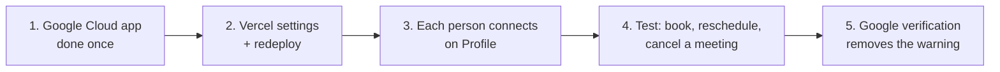

# Google Calendar setup

**Last updated:** 2026-10-01. Background on how the sync works is in `docs/APP-GUIDE.md`: section 9 (the meeting and calendar journey), section 6 (meeting rules) and section 13 (deploy).

**What it does:** when a BD or founder books a meeting in the app, it can be added to **their own** Google Calendar. Rescheduling or cancelling in the app updates or removes the event. The sync is one-way (app → Google). The app never reads other events.

**Who sets up what:**

| Who | What | How often |
|---|---|---|
| You, the app owner | Google Cloud app, Vercel settings, Google verification | Once, for every office |
| Each person | Profile → **Connect Google Calendar** | Once per person |

Offices need nothing of their own. Every office uses the same Google app, and each person connects only their own calendar.



---

## Step 1. The Google Cloud app (check it, most is already done)

The project **client-acquisition-os-510114** already exists. Open [console.cloud.google.com](https://console.cloud.google.com) with that project selected and check each item:

1. **APIs & Services → Library → Google Calendar API**: it should say **Enabled**. If not, click **Enable**.
2. **Google Auth Platform → Audience**:
   - User type: **External**.
   - Publishing status: **In production**, not "Testing". In Testing, Google disconnects everyone every 7 days.
3. **Google Auth Platform → Data Access**: the scopes should be exactly these three. Remove anything else.
   - `openid`
   - `.../auth/userinfo.email`
   - `.../auth/calendar.events.owned`
4. **Google Auth Platform → Clients → your Web client → Authorized redirect URIs**: both of these must be listed, spelled exactly like this.
   - `http://localhost:3000/api/google/callback`
   - `https://bd-minimal.vercel.app/api/google/callback`
5. On the same client page, copy the **Client ID** and **Client secret**. You need them in Step 2.

---

## Step 2. Vercel settings (5 values, then redeploy)

Open vercel.com → project **bd-minimal** → **Settings → Environment Variables**. Set these for **Production**:

| Name | Value |
|---|---|
| `GOOGLE_CALENDAR` | `on` |
| `GOOGLE_CLIENT_ID` | the Client ID from Step 1.5 |
| `GOOGLE_CLIENT_SECRET` | the Client secret from Step 1.5 |
| `GOOGLE_TOKEN_KEY` | a new random key; generate it with the command below |
| `NEXT_PUBLIC_SITE_URL` | `https://bd-minimal.vercel.app` (no slash at the end) |

To make `GOOGLE_TOKEN_KEY`, run this in PowerShell in `D:\bd-minimal`, and paste the output into Vercel:

```powershell
node -e "console.log(require('crypto').randomBytes(32).toString('base64'))"
```

- **Keep this key safe and never change it.** It encrypts everyone's Google access. If it changes, everyone has to reconnect.
- **Use a different key locally** (in `.env.local`) than in production.

Then go to **Deployments → the latest one → ⋯ → Redeploy**. The new settings take effect only after a redeploy.

**If any of the four `GOOGLE_*` values is missing, the calendar section is hidden.** Profile shows no "Connect Google Calendar" button. That's the quickest way to tell whether Step 2 worked.

---

## Step 3. Each person connects their calendar

Send this to your team (BDs and founders; social media managers don't book meetings):

1. Sign in at https://bd-minimal.vercel.app/login, then open **Profile** from the menu at the bottom of the sidebar.
2. Under **Google Calendar**, click **Connect Google Calendar**.
3. Pick your Google account.
4. Until Google verifies the app (Step 5), you'll see "Google hasn't verified this app". Click **Advanced**, then **Go to Client Acquisition OS (unsafe)**. It's safe: it's our own app.
5. Tick **the calendar permission**, then **Continue**. You're back on Profile, and it says you're connected.
6. Leave **Add booked meetings to my calendar** on (the default) to add meetings you book. **Sync now** retries anything that failed.

Founders can see who is connected on **Team**, in the Calendar column.

---

## Step 4. Test it (2 minutes)

1. As a connected BD, open a lead → **Log activity**.
2. Pick an outcome of **Meeting booked**. Fill in the Meeting section (a time tomorrow), tick **Add to Google Calendar**, and save.
3. Open Google Calendar: the event is there at the right time, with its reminders.
4. In the app, reschedule the meeting (lead page → Meetings), and check the event moved.
5. Cancel the meeting, with a reason, and check the event is gone.

If Google is slow or down, the meeting is still saved in the app. The sync retries the next time that person opens the app.

---

## Step 5. Google verification (removes the warning and the 100-user cap)

Until this is done, the app works but everyone sees the "unverified app" warning, and at most 100 people can connect. The public homepage (`/`), `/privacy` and `/terms` are already live. What's left:

### 5.1 Prove you own the site (Search Console)

1. Go to [search.google.com/search-console](https://search.google.com/search-console). Use the **same Google account** that owns the Cloud project.
2. **Add property → URL prefix →** `https://bd-minimal.vercel.app/`.
3. Choose the **HTML tag** method. Copy only the code inside `content="…"`.
4. In Vercel, add the environment variable `GOOGLE_SITE_VERIFICATION` with that code, then **Redeploy**.
5. Back in Search Console, click **Verify**.

### 5.2 Fill in the Branding page

In **Google Auth Platform → Branding**:

| Field | Value |
|---|---|
| App name | `Client Acquisition OS` (must match the homepage title) |
| User support email | your email |
| App home page | `https://bd-minimal.vercel.app` |
| Privacy policy | `https://bd-minimal.vercel.app/privacy` |
| Terms of service | `https://bd-minimal.vercel.app/terms` |
| Authorized domains | `bd-minimal.vercel.app` |
| Developer contact | your email |

Click **Save**.

### 5.3 Explain the calendar permission

In **Data Access**, paste this where Google asks why you need `calendar.events.owned`:

> Our app is a sales CRM for small teams. When a team member books a meeting with a prospect in the app, we create that meeting as an event on the team member's own Google Calendar. If they reschedule or cancel it in the app, we update or delete that same event. We need calendar.events.owned to create, update and delete these events. We don't read, list or change any other events, and we don't access calendars the user doesn't own. Each user connects their calendar themselves and can disconnect at any time from their Profile page, which revokes our access.

### 5.4 Record a demo video (about 3 minutes)

Record your screen in English and upload it to YouTube as **Unlisted**. Show, in this order:

1. The homepage `https://bd-minimal.vercel.app`, then sign in.
2. Profile → **Connect Google Calendar**.
3. **On Google's consent screen, click the browser's address bar** so the full URL, including `client_id=…`, is readable. Google checks this.
4. The consent screen showing the app name and the calendar permission, then **Continue**.
5. Book a meeting in the app, then open Google Calendar and show the event.
6. Reschedule it in the app and show the event moved. Cancel it and show it's gone.
7. Profile → **Disconnect**.

### 5.5 Submit

1. Go to **Verification Center → Prepare for verification**. Paste the YouTube link and submit.
2. Google replies by email, often more than once. Answer in the same thread. Common requests:
   - "the homepage doesn't explain the app"
   - "the name doesn't match"
   - "the video doesn't show the client ID"
3. Approval usually takes a few days to a few weeks. The app keeps working the whole time.

---

## Troubleshooting

| What you see | Why | Fix |
|---|---|---|
| No "Connect Google Calendar" on Profile | One of the four `GOOGLE_*` settings is missing, or you didn't redeploy | Step 2, then redeploy |
| Google says `redirect_uri_mismatch` | The redirect URI in Google doesn't match `NEXT_PUBLIC_SITE_URL` + `/api/google/callback` | Step 1.4: exact spelling, `https`, no trailing slash |
| Google says "Access blocked: app not configured" or shows no permission | The Calendar API is off, or the scope is missing | Step 1.1 and 1.3 |
| Everyone is logged out of Google after about 7 days | The app is in "Testing" | Step 1.2: publish to **In production** |
| Profile says "Google access expired or was removed" | The person removed access in Google, or the token key changed | Click **Reconnect** |
| Everyone suddenly needs to reconnect | `GOOGLE_TOKEN_KEY` was changed | Expected. Keep the key stable from now on |
| "Only 100 users" error when connecting | The app isn't verified yet | Step 5 |
| The meeting saved but no event appeared | Google was slow or down, or "Add booked meetings to my calendar" is off | It retries on the person's next page load, or click **Sync now** on Profile. Check the Calendar column on Team |

## When you get your own domain later

1. Add the new callback URL in Google (Step 1.4), for example `https://app.yourdomain.com/api/google/callback`.
2. Change `NEXT_PUBLIC_SITE_URL` in Vercel and redeploy.
3. Update the Branding page URLs and authorized domain, and verify the new domain in Search Console.
4. People don't need to reconnect, unless you also change `GOOGLE_TOKEN_KEY`.
