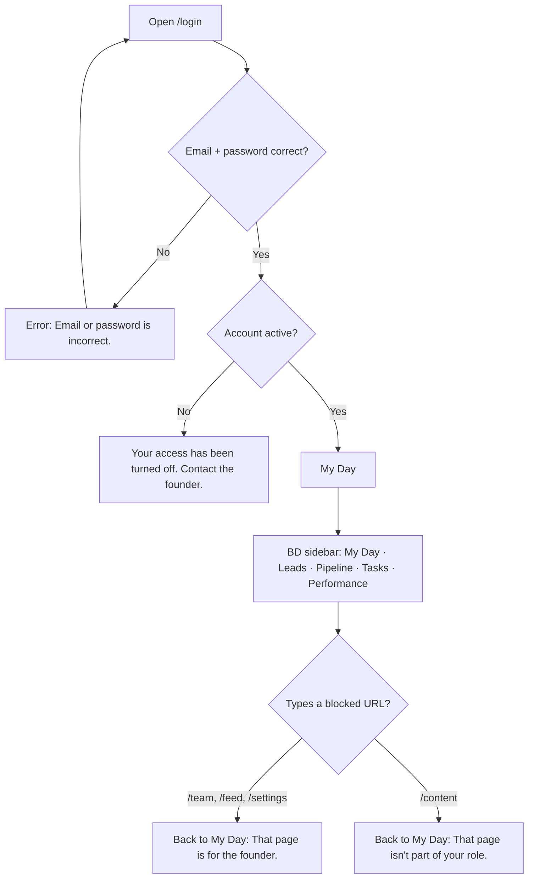
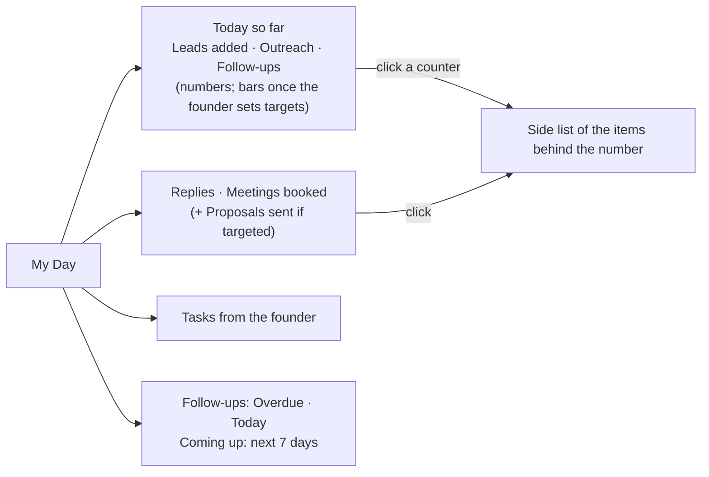
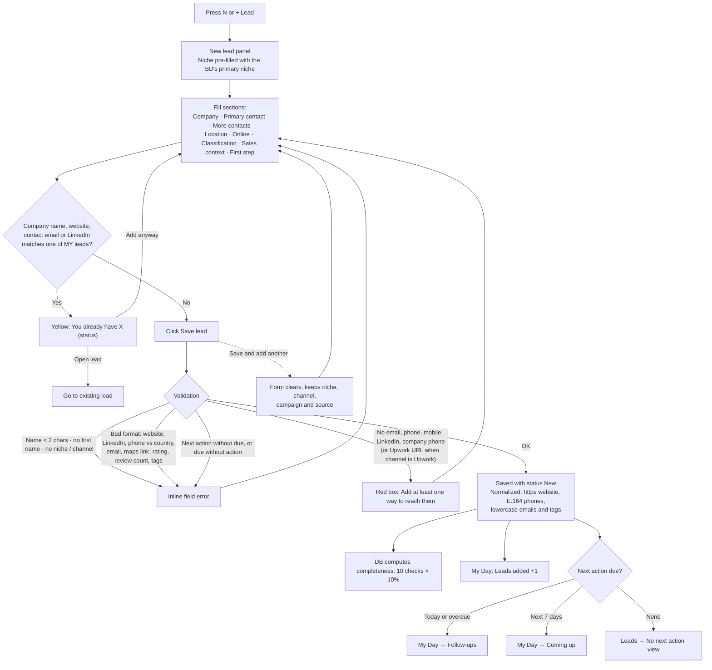
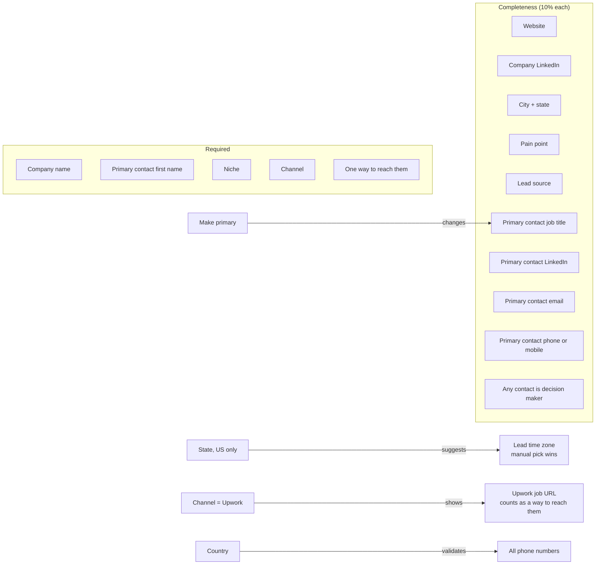
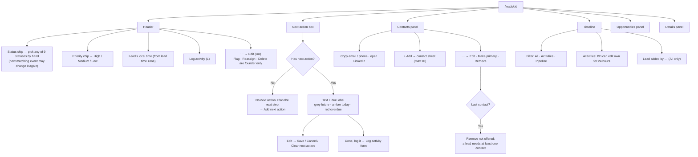
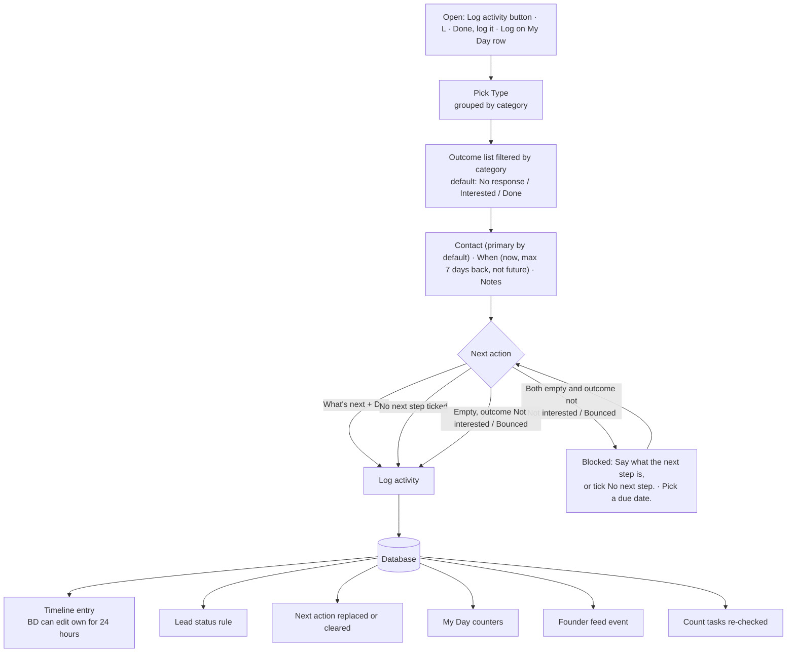
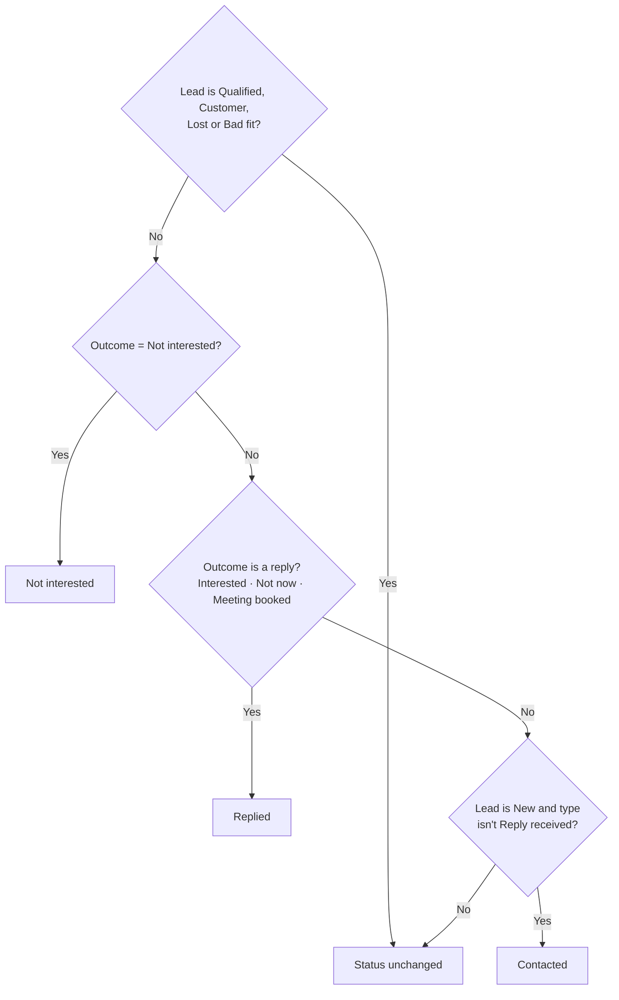
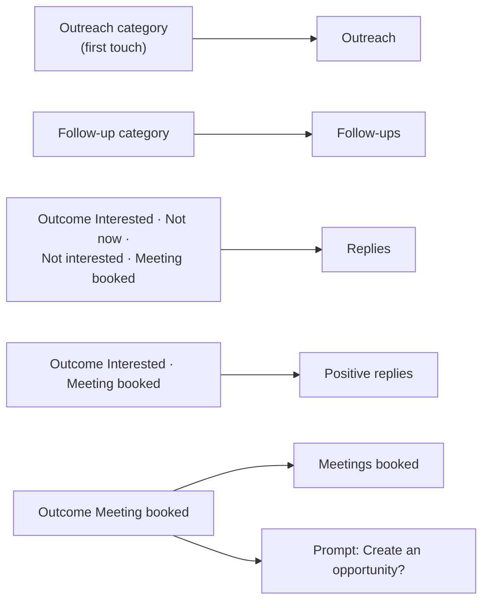
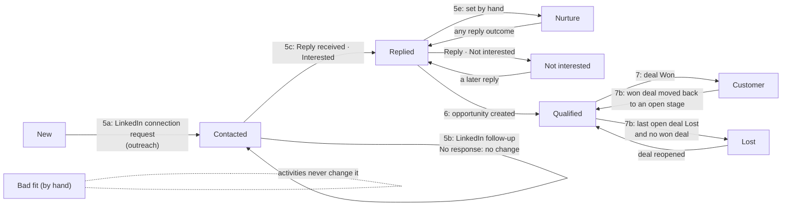
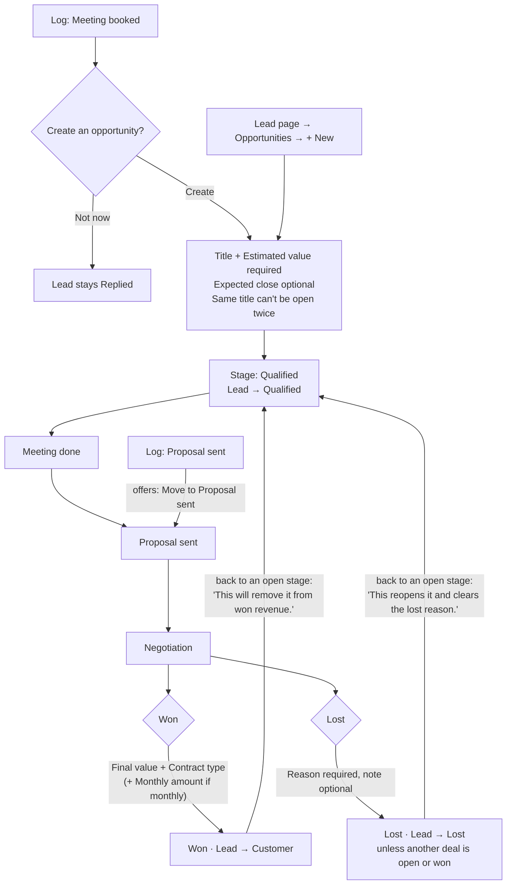

# BD flow: visual guide

What a BD (business developer) sees and does in the app, one diagram per area.
Built step by step during the BD walkthrough. Founder and social media manager flows come later.

## 1. Sign in and page access

My Day on an empty database:

## 2. New lead form

Form sections and what each field feeds:

## 3. Lead page

## 4. Log activity

Status rule applied by the database:

Which counter goes up:

## 5. A lead's status over its life

Worked example from the walkthrough (Smile Dental Austin):

- Editing an activity (5d, own activities, 24 hours) never changes the status.
- Customer, Lost, Not interested and Bad fit leads leave My Day follow-ups and the **My open leads** view; **All my leads** still shows them.

## 6. Opportunity and pipeline

Moves: drag on **Pipeline**, or the stage dropdown in the lead page's Opportunities panel. Any stage can go to any stage; every move shows in the timeline under **Pipeline**.
