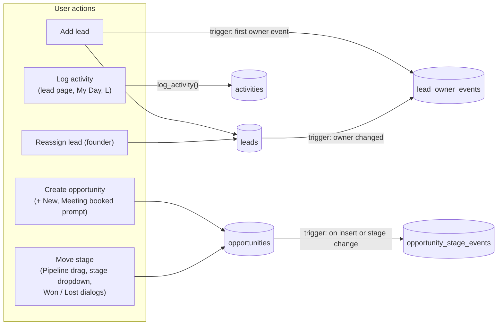
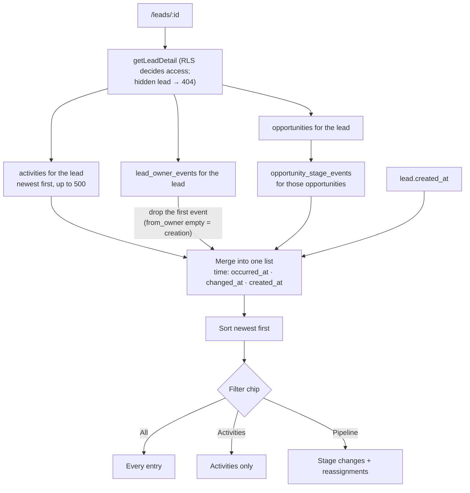
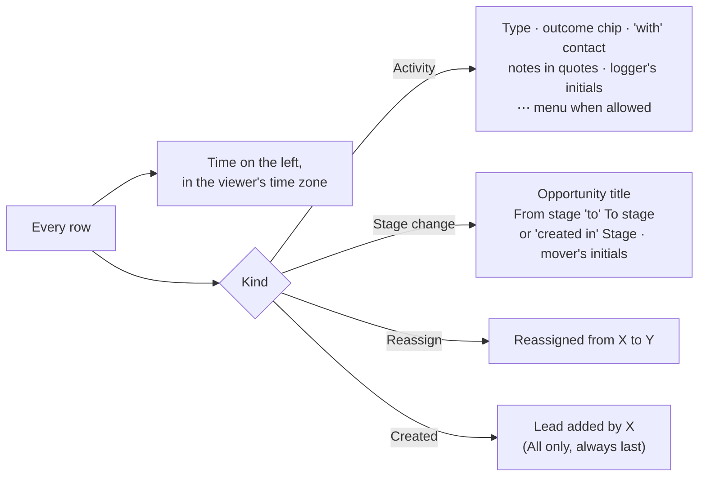
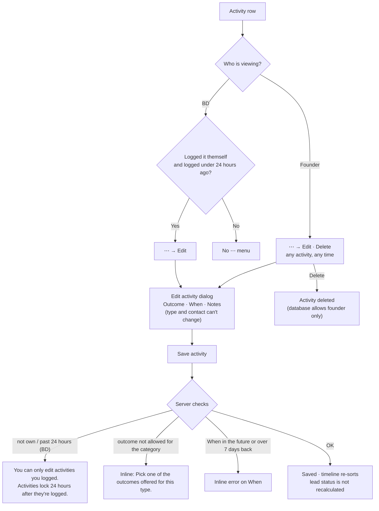

# Lead timeline: flow

How the **Timeline** panel on the lead page (`/leads/:id`) is built, filtered and edited.
Spec: `docs/07-screens.md` section 5. Code: `src/components/leads/timeline.tsx`, `src/server/queries/lead-detail.ts`, `src/server/actions/activities.ts`.

## 1. Where the entries come from

Every entry is written by the app or by a database trigger. The timeline only reads.

## 2. How the page loads and merges them

Activities sort by **when it happened** (`occurred_at`), so a backdated activity lands at its real place in the list, not at the top.

## 3. What each entry shows

Outcome chip colours: Interested accent · Meeting booked green · Not now amber · Bounced red · Not interested muted · No response and Done neutral.

## 4. Edit and delete an activity

- The 24-hour window counts from when the activity was **logged** (`created_at`), not from its **When** date.
- The ⋯ menu is hidden by the UI; the server action and RLS reject the same cases anyway.

## 5. Acceptance

Anything logged elsewhere (My Day, Log activity, Pipeline board, Won / Lost dialogs, reassign) shows up in this timeline, in time order. Founder-only actions (Delete, Reassign) are hidden from BDs and rejected by the server.
